# Task 1: Container Management

## 1. List containers using "ps -a" command

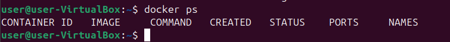

## 2. Pull Latest Ubuntu Image using "docker pull ubuntu:latest" command

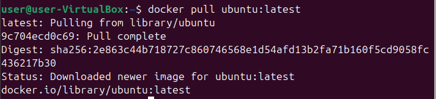

Check the installed image using "docker images" command

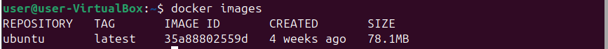

## 3. Run Container using "docker run -it --name ubuntu_container ubuntu:latest" command

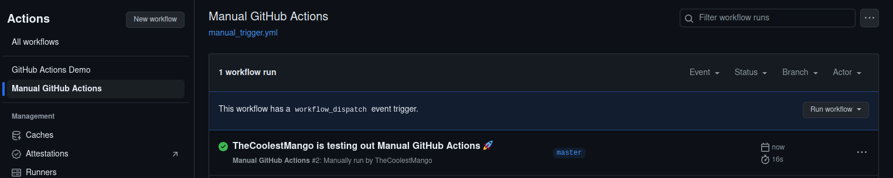

Check the active container using "ps -a" command

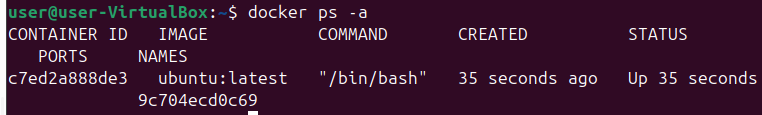

## 4. Remove the Ubuntu image using "docker rmi ubuntu:latest"

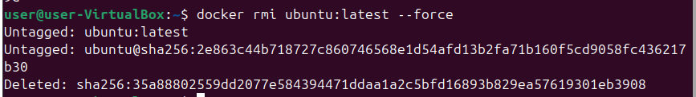

Check that the image was removed using "docker images" command

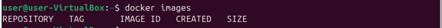

# Task 2: Image and Container Operations

## 1. Create Image Archive using "docker save -o ubuntu_image.tar ubuntu:latest" command

Compare the package size using "ls -lh | grep ubuntu" command

Created image's size:

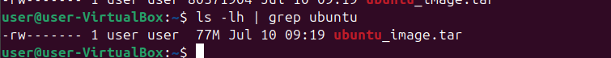

Initial pulled image's size:

**Result: the size of manually created image is 1.1M less than the initial size of the pulled image.**

## 2. Run Nginx Container using "docker run -d -p 80:80 --name nginx_container nginx"

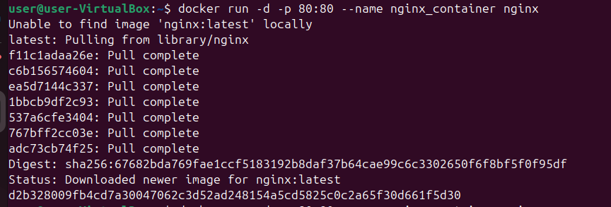

Verify that the container is up and the server accessible via the browser

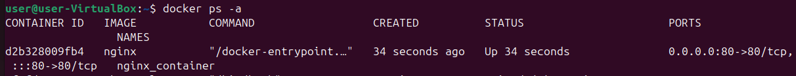

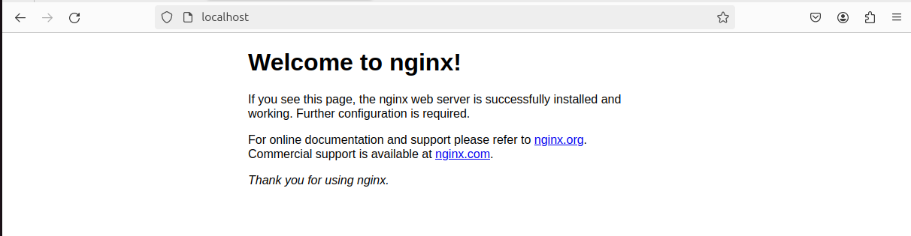

## 3. Create HTML File

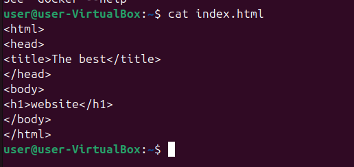


Copy the HTML file to the container using "docker cp index.html nginx_container:/usr/share/nginx/html/index.html"


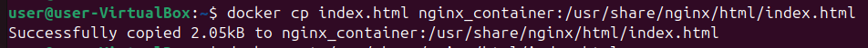


## 4. Create Custom Image with name "my_website" and tag "latest" using "docker commit nginx_container my_website:latest" command


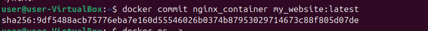


Check the created image


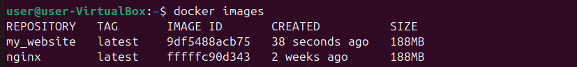


## 5. Remove Original nginx_container using "docker rm -f nginx_container" command


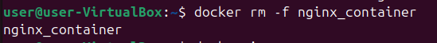


Check that the container was removed






## 6. Create new container using the image my_website "docker run -d -p 80:80 --name my_website_container my_website:latest"

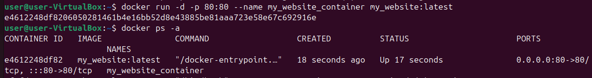


## 7. Test Web Server via terminal using "curl http://127.0.0.1:80"

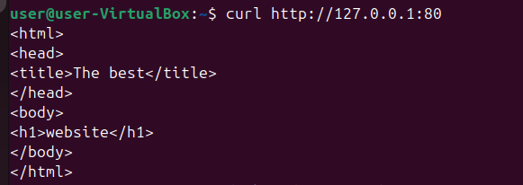


## 8. Analyze Image Changes using "docker diff my_website_container" command

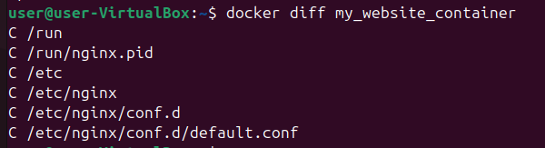

The changes of the configuration file relate to the added index.html file while the changes of nginx.pid relate to the container's restarts.
