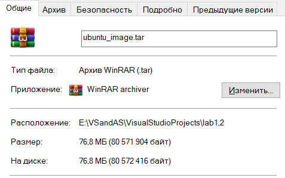

## Task 2: Image and Container Operations

### 1. Create Image Archive:
```docker save -o ubuntu_image.tar ubuntu:latest ```
```sh
PS E:\VSandAS\VisualStudioProjects\lab1,2> docker save -o ubuntu_image.tar ubuntu:latest
PS E:\VSandAS\VisualStudioProjects\lab1,2> docker images
REPOSITORY                        TAG       IMAGE ID       CREATED       SIZE
ubuntu                            latest    35a88802559d   4 weeks ago   78.1MB
goresumeapi                       dev       c30dc5c5f786   5 weeks ago   212MB
mcr.microsoft.com/dotnet/aspnet   7.0       ec861be01768   5 weeks ago   212MB
```



__Size Comparation:__
Original image: 78.1MB
Archive file: 76.8MB

### 2. Run Nginx Container:
```docker run -d -p 80:80 --name nginx_container nginx```
```sh
Unable to find image 'nginx:latest' locally
latest: Pulling from library/nginx
f11c1adaa26e: Pull complete
c6b156574604: Pull complete
ea5d7144c337: Pull complete
1bbcb9df2c93: Pull complete
537a6cfe3404: Pull complete
767bff2cc03e: Pull complete
adc73cb74f25: Pull complete
Digest: sha256:67682bda769fae1ccf5183192b8daf37b64cae99c6c3302650f6f8bf5f0f95df
Status: Downloaded newer image for nginx:latest
2c5440847465bde6a90420bb1ff13d26e25f1a87374b62d6fb816d0c096bc7f6
```


### 3. Create HTML File:

I changed ``index.html`` file and move it inside docker container with ``docker cp index.html nginx_container:/usr/share/nginx/html/index.html``
```sh
Successfully copied 2.05kB to nginx_container:/usr/share/nginx/html/index.html
```


### 4. Create Custom Image:
```docker commit nginx_container my_website:latest```

```sh
PS E:\VSandAS\VisualStudioProjects\lab1,2\Sum24-intro-labs> docker commit nginx_container my_website:latest
sha256:66de3d74d6297bde714815382b055752516b02fffc63f4e326434572151ace24
```

### 5. Remove Original Container:

```docker rm -f nginx_container```
```sh
PS E:\VSandAS\VisualStudioProjects\lab1,2\Sum24-intro-labs> docker rm -f nginx_container
nginx_container
```

### 6. Create New Container:
```docker run -d -p 80:80 --name my_website_container my_website:latest```
```sh
PS E:\VSandAS\VisualStudioProjects\lab1,2\Sum24-intro-labs> docker run -d -p 80:80 --name my_website_container my_website:latest
bec8aa0bcc47a8dbaedf70f0101988e3c84b119196cb5e08c58a6b5a0ae937f1
```

### 7.Test Web Server:
```curl http://127.0.0.1:80```
```sh
PS E:\VSandAS\VisualStudioProjects\lab1,2\Sum24-intro-labs> curl http://127.0.0.1:80


StatusCode        : 200
StatusDescription : OK
Content           : <html>
                    <head>
                    <title>The best</title>
                    </head>
                    <body>
                    <h1>website</h1>
                    </body>
                    </html>
RawContent        : HTTP/1.1 200 OK
                    Connection: keep-alive
                    Accept-Ranges: bytes
                    Content-Length: 92
                    Content-Type: text/html
                    Date: Tue, 09 Jul 2024 18:20:13 GMT
                    ETag: "668d7dc0-5c"
                    Last-Modified: Tue, 09 Jul 2024 18...
Forms             : {}
Headers           : {[Connection, keep-alive], [Accept-Ranges, bytes], [Content-Length, 92], [Content-Type, text/html]...}
Images            : {}
InputFields       : {}
Links             : {}
ParsedHtml        : mshtml.HTMLDocumentClass
RawContentLength  : 92
```

### 8. Analyze Image Changes:
```docker diff my_website_container```
```sh
PS E:\VSandAS\VisualStudioProjects\lab1,2\Sum24-intro-labs> docker diff my_website_container
C /etc
C /etc/nginx
C /etc/nginx/conf.d
C /etc/nginx/conf.d/default.conf
C /run
C /run/nginx.pid
```