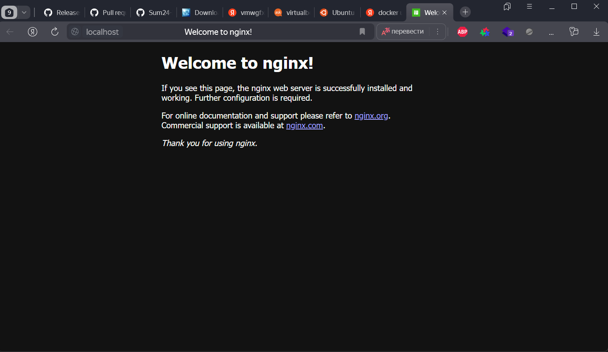
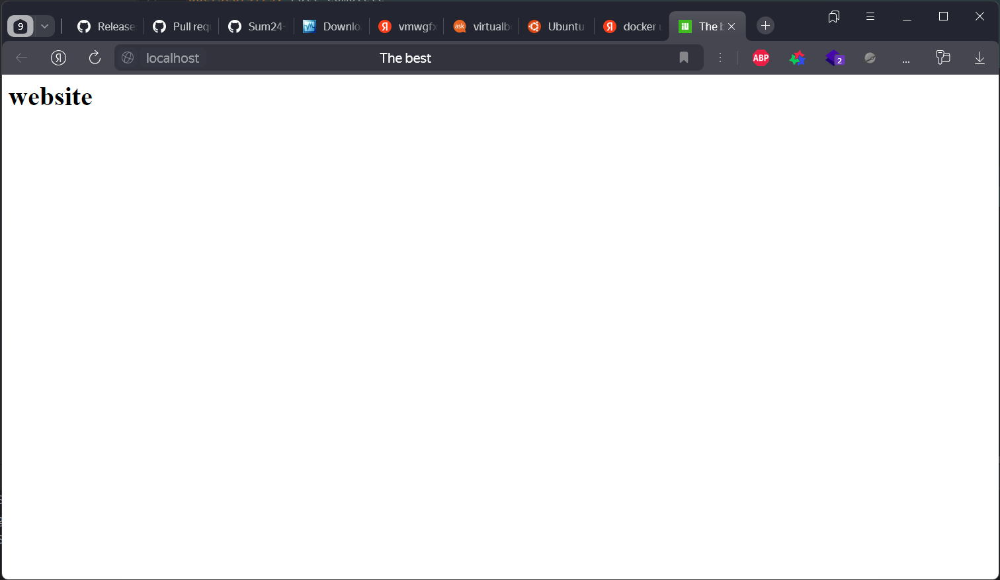

# Task 2

1. Create Image Archive:
```bash
PS C:\Users\ku_ku\Desktop\DEVOPS> docker save -o ubuntu_image.tar ubuntu:latest
```
## Comparison of Sizes

**Original Image Size (27 MB):**
- The original image size represents the size of the Ubuntu image before it was compressed or archived. This size includes all the layers, dependencies, and configurations needed to run the Ubuntu image in a Docker container.

**Archive File Size (89 KB):**
- When you create an archive file using the docker save command, Docker compresses the image layers and metadata into a single tarball file. This compression significantly reduces the size of the image data.
- The archive file size (89 KB) is much smaller than the original image size (27 MB) because of this compression. Docker uses efficient compression algorithms to minimize the file size while retaining all the necessary information to recreate the image.

2. Run Nginx Container:
```bash
PS C:\Users\ku_ku\Desktop\DEVOPS> docker run -d -p 80:80 --name nginx_container nginx
Unable to find image 'nginx:latest' locally
latest: Pulling from library/nginx
f11c1adaa26e: Pull complete
c6b156574604: Pull complete
ea5d7144c337: Pull complete
1bbcb9df2c93: Pull complete
537a6cfe3404: Pull complete
767bff2cc03e: Pull complete
adc73cb74f25: Pull complete
Digest: sha256:67682bda769fae1ccf5183192b8daf37b64cae99c6c3302650f6f8bf5f0f95df
Status: Downloaded newer image for nginx:latest
050a94d770e012779b4b5930c421aeb3f1f74352f1fdbd6aa00ec48adaddc08d

```


3. Create HTML File:
```bash
PS C:\Users\ku_ku\Desktop\DEVOPS> docker cp index.html nginx_container:/usr/share/nginx/html/index.html
Successfully copied 2.05kB to nginx_container:/usr/share/nginx/html/index.html
```


5. Create Custom Image:
```bash
PS C:\Users\ku_ku\Desktop\DEVOPS> docker commit nginx_container my_website:latest
sha256:9ae15d1e2d0cefbe1010262638000def105a142ff965db4ced9b01117412d650
```

6. Remove Original Container:
```bash
PS C:\Users\ku_ku\Desktop\DEVOPS> docker rm -f nginx_container
nginx_container
```

7. Create New Container:
```bash
PS C:\Users\ku_ku\Desktop\DEVOPS> docker run -d -p 80:80 --name my_website_container my_website:latest
474e7df429c1e159b6c23708e32e49da3961cd3463724338231174ae4205acdf
```

8. Test Web Server:
```bash
PS C:\Users\ku_ku\Desktop\DEVOPS> curl http://127.0.0.1:80

                                                                                                                                                                                                                                                                                       StatusCode        : 200                                                                                                                                                                                                                                                                
StatusDescription : OK                                                                                                                                                                                                                                                                 
Content           : <html>                                                                                                                                                                                                                                                             
                    <head>
                        <title>The best</title>
                    </head>
                    <body>
                    <h1>website</h1>
                    </body>
                    </html>
RawContent        : HTTP/1.1 200 OK
                    Connection: keep-alive
                    Accept-Ranges: bytes
                    Content-Length: 96
                    Content-Type: text/html
                    Date: Tue, 09 Jul 2024 19:13:28 GMT
                    ETag: "668d8b68-60"
                    Last-Modified: Tue, 09 Jul 2024 19...
Forms             : {}
Headers           : {[Connection, keep-alive], [Accept-Ranges, bytes], [Content-Length, 96], [Content-Type, text/html]...}
Images            : {}
InputFields       : {}
Links             : {}
ParsedHtml        : mshtml.HTMLDocumentClass
RawContentLength  : 96

```

9. Analyze Image Changes:
```bash
PS C:\Users\ku_ku\Desktop\DEVOPS> docker diff my_website_container
C /etc
C /etc/nginx
C /etc/nginx/conf.d
C /etc/nginx/conf.d/default.conf
C /run
C /run/nginx.pid
```

The docker diff command shows the difference between a container's file system and its corresponding image. Here's what each of the symbols means in the output provided:

- C: This indicates that the file or directory was changed within the container compared to the image.
- /etc: This directory has been changed within the container.
- /etc/nginx: This directory has been changed within the container.
- /etc/nginx/conf.d: This directory has been changed within the container.
- /etc/nginx/conf.d/default.conf: The default.conf file in the /etc/nginx/conf.d directory has been changed within the container.
- /run: This directory has been changed within the container.
- /run/nginx.pid: The nginx.pid file in the /run directory has been changed within the container.