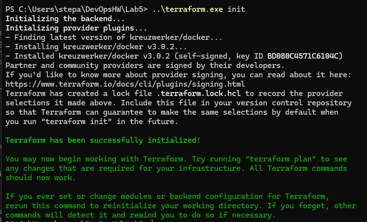
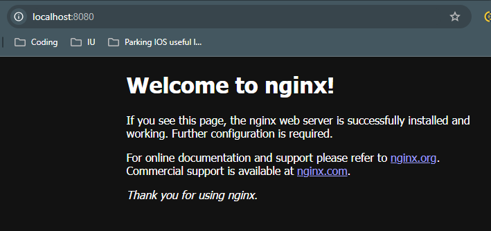

## Installation:
I had to use VPN and due to this reason I had to switch back to Windows for this task (my VPN broke several weeks ago on Ubuntu and I couldn't fix it fast).  
For the Windows you can just download .exe file and put it anywhere you want. Unfortunately, I could not manage to put it into PATH, even with their guide, but placed it into this folder instead.

## Usage
- To begin with, we create main.tf in the lab5 folder. Then we write the following in the file:
```
terraform {
    required_providers {
    docker = {
            source = "kreuzwerker/docker"
    }
    }
}

provider "docker" {}

resource "docker_image" "nginx" {
name = "nginx:latest"
keep_locally = false
}

resource "docker_container" "nginx" {
image = docker_image.nginx.image_id
name  = "nginx-server"
ports {
    internal = 80
    external = 8080
}
}
```
In the first block we define the provider for the docker manipulations. Default terraform doesn't contain one, but suggests to use this one.  
In the next part we setup the docker image of nginx.    
In the last part we create container of the image.

- Init of Terraform:
```
./terraform.exe init
```
Output:


- Checking the plan of the terraform configuration
```
./terraform.exe plan
```
Output
```
Terraform used the selected providers to generate the following execution plan. Resource actions are indicated with the
following symbols:
+ create

Terraform will perform the following actions:

# docker_container.nginx will be created
+ resource "docker_container" "nginx" {
    + attach                                      = false
    + bridge                                      = (known after apply)
    + command                                     = (known after apply)
    + container_logs                              = (known after apply)
    + container_read_refresh_timeout_milliseconds = 15000
    + entrypoint                                  = (known after apply)
    + env                                         = (known after apply)
    + exit_code                                   = (known after apply)
    + hostname                                    = (known after apply)
    + id                                          = (known after apply)
    + image                                       = (known after apply)
    + init                                        = (known after apply)
    + ipc_mode                                    = (known after apply)
    + log_driver                                  = (known after apply)
    + logs                                        = false
    + must_run                                    = true
    + name                                        = "nginx-server"
    + network_data                                = (known after apply)
    + read_only                                   = false
    + remove_volumes                              = true
    + restart                                     = "no"
    + rm                                          = false
    + runtime                                     = (known after apply)
    + security_opts                               = (known after apply)
    + shm_size                                    = (known after apply)
    + start                                       = true
    + stdin_open                                  = false
    + stop_signal                                 = (known after apply)
    + stop_timeout                                = (known after apply)
    + tty                                         = false
    + wait                                        = false
    + wait_timeout                                = 60

    + healthcheck (known after apply)

    + labels (known after apply)

    + ports {
        + external = 8080
        + internal = 80
        + ip       = "0.0.0.0"
        + protocol = "tcp"
    }
    }

# docker_image.nginx will be created
+ resource "docker_image" "nginx" {
    + id           = (known after apply)
    + image_id     = (known after apply)
    + keep_locally = false
    + name         = "nginx:latest"
    + repo_digest  = (known after apply)
    }

Plan: 2 to add, 0 to change, 0 to destroy.

───────────────────────────────────────────────────────────────────────────────────────────────────────────────────────

Note: You didn't use the -out option to save this plan, so Terraform can't guarantee to take exactly these actions if
you run "terraform apply" now.
```

- If we are suttisfied with the plan, we apply it:
```
./terraform.exe apply
```
Output:
```
...
same as previous +:
...

Do you want to perform these actions?
Terraform will perform the actions described above.
Only 'yes' will be accepted to approve.

Enter a value: yes

docker_image.nginx: Creating...
docker_image.nginx: Still creating... [10s elapsed]
docker_image.nginx: Creation complete after 10s [id=sha256:60c8a892f36faf6c9215464005ee6fb8cf0585f70b113c0b030f6cb497a41876nginx:latest]
docker_container.nginx: Creating...
docker_container.nginx: Creation complete after 1s [id=10cdd71ec517c34b7f1354ce29a7081d34de2f119ec774b4b039731f5020dacb]

Apply complete! Resources: 2 added, 0 changed, 0 destroyed.
```

- Now everything works fine:


- If we need to change something, we just change main.tf file and do the following:
```
./terraform.exe plan
./terraform.exe apply
```

- To destroy, just simply run:
```
./terraform.exe destroy
```
Output:
```
docker_image.nginx: Refreshing state... [id=sha256:60c8a892f36faf6c9215464005ee6fb8cf0585f70b113c0b030f6cb497a41876nginx:latest]
docker_container.nginx: Refreshing state... [id=10cdd71ec517c34b7f1354ce29a7081d34de2f119ec774b4b039731f5020dacb]

Terraform used the selected providers to generate the following execution plan. Resource actions are indicated with the following symbols:
- destroy

Terraform will perform the following actions:

# docker_container.nginx will be destroyed
- resource "docker_container" "nginx" {
    - attach                                      = false -> null
    - command                                     = [
        - "nginx",
        - "-g",
        - "daemon off;",
    ] -> null
    - container_read_refresh_timeout_milliseconds = 15000 -> null
    - cpu_shares                                  = 0 -> null
    - dns                                         = [] -> null
    - dns_opts                                    = [] -> null
    - dns_search                                  = [] -> null
    - entrypoint                                  = [
        - "/docker-entrypoint.sh",
    ] -> null
    - env                                         = [] -> null
    - group_add                                   = [] -> null
    - hostname                                    = "10cdd71ec517" -> null
    - id                                          = "10cdd71ec517c34b7f1354ce29a7081d34de2f119ec774b4b039731f5020dacb" -> null
    - image                                       = "sha256:60c8a892f36faf6c9215464005ee6fb8cf0585f70b113c0b030f6cb497a41876" -> null
    - init                                        = false -> null
    - ipc_mode                                    = "private" -> null
    - log_driver                                  = "json-file" -> null
    - log_opts                                    = {} -> null
    - logs                                        = false -> null
    - max_retry_count                             = 0 -> null
    - memory                                      = 0 -> null
    - memory_swap                                 = 0 -> null
    - must_run                                    = true -> null
    - name                                        = "nginx-server" -> null
    - network_data                                = [
        - {
            - gateway                   = "172.17.0.1"
            - global_ipv6_prefix_length = 0
            - ip_address                = "172.17.0.2"
            - ip_prefix_length          = 16
            - mac_address               = "02:42:ac:11:00:02"
            - network_name              = "bridge"
                # (2 unchanged attributes hidden)
            },
    ] -> null
    - network_mode                                = "bridge" -> null
    - privileged                                  = false -> null
    - publish_all_ports                           = false -> null
    - read_only                                   = false -> null
    - remove_volumes                              = true -> null
    - restart                                     = "no" -> null
    - rm                                          = false -> null
    - runtime                                     = "runc" -> null
    - security_opts                               = [] -> null
    - shm_size                                    = 64 -> null
    - start                                       = true -> null
    - stdin_open                                  = false -> null
    - stop_signal                                 = "SIGQUIT" -> null
    - stop_timeout                                = 0 -> null
    - storage_opts                                = {} -> null
    - sysctls                                     = {} -> null
    - tmpfs                                       = {} -> null
    - tty                                         = false -> null
    - wait                                        = false -> null
    - wait_timeout                                = 60 -> null
    - working_dir                                 = "/" -> null
    # (6 unchanged attributes hidden)

    - ports {
        - external = 8080 -> null
        - internal = 80 -> null
        - ip       = "0.0.0.0" -> null
        - protocol = "tcp" -> null
    }
    }

# docker_image.nginx will be destroyed
- resource "docker_image" "nginx" {
    - id           = "sha256:60c8a892f36faf6c9215464005ee6fb8cf0585f70b113c0b030f6cb497a41876nginx:latest" -> null
    - image_id     = "sha256:60c8a892f36faf6c9215464005ee6fb8cf0585f70b113c0b030f6cb497a41876" -> null
    - keep_locally = false -> null
    - name         = "nginx:latest" -> null
    - repo_digest  = "nginx@sha256:bc5eac5eafc581aeda3008b4b1f07ebba230de2f27d47767129a6a905c84f470" -> null
    }

Plan: 0 to add, 0 to change, 2 to destroy.

Do you really want to destroy all resources?
Terraform will destroy all your managed infrastructure, as shown above.
There is no undo. Only 'yes' will be accepted to confirm.

Enter a value: yes

docker_container.nginx: Destroying... [id=10cdd71ec517c34b7f1354ce29a7081d34de2f119ec774b4b039731f5020dacb]
docker_container.nginx: Destruction complete after 0s
docker_image.nginx: Destroying... [id=sha256:60c8a892f36faf6c9215464005ee6fb8cf0585f70b113c0b030f6cb497a41876nginx:latest]
docker_image.nginx: Destruction complete after 0s

Destroy complete! Resources: 2 destroyed.
```

- And, obviously, our website is not accessible anymore.  

## Sum up
Terraform is quite complicated instrument, especially for the newbies. But, as soon as all the configurations are set up properly, deploying of projects of any size and complexity becomes as easy as running several very simple command in the terminal.