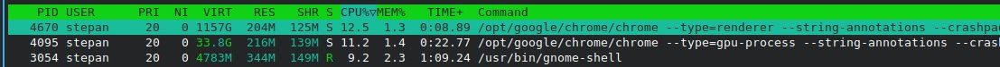
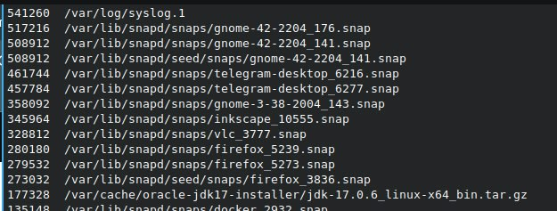

# GitOps & SRE Lab

## Task 1: Key Metrics for SRE and SLAs

**Objective**: Monitor system resources and manage disk space.

1. **Monitor System Resources**:
   - Use commands like `htop` and `iostat` to monitor CPU, memory, and I/O usage.
   - Identify and document the top 3 most consuming applications for CPU, memory, and I/O usage in a `submission5.md` file.

   In my case the two most consuming processes by CPU load was Chrome (there are huge amount of subprocesses, but it covers quite huge part of the screen and shell. Also htop itself was most of the time the third process by CPU)
   

2. **Disk Space Management**:
   - Use `du` and `df` to manage disk space.
   - Identify and log the top 3 largest files in the `/var` directory in the `submission5.md` file.

   - `du` analyzes the disk usage of a folder with all the subfolders and files. Actually, it is hard to find 3 largest files since it cannot ditinguish files from folders. In my case I changed it a bit:
    ```
    find /var -type f -exec du -a {} + | sort -n -r | less
    ```
    Output:
    

    The idea is to firstly sort out only files, then execute du on this list and then sort it by the size.

   - `df` - this command shows the usage of disks. In my case the output was (i guess the output is clear and does not need an explanation):
    ```
    Filesystem     1K-blocks      Used Available Use% Mounted on
    /dev/nvme1n1p2 490617784 250591748 215030556  54% /
    ```

## Task 2: Terraform Installation and Nginx Deployment

**Objective**: Install Terraform and deploy an Nginx container.

1. **Research and Installation**:
   - Read about Terraform.
   - Install Terraform on your system by following the [official instructions](https://developer.hashicorp.com/terraform/tutorials/docker-get-started).  

2. **Nginx Deployment**:
   - Follow the tutorial steps to build, change, and destroy infrastructure.
   - Define variables and query data with outputs.
   - Document your process.

3. **Publish Configuration Files**:
   - Create a `lab5` folder in your repository.
   - Include all Terraform configuration files used in the tutorial in this folder.

4. **Documentation**:
   - Create a Markdown file named `TerraformAndNginx.md` in the `lab5` folder.
   - Include the following details:
     - The version number of Terraform installed.
     - Steps followed to install Terraform.
     - Commands executed to initialize and apply the Terraform configuration.
     - Observations or challenges encountered during the installation and deployment process.


