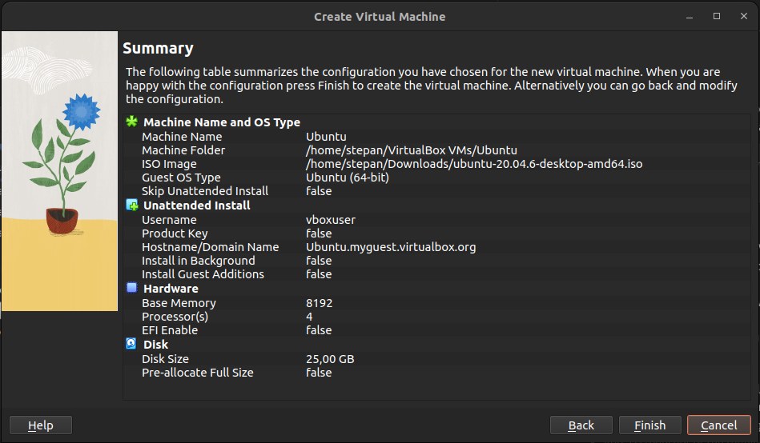
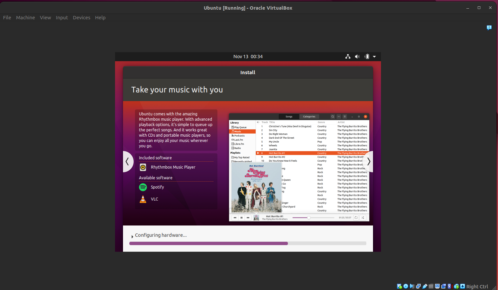
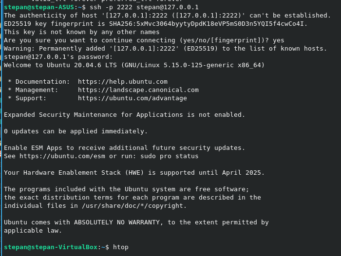
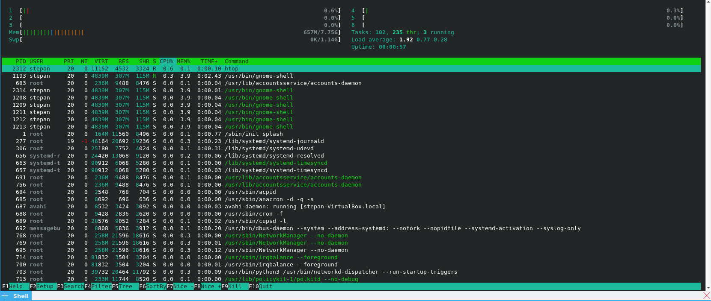

# Virtualization Lab

In this lab, you will learn how to deploy a Virtual Machine (VM) using VirtualBox and customize its settings. Follow the tasks below to complete the lab assignment.

## Task 1: VM Deployment

**Objective**: Install VirtualBox and deploy a new VM using Ubuntu.

1. **Install VirtualBox**:
   - Download and install VirtualBox from the official [VirtualBox website](https://www.virtualbox.org/).
   - To install on Ubuntu(22 in my case):
   ```
   sudo dpkg -i ~/Downloads/virtualbox-7.1_7.1.4-165100~Ubuntu~jammy_amd64.deb
   ```

2. **Deploy a Virtual Machine**:
   - Quite simple setup is enough due to quite powerfull laptop:
   

   - The only problem I faced was due to quite new kernel (6.5) which can be fixed by [link](https://forums.virtualbox.org/viewtopic.php?p=545341&sid=36cd0e3ccab406f0a7b2087f34fb8585#p545341)  
   - Also lately I found that I had to skip Unattended install since it setups Ubuntu 20 quite badly with several problems, like not sudo user, not openable terminal and others. Had to reinstall it with skipping unattended install.
3. **Documentation**:
   - Add a screenshot of the running VM in the `submission7.md` file.
   
## Task 2: System Information Tools

**Objective**: Discover and use command-line tools to display system information of the VM.

- To get the list of VMs:
```
VBoxManage list vms 
```
Output:
```
"Ubuntu" {257b55d3-0d0b-4386-8b8f-4a2936a3113a}
```

I couldn't find any usable tool to monitor VM from the host machine, so I just setted up port forwarding, hosted ssh server on VM side and connected to the VM using ssh. Since that we can just simply install any monitoring tool, like `htop` on the VM and monitor it from the host machine:



In order to not write again the simple steps, I will just link the guide, which quite simply explains the steps, which are specific to VirtualBox in this setup: https://www.makeuseof.com/how-to-ssh-into-virtualbox-ubuntu/

It seems like a universal solution to any tasks we might need or not depending on the task we need to solve. That is the reason why I chose this solution for the lab.
