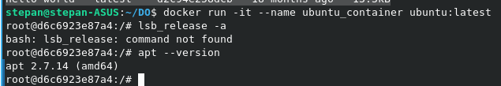
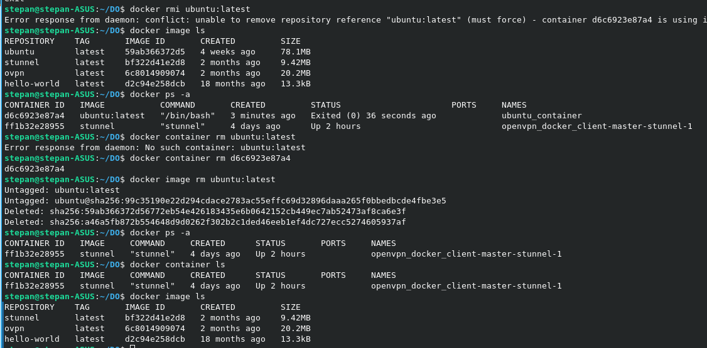
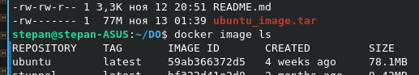
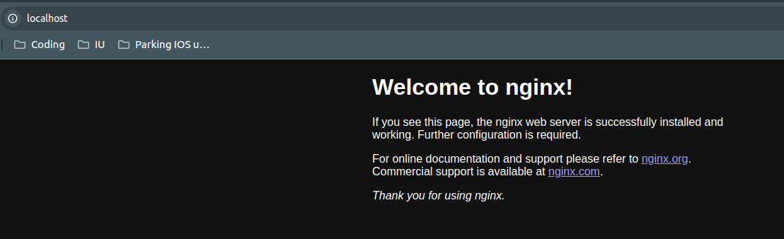
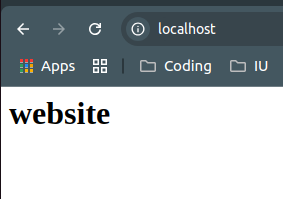

# Containers Lab - Docker

In this lab, you will gain hands-on experience with Docker, a popular containerization platform. You will perform various tasks related to Docker containers, such as listing and pulling images, running containers, and creating custom images. Follow the tasks below to complete the lab assignment.

## Task 1: Container Management

**Objective**: Manage Docker containers and images.

1. **List Containers**:
   - Use the appropriate command to list the Docker containers present in your environment.

     ```sh
     docker ps -a
     ```
     Output:
     ```
     CONTAINER ID   IMAGE     COMMAND     CREATED      STATUS       PORTS     NAMES
     ff1b32e28955   stunnel   "stunnel"   4 days ago   Up 2 hours             openvpn_docker_client-master-stunnel-1
     ```

   - Document the command used and provide the output in a Markdown file named `submission8.md` in the lab folder.

2. **Pull Latest Ubuntu Image**:
   - Use the appropriate command to pull the latest Ubuntu image from the Docker registry.

     ```sh
     docker pull ubuntu:latest
     ```
     ```
     latest: Pulling from library/ubuntu
     ff65ddf9395b: Pull complete 
     Digest: sha256:99c35190e22d294cdace2783ac55effc69d32896daaa265f0bbedbcde4fbe3e5
     Status: Downloaded newer image for ubuntu:latest
     docker.io/library/ubuntu:latest
     ```

     Check:
     ```
     docker image ls
     ```
     ```
     REPOSITORY    TAG       IMAGE ID       CREATED         SIZE
     ubuntu        latest    59ab366372d5   4 weeks ago     78.1MB
     stunnel       latest    bf322d41e2d8   2 months ago    9.42MB
     ovpn          latest    6c8014909074   2 months ago    20.2MB
     hello-world   latest    d2c94e258dcb   18 months ago   13.3kB
     ```

   - Document the command used in the same `submission8.md` file.

3. **Run Container**:
   - Use the appropriate command to run a container using the Ubuntu image you just pulled.

     ```sh
     docker run -it --name ubuntu_container ubuntu:latest
     ```
    
    This is the very base of the OS to make in download and install very fast and to be set up lately for the needs.

    `-it` flag is used to open the virtual terminal to communicate with the container.
   - Document the command used and any relevant details about the container in the same `submission8.md` file.

4. **Remove Image**:
   - Attempt to remove the Ubuntu image you pulled earlier.

     ```sh
     docker rmi ubuntu:latest
     ```
     Output:
     ```
     Error response from daemon: conflict: unable to remove repository reference "ubuntu:latest" (must force) - container d6c6923e87a4 is using its referenced image 59ab366372d5
     ```

     Remove, I usually use:
     

   - Document the command used and the outcome of the removal process in the same `submission8.md` file.

## Task 2: Image and Container Operations

**Objective**: Perform operations on Docker images and containers.

1. **Create Image Archive**:
   - Pull the latest Ubuntu image and create an archive file from it.

     ```sh
     docker save -o ubuntu_image.tar ubuntu:latest
     ```

   - Document the commands used in a Markdown file named `submission8.md` in the lab folder.
   - Compare the size of the archive file with the size of the original image. Explain any differences, if present, in the same `submission8.md` file.
     
   Seems like no difference in size. 77M shown by ls is using 1MB = 1024KB. Which should be about 78.1M shown by docker, which might use 1MB = 1000KB (quite widely used in different tools for some reasons).

2. **Run Nginx Container**:
   - Use the appropriate command to run a container using the Nginx web server image:
     - Bind the container's port 80 to the local port 80.
     - Run the container in detached mode and name it `nginx_container`.

     ```sh
     docker run -d -p 80:80 --name nginx_container nginx
     ```

   - Verify that the web server is running and accessible from the local machine.
   

3. **Create HTML File**:
   - Create an HTML file with the specified content:

     ```html
     <html>
     <head>
     <title>The best</title>
     </head>
     <body>
     <h1>website</h1>
     </body>
     </html>
     ```

   - Copy the HTML file to the container at the appropriate location to serve as an index file.

     ```sh
     docker cp index.html nginx_container:/usr/share/nginx/html/index.html
     ```

     

4. **Create Custom Image**:
   - Create a custom Docker image from the running container and name it `my_website`.
   - Tag the container with the `latest` tag.

     ```sh
     docker commit nginx_container my_website:latest
     ```

5. **Remove Original Container**:
   - Remove the original container (`nginx_container`) and verify that it has been successfully removed.

     ```sh
     docker rm -f nginx_container
     ```
     ```
     stepan@stepan-ASUS:~/DO/Lab8$ docker ps -a
     CONTAINER ID   IMAGE     COMMAND     CREATED      STATUS       PORTS     NAMES
     ff1b32e28955   stunnel   "stunnel"   4 days ago   Up 2 hours             openvpn_docker_client-master-stunnel-1
     ```

6. **Create New Container**:
   - Create a new container using the custom image you've created (the same way as the original container).

     ```sh
     docker run -d -p 80:80 --name my_website_container my_website:latest
     ```

7. **Test Web Server**:
   - Use the `curl` command to access the web server at `127.0.0.1:80`.

     ```sh
     curl http://127.0.0.1:80
     ```
     ```
     stepan@stepan-ASUS:~/DO/Lab8$ docker ps -a
     CONTAINER ID   IMAGE               COMMAND                  CREATED          STATUS          PORTS                               NAMES
     d01b3d5455a5   my_website:latest   "/docker-entrypoint.…"   13 seconds ago   Up 12 seconds   0.0.0.0:80->80/tcp, :::80->80/tcp   my_website_container
     ff1b32e28955   stunnel             "stunnel"                4 days ago       Up 2 hours                                          openvpn_docker_client-master-stunnel-1
     stepan@stepan-ASUS:~/DO/Lab8$ curl http://127.0.0.1:80
     <html>
     <head>
     <title>The best</title>
     </head>
     <body>
     <h1>website</h1>
     </body>
     </html>
     ```

8. **Analyze Image Changes**:
   - Use the `docker diff` command to analyze the changes made to the new image.

     ```sh
     docker diff my_website_container
     ```

     ```
     C /run
     C /run/nginx.pid
     C /etc
     C /etc/nginx
     C /etc/nginx/conf.d
     C /etc/nginx/conf.d/default.conf
     ```

     Symbol `C` in the beginning of each line says, that the file or folder (or files inside it) was changed. In our case two files were changed:
     - `/run/nginx.pid` - this is file, containing process id of nginx. Each run it might change. There is nothing to worry about.
     - `/etc/nginx/conf.d/default.conf` - configuration of our server. For some reason they were changed by our change of index.html
     We can check the changes by the following series of commands:
     ```sh
     docker cp my_website_container:/etc/nginx/conf.d/default.conf ./new_default.conf
     docker cp nginx_container:/etc/nginx/conf.d/default.conf ./old_default.conf
     ```
     By comparing this two files we can find out, that it is not changed. Running 
     ```sh
     docker diff nginx_container
     ```
     Shows that this two files are changed here two. To be more precised, they are added. So, we can sum up that they are just autogenerated, so there is also nothing to worry about.

     - Also important to say, that we do not see `index.html` in the list of changed files. I couldn't find any good explanation of why it happens, but it looks like docker diff only compares OS-level part of filesystem. And index.html is somewhere like /home/ part of the OS which are not being tracked by docker diff.
