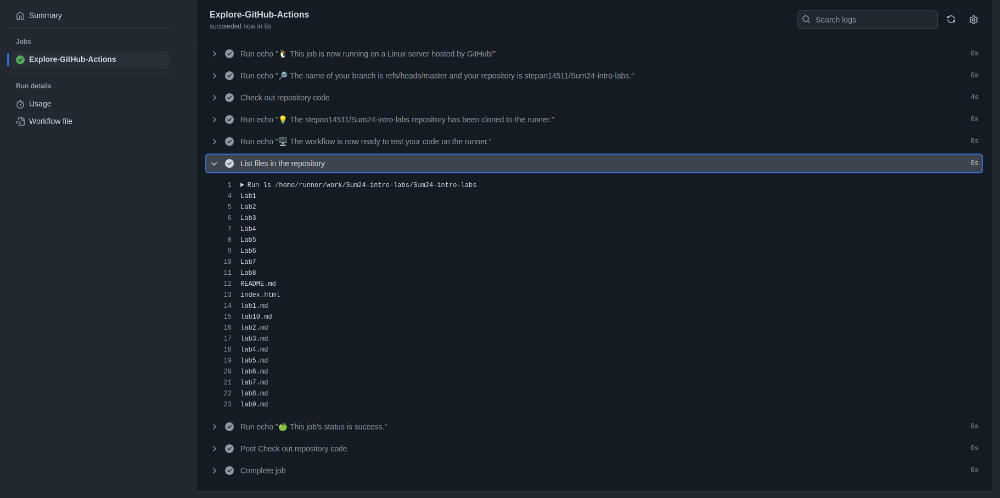

# CI/CD Lab - GitHub Actions

In this lab, you will explore continuous integration and continuous deployment (CI/CD) practices using GitHub Actions. GitHub Actions provides a powerful workflow automation tool to streamline your development and deployment processes. You will perform various tasks related to setting up CI/CD pipelines and gathering system information using GitHub Actions. Follow the tasks below to complete the lab assignment.

## Task 1: Create Your First GitHub Actions Pipeline

**Objective**: Set up a basic GitHub Actions workflow and observe its execution.

1. **Read the Official Guide**:
   - Due to my job I have to work quite a lot with [QGroundControl](https://github.com/mavlink/qgroundcontrol) which uses GitHub Actions for the following automatization:
        - Tests
        - Auto generation of Documentation
        - Building the app for all supported OSs (Win, Linux, MacOS, IOS, Android)
        - Auto Deploy of installers (at least .apk) to the Play Market, App Store and others.
    
    The app building is quite hard and OS specific task and Actions really help with that. I look at them as one-time called (after each commit, for example) docker container made for automatization and standartization of routine jobs.  
    Actions have quite flexible settings (like when to be triggered), big set of opensource modules, which are easy to use. In most of the cases the modules are just docker containers with some pre-defined images. But sometimes they are written on JS since Windows platform does not support docker (according to GitHub documentation), which rarely, but used.  
    With Artifact system they are extremely convenient to use.

2. **Observe the Workflow Execution**:
   - Push some changes to your repository and observe the GitHub Actions workflow execution.
   - Document the output, any errors encountered, and any observations in the same `submission9.md` file.

   I used the default action from the guide.
     
   Action finished successfuly.

## Task 2: Gathering System Information and Manual Triggering

**Objective**: Extend your workflow to include manual triggering and system information gathering.

1. **Configure a Manual Trigger**:
   - In the parameter `on` we need to replace `push` with `workflow_dispatch`:
   ```yml
    on: [workflow_dispatch]
   ```

2. **Gather System Information**:
   - Modify your workflow to include an additional step for gathering system information.
   - Use the appropriate actions and steps to collect information about the runner, hardware specifications, and operating system details.
   - Document the changes made to the workflow file and the gathered system information in the same `submission9.md` file.  
   
    So, I removed all the steps from the previous action, and replace it with two simple steps:
    - Collect system info into a info.txt file:
    ```
    - name: "Collect information about the runner."
        run: touch info.txt && lsb_release -a >> info.txt && lshw -short -sanitize >> info.txt
    ```
    - Upload info.txt as an artifact:
    ```
    - name: "Upload artifact"
        uses: actions/upload-artifact@v4
        with:
          name: System Information
          path: info.txt
    ```

    Then I ran this action by hands (we switched from push to Manual Triggering previously) and here is the result: [link](https://github.com/stepan14511/Sum24-intro-labs/actions/runs/11807967338)

    The file also could be found in the Lab9 folder.
