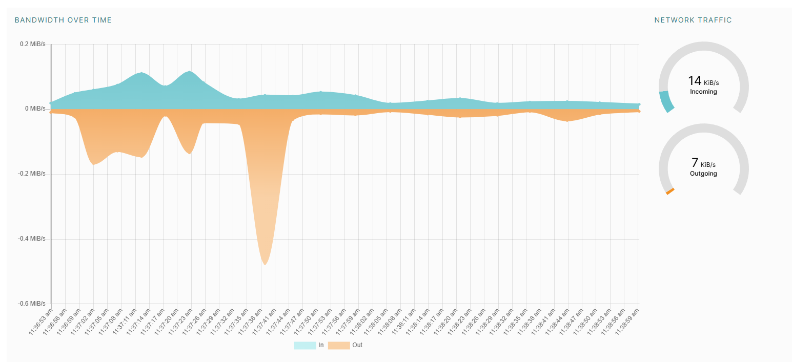

# DevOps Tool Exploration

In this lab, you will explore essential DevOps tools and set up a project on the Fleek service. Follow the tasks below to complete the lab assignment.

## Task 1: Set Up an IPFS Gateway Using Docker

**Objective**: Understand and implement an IPFS gateway using Docker, upload a file, and verify it via an IPFS cluster.

1. **Set Up IPFS Gateway**:
   - Install Docker on your machine if it's not already installed.
     - It was installed

   - Pull the IPFS Docker image and run an IPFS container:

    Pull docker IPFS image
     ```sh
     docker pull ipfs/go-ipfs
     ```
    Building container of the downloaded image. Using -v flag we create virtual volumes in our container, which are just links to some folders in the host system. -d is used to run container in background and not occupy the terminal. --name - specify a name for the container. -p - we make a mapping, that port 8080, for example, in container is working with port 8080 on the host machine.
     ```sh
     docker run -d --name ipfs_host -v /path/to/folder/with/file:/export -v ipfs_data:/data/ipfs -p 8080:8080 -p 4001:4001 -p 5001:5001 ipfs/go-ipfs
     ```

   - Verify the IPFS container is running:

     ```sh
     docker ps
     ```

     ```
     64c95467573c   ipfs/go-ipfs          "/sbin/tini -- /usr/…"   15 seconds ago   Up 15 seconds (healthy)   0.0.0.0:4001->4001/tcp, 0.0.0.0:5001->5001/tcp, 4001/udp, 0.0.0.0:8080->8080/tcp, 8081/tcp   ipfs_host
     ```

2. **Upload a File to IPFS**:
   - Open a browser and access the IPFS web UI:

     ```sh
     http://127.0.0.1:5001/webui/
     ```

   - Explore the web UI and wait for 5 minutes to sync up with the network.
   - Upload any file via the web UI.
   - Use the obtained hash to access the file via any public IPFS gateway. Here are a few options:
     - [IPFS.io Gateway](https://ipfs.io/ipfs/)
     - [Cloudflare IPFS Gateway](https://cloudflare-ipfs.com/ipfs/)
     - [Infura IPFS Gateway](https://ipfs.infura.io/ipfs/)

   - Append your file hash to any of the gateway URLs to verify your file is accessible. Note that it may fail due to network overload, so don't worry if you can't reach it  
   
   
   Worked only on local for some reason.  
   

3. **Documentation**:
   - Create a `submission2.md` file.
   - Share information about connected peers and bandwidth in your report.  
     
   
   - Provide the hash and the URLs used to verify the file on the IPFS gateways.  
   QmYgf7rbovaD3DK9cK3WzDwD1S4EyM4jj5efYLtr7BQuhs   
   http://bafybeiezwtzmzm6cj7ylsoq6matuo5l7gnns7qqcrbucmmnfwvlbv6wvji.ipfs.localhost:8080/  
   https://dweb.link/ipfs/QmYgf7rbovaD3DK9cK3WzDwD1S4EyM4jj5efYLtr7BQuhs

## Task 2: Set Up Project on Fleek.co

**Objective**: Set up a project on the Fleek service and share the IPFS link.

1. **Research**:
   - Understand what IPFS is and its purpose.  
   IPFS - decentralized File System, which addresses data by its content, not location. It makes data available from any point of internet and cannot be sensored.
   - Explore Fleek's features.  
   

2. **Set Up**:
   - Sign up for a Fleek account if you haven't already.
   - Use your fork of the Labs repository as your project source. Optionally, set up your own website (notify us in advance).
   - Configure the project settings on Fleek.
   - Deploy the Labs repository to Fleek, ensuring it is uploaded to IPFS.
   

3. **Documentation**:
   - Share the IPFS link and domain of the deployed project in the `submission2.md` file.  
   https://ipfs.io/ipfs/bafybeienfnnln4emucoaziqfnjrod6fhd4wenubg6ws4zezvubgprm5ltq/

