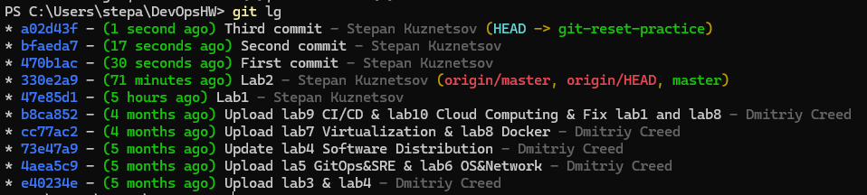
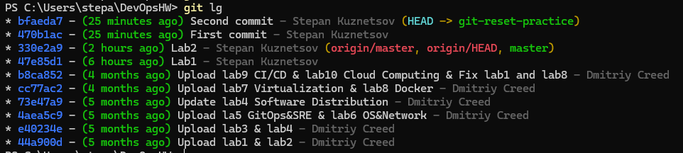
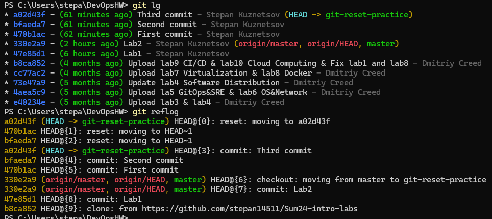

# Version Control

In this lab, you will learn about version control systems and their importance in collaborative software development. You will specifically focus on Git, one of the most widely used version control systems. Follow the tasks below to complete the lab assignment.

## Task 1: Understanding Version Control Systems

**Objective**: Understand how Git stores data.

1. **Create and Explore a Repository**:
   - Use the current repository and make a few commits.
   - Use `git cat-file` to inspect the contents of blobs, trees, and commits.

     -
       ```sh
       git cat-file -p <blob_hash>
       ```
       ```sh
       Here was printed the file content, too big to put here.
       ```
     -
       ```sh
       git cat-file -p <tree_hash>
       ```
       ```
       100644 blob ede183da8ef201e5f5737eea502edc77fd8a9bdc    README.md
       040000 tree 0ae774b180e2f58aeec5d66d1b3407c9c9cdd5cc    Solutions
       040000 tree b926a085a558de1861b03912b887736724b46292    images
       100644 blob 5738bc15a0416ad2624df13badfb235052777e79    index.html
       100644 blob 1dba99957c3bb59d40913294b83e40d5c38b6c0b    lab1.md
       100644 blob bf5553698071098c4cb429db6b14811d4316e822    lab10.md
       100644 blob 1b99cc0044f93f556a0f6a599c7edf2f33f4944a    lab2.md
       100644 blob 2f8463cc188ec6ca69ae7a0f98d38e132280becb    lab3.md
       100644 blob d66a6867f90e48f6f44d9d80821aa1d866a24882    lab4.md
       100644 blob 2ff5995a25b74c9c02a143c09a9601ce66001a9f    lab5.md
       100644 blob 793bb19cd158fae333205f524eba5adc16718c58    lab6.md
       100644 blob e3daa92d57248cbfb76d60de86f7b2e0da7e9a22    lab7.md
       100644 blob 0a88f0778b2534da7d9208198d1f2de010ca7459    lab8.md
       100644 blob 15ab5a07323c525efeda1f3ce737612852e02f2b    lab9.md
       ```
     - 
       ```sh
       git cat-file -p <commit_hash>
       ```
       ```sh
       tree 53fa5326dd73918edd7bfdd614c5c5725b86670e
       parent 47e85d158914eee28418c250e813cb59c26f5d21
       author Stepan Kuznetsov <Stepan14511@gmail.com> 1731404522 +0300
       committer Stepan Kuznetsov <Stepan14511@gmail.com> 1731404522 +0300
       gpgsig -----BEGIN SSH SIGNATURE-----
       sensored
       -----END SSH SIGNATURE-----

       Lab2
       ```

   - Create a `submission3.md` file.
   - Provide the output in the `submission3.md` file.

## Task 2: Practice with Git Reset Command

**Objective**: Practice using different ways to use the `git reset` command.

1. **Create a New Branch**:
   - Create a new branch named "git-reset-practice" in your Git repository.

     ```sh
     git checkout -b git-reset-practice
     ```
     ```sh
     Switched to a new branch 'git-reset-practice'
     ```

2. **Explore Advanced Reset and Reflog Usage**:
   - Create a series of commits.

     ```sh
     echo "First commit" > file.txt
     git add file.txt
     git commit -m "First commit"
     
     echo "Second commit" >> file.txt
     git add file.txt
     git commit -m "Second commit"
     
     echo "Third commit" >> file.txt
     git add file.txt
     git commit -m "Third commit"
     ```

      
      P.s.: style used by me could be found [here](https://stackoverflow.com/a/9074343)

   - Use `git reset --hard` and `git reset --soft` to navigate the commit history.

     ```sh
     git reset --soft HEAD~1
     ```
     
     ```sh
     git reset --hard HEAD~1
     ```
     
     

   - Use `git reflog` to recover commits after a reset.

     ```sh
     git reflog
     ```
     - ```sh
         470b1ac (HEAD -> git-reset-practice) HEAD@{0}: reset: moving to HEAD~1
         bfaeda7 HEAD@{1}: reset: moving to HEAD~1
         a02d43f HEAD@{2}: commit: Third commit
         bfaeda7 HEAD@{3}: commit: Second commit
         470b1ac (HEAD -> git-reset-practice) HEAD@{4}: commit: First commit
         330e2a9 (origin/master, origin/HEAD, master) HEAD@{5}: checkout: moving from master to git-reset-practice
         330e2a9 (origin/master, origin/HEAD, master) HEAD@{6}: commit: Lab2
         47e85d1 HEAD@{7}: commit: Lab1
         b8ca852 HEAD@{8}: clone: from https://github.com/stepan14511/Sum24-intro-labs
         ```
     ```sh
     git reset --hard <reflog_hash>
     ```
     
     

3. **Documentation**:

    `git chekout, add, commit` seems like something that doesn't need explanation.  
    Next step we made was `git reset --soft/hard`.  
    - `git reset --soft` - moves head to other commit. `HEAD~1` is a link to 1 commit before HEAD. Changing number we can go back on any amount of commits.
    - `git reset --hard` - do the same, but discards all the changes in the working directory or staging area. Should be used wisely or can lead to data loss.  

    Next step was `git reflog`. This command shows the logs, which save the commits, which were referenced by HEAD, branches, tags or other pointers. Most widely used to retrieve the hash of a deleted commit to recover it. But may be also used for some other tasks.  

    `git reset --hard <reflog_hash>` - command to point the HEAD to some specified commit. In our case we retrieved the hash of our Third commit and fixed the pointer of our HEAD.