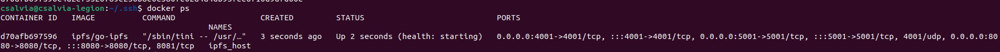
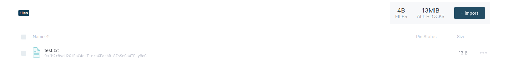
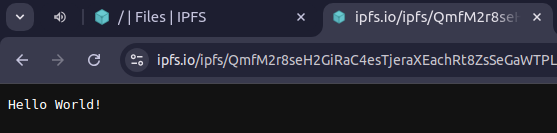
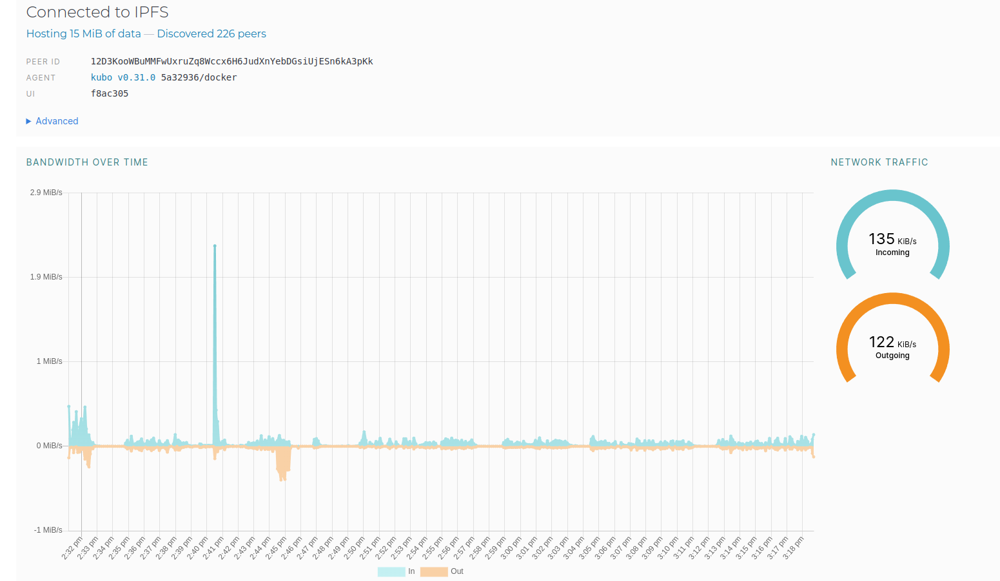

# Lab2

## Task 1

1. Pull and run container:
   

2. Upload the file:
   

3. get the file with [the link](https://ipfs.io/ipfs/QmfM2r8seH2GiRaC4esTjeraXEachRt8ZsSeGaWTPLyMoG) (hash **QmfM2r8seH2GiRaC4esTjeraXEachRt8ZsSeGaWTPLyMoG**)
   

4. Peers and bandwith
   

## Task 2

1. IPFS hash: [QmfM2r8seH2GiRaC4esTjeraXEachRt8ZsSeGaWTPLyMoG](https://ipfs.io/ipfs/QmfM2r8seH2GiRaC4esTjeraXEachRt8ZsSeGaWTPLyMoG)
2. site: [site url](https://bafybeidlwxayxdx5mosiqkuwzmjp4qkcu2d4c34uaee4br25b5i7uwsfai.ipfs.flk-ipfs.xyz/)