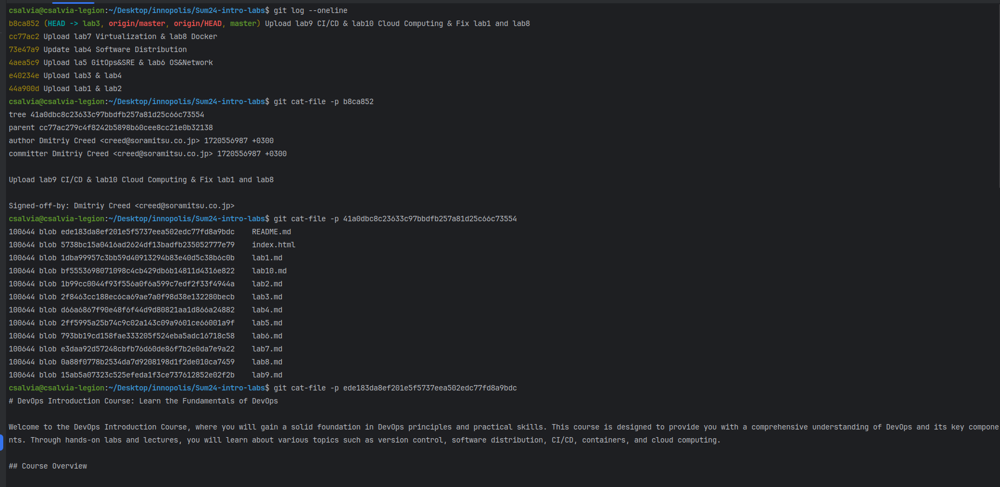
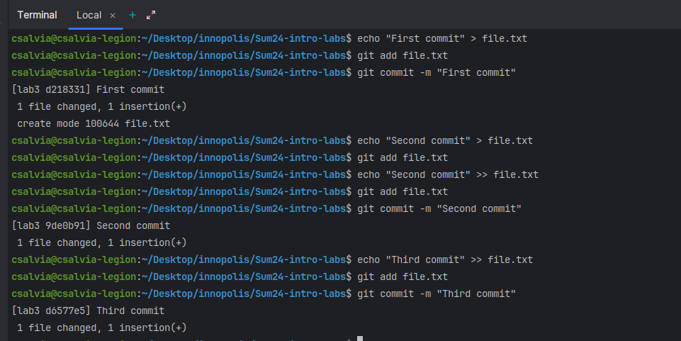
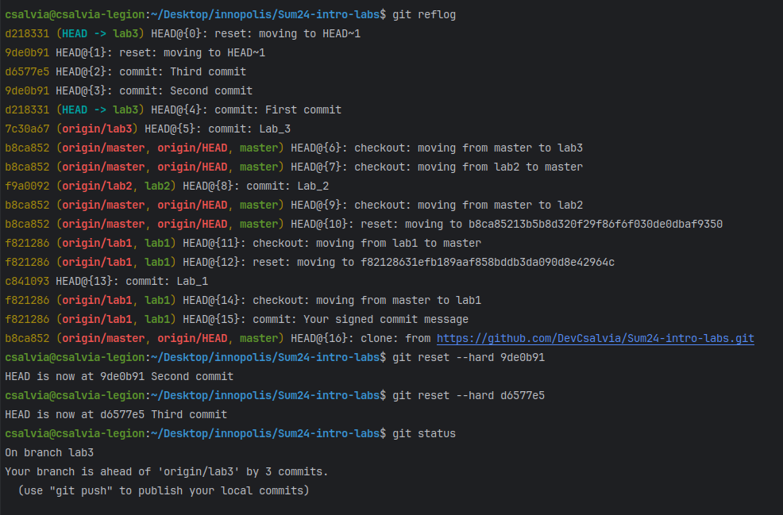

# Lab3

## Task 1

1. try `git cat-file`
   

## Task 2

1. make all commits:
    - file
    ```
    First commit
    Second commit
    Third commit
    ```
   
2. `git reflog`
   

3. Explanation
    - `git reset`:  Adjusts the position of HEAD (the current branch pointer) to a specified commit, with different effects depending on the mode selected:
        - **soft**: Moves HEAD to the target commit without affecting the staging area (index) or working directory (tree).
        - **mixed** (default): Moves HEAD and updates the staging area to match the target commit, without changing the working directory.
        - **hard**: Moves HEAD, updates the staging area, and modifies the working directory to match the target commit.
    - `git reflog`: Logs all movements of HEAD (commits, resets, checkouts, and rebases) on the current branch, allowing you to track recent changes to branch history. 
    - `HEAD~<int>` A reference to a commit relative to HEAD
    - `HEAD~3` Refers to three commits before HEAD
