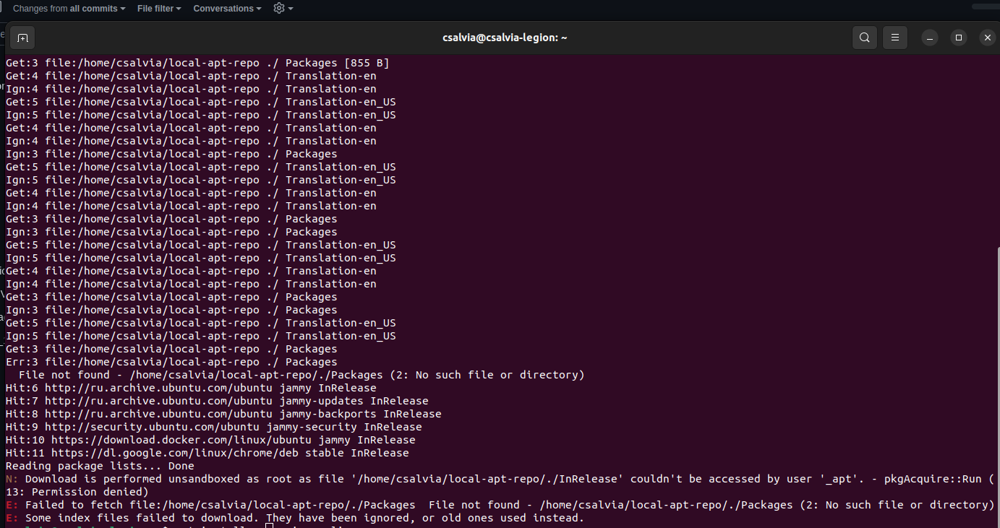

## Task 1

1. Generate a package index:
   
   

2. Add repo to the source list(This step fails on ubuntu 22.04LTS)
    ```bash
    echo "deb [trusted=yes] file:/home/csalvia/local-apt-repo/ ./" | sudo tee /etc/apt/sources.list.d/local-apt-repo.list
    sudo apt update
    ```
   
   
   