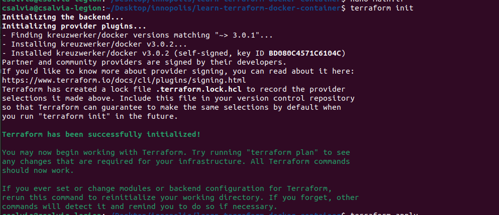
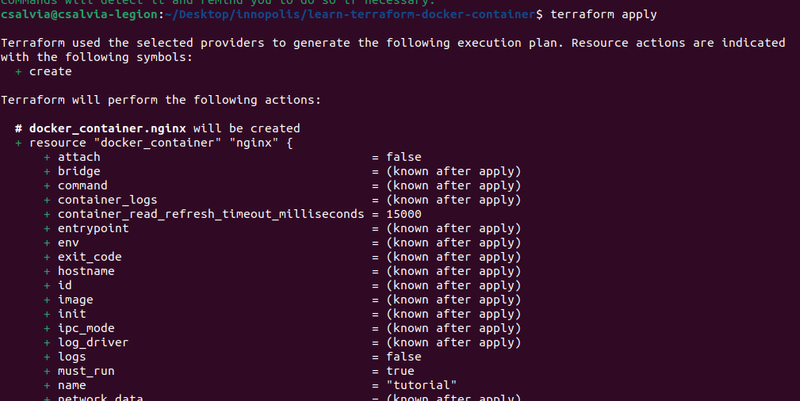
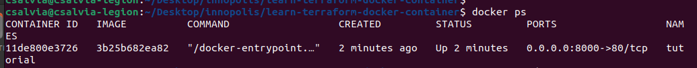
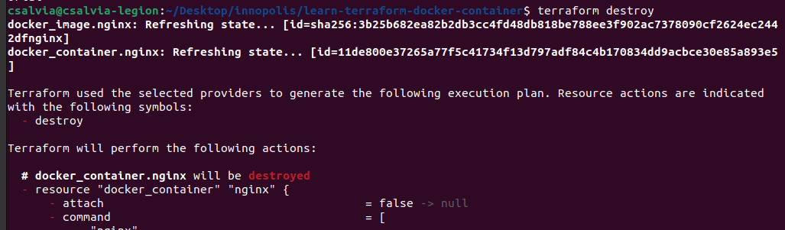

# Terraform

1. Create "main.tf"
    ```tf
    terraform {
        required_providers {
            docker = {
            source = "kreuzwerker/docker"
            version = "~> 3.0.1"
            }
        }
        }

        provider "docker" {}

        resource "docker_image" "nginx" {
        name         = "nginx:latest"
        keep_locally = false
        }

        resource "docker_container" "nginx" {
        image = docker_image.nginx.image_id
        name  = "tutorial"
        ports {
            internal = 80
            external = 8000
        }
    }
    ```

2. `terraform init` 


3. `terraform apply` 


4. `terraform destroy`

- terraform version: v1.9.8
