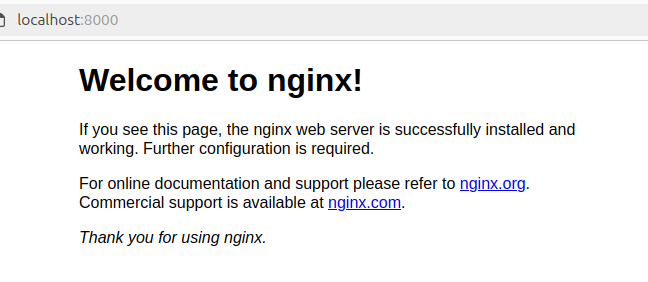

# Task 2
## Version of Terraform
Terraform v1.9.0
on linux_amd64
+ provider registry.terraform.io/kreuzwerker/docker v3.0.2

## Installation steps
1. Downloaded Terraform package for the AMD64 architecture from the official site https://developer.hashicorp.com/terraform/install
2. Unpacked the package
3. Ran the binary file using terminal: 
$ ./terraform

## Initialization and application
$ ../terraform init

$ ../terraform apply

Terraform used the selected providers to generate the following execution plan. Resource actions are
indicated with the following symbols:
  + create

Terraform will perform the following actions:

  # docker_container.nginx will be created
  + resource "docker_container" "nginx" {
      + attach                                      = false
      + bridge                                      = (known after apply)
      + command                                     = (known after apply)
      + container_logs                              = (known after apply)
      + container_read_refresh_timeout_milliseconds = 15000
      + entrypoint                                  = (known after apply)
      + env                                         = (known after apply)
      + exit_code                                   = (known after apply)
      + hostname                                    = (known after apply)
      + id                                          = (known after apply)
      + image                                       = (known after apply)
      + init                                        = (known after apply)
      + ipc_mode                                    = (known after apply)
      + log_driver                                  = (known after apply)
      + logs                                        = false
      + must_run                                    = true
      + name                                        = "lab5"
      + network_data                                = (known after apply)
      + read_only                                   = false
      + remove_volumes                              = true
      + restart                                     = "no"
      + rm                                          = false
      + runtime                                     = (known after apply)
      + security_opts                               = (known after apply)
      + shm_size                                    = (known after apply)
      + start                                       = true
      + stdin_open                                  = false
      + stop_signal                                 = (known after apply)
      + stop_timeout                                = (known after apply)
      + tty                                         = false
      + wait                                        = false
      + wait_timeout                                = 60

      + healthcheck (known after apply)

      + labels (known after apply)

      + ports {
          + external = 8000
          + internal = 80
          + ip       = "0.0.0.0"
          + protocol = "tcp"
        }
    }

  # docker_image.nginx will be created
  + resource "docker_image" "nginx" {
      + id           = (known after apply)
      + image_id     = (known after apply)
      + keep_locally = false
      + name         = "nginx"
      + repo_digest  = (known after apply)
    }

Plan: 2 to add, 0 to change, 0 to destroy.

Do you want to perform these actions?
  Terraform will perform the actions described above.
  Only 'yes' will be accepted to approve.

  Enter a value: yes

docker_image.nginx: Creating...
docker_image.nginx: Still creating... [10s elapsed]
docker_image.nginx: Creation complete after 13s [id=sha256:fffffc90d343cbcb01a5032edac86db5998c536cd0a366514121a45c6723765cnginx]
docker_container.nginx: Creating...
docker_container.nginx: Creation complete after 1s [id=074dc80e9bafcd566d57f5369e9ca3562cd2722d055580ba88e7b9fe22bde36a]

Apply complete! Resources: 2 added, 0 changed, 0 destroyed.

**Checking that the nginx container successfully ran.**
$ docker ps
CONTAINER ID   IMAGE          COMMAND                  CREATED          STATUS          PORTS                  NAMES
074dc80e9baf   fffffc90d343   "/docker-entrypoint.…"   14 minutes ago   Up 14 minutes   0.0.0.0:8000->80/tcp   lab5

**Checking nginx in browser is showed on the picture** 

## Change
**I changed external ports in main.tf file from 8000 to 8080 and applied the changes.**

$ ../terraform apply
docker_image.nginx: Refreshing state... [id=sha256:fffffc90d343cbcb01a5032edac86db5998c536cd0a366514121a45c6723765cnginx]
docker_container.nginx: Refreshing state... [id=074dc80e9bafcd566d57f5369e9ca3562cd2722d055580ba88e7b9fe22bde36a]

Terraform used the selected providers to generate the following execution plan. Resource actions are
indicated with the following symbols:
-/+ destroy and then create replacement

Terraform will perform the following actions:

  # docker_container.nginx must be replaced
-/+ resource "docker_container" "nginx" {
      + bridge                                      = (known after apply)
      ~ command                                     = [
          - "nginx",
          - "-g",
          - "daemon off;",
        ] -> (known after apply)
      + container_logs                              = (known after apply)
      - cpu_shares                                  = 0 -> null
      - dns                                         = [] -> null
      - dns_opts                                    = [] -> null
      - dns_search                                  = [] -> null
      ~ entrypoint                                  = [
          - "/docker-entrypoint.sh",
        ] -> (known after apply)
      ~ env                                         = [] -> (known after apply)
      + exit_code                                   = (known after apply)
      - group_add                                   = [] -> null
      ~ hostname                                    = "074dc80e9baf" -> (known after apply)
      ~ id                                          = "074dc80e9bafcd566d57f5369e9ca3562cd2722d055580ba88e7b9fe22bde36a" -> (known after apply)
      ~ init                                        = false -> (known after apply)
      ~ ipc_mode                                    = "private" -> (known after apply)
      ~ log_driver                                  = "json-file" -> (known after apply)
      - log_opts                                    = {} -> null
      - max_retry_count                             = 0 -> null
      - memory                                      = 0 -> null
      - memory_swap                                 = 0 -> null
        name                                        = "lab5"
      ~ network_data                                = [
          - {
              - gateway                   = "172.17.0.1"
              - global_ipv6_prefix_length = 0
              - ip_address                = "172.17.0.2"
              - ip_prefix_length          = 16
              - mac_address               = "02:42:ac:11:00:02"
              - network_name              = "bridge"
                # (2 unchanged attributes hidden)
            },
        ] -> (known after apply)
      - network_mode                                = "bridge" -> null # forces replacement
      - privileged                                  = false -> null
      - publish_all_ports                           = false -> null
      ~ runtime                                     = "runc" -> (known after apply)
      ~ security_opts                               = [] -> (known after apply)
      ~ shm_size                                    = 64 -> (known after apply)
      ~ stop_signal                                 = "SIGQUIT" -> (known after apply)
      ~ stop_timeout                                = 0 -> (known after apply)
      - storage_opts                                = {} -> null
      - sysctls                                     = {} -> null
      - tmpfs                                       = {} -> null
        # (20 unchanged attributes hidden)

      ~ healthcheck {
          + attach                                      = (known after apply)
          + bridge                                      = (known after apply)
          + cgroupns_mode                               = (known after apply)
          + command                                     = (known after apply)
          + container_logs                              = (known after apply)
          + container_read_refresh_timeout_milliseconds = (known after apply)
          + cpu_set                                     = (known after apply)
          + cpu_shares                                  = (known after apply)
          + destroy_grace_seconds                       = (known after apply)
          + dns                                         = (known after apply)
          + dns_opts                                    = (known after apply)
          + dns_search                                  = (known after apply)
          + domainname                                  = (known after apply)
          + entrypoint                                  = (known after apply)
          + env                                         = (known after apply)
          + exit_code                                   = (known after apply)
          + gpus                                        = (known after apply)
          + group_add                                   = (known after apply)
          + hostname                                    = (known after apply)
          + id                                          = (known after apply)
          + image                                       = (known after apply)
          + init                                        = (known after apply)
          + ipc_mode                                    = (known after apply)
          + log_driver                                  = (known after apply)
          + log_opts                                    = (known after apply)
          + logs                                        = (known after apply)
          + max_retry_count                             = (known after apply)
          + memory                                      = (known after apply)
          + memory_swap                                 = (known after apply)
          + must_run                                    = (known after apply)
          + name                                        = (known after apply)
          + network_data                                = (known after apply)
          + network_mode                                = (known after apply)
          + pid_mode                                    = (known after apply)
          + privileged                                  = (known after apply)
          + publish_all_ports                           = (known after apply)
          + read_only                                   = (known after apply)
          + remove_volumes                              = (known after apply)
          + restart                                     = (known after apply)
          + rm                                          = (known after apply)
          + runtime                                     = (known after apply)
          + security_opts                               = (known after apply)
          + shm_size                                    = (known after apply)
          + start                                       = (known after apply)
          + stdin_open                                  = (known after apply)
          + stop_signal                                 = (known after apply)
          + stop_timeout                                = (known after apply)
          + storage_opts                                = (known after apply)
          + sysctls                                     = (known after apply)
          + tmpfs                                       = (known after apply)
          + tty                                         = (known after apply)
          + user                                        = (known after apply)
          + userns_mode                                 = (known after apply)
          + wait                                        = (known after apply)
          + wait_timeout                                = (known after apply)
          + working_dir                                 = (known after apply)
        } -> (known after apply)

      ~ labels {
          + attach                                      = (known after apply)
          + bridge                                      = (known after apply)
          + cgroupns_mode                               = (known after apply)
          + command                                     = (known after apply)
          + container_logs                              = (known after apply)
          + container_read_refresh_timeout_milliseconds = (known after apply)
          + cpu_set                                     = (known after apply)
          + cpu_shares                                  = (known after apply)
          + destroy_grace_seconds                       = (known after apply)
          + dns                                         = (known after apply)
          + dns_opts                                    = (known after apply)
          + dns_search                                  = (known after apply)
          + domainname                                  = (known after apply)
          + entrypoint                                  = (known after apply)
          + env                                         = (known after apply)
          + exit_code                                   = (known after apply)
          + gpus                                        = (known after apply)
          + group_add                                   = (known after apply)
          + hostname                                    = (known after apply)
          + id                                          = (known after apply)
          + image                                       = (known after apply)
          + init                                        = (known after apply)
          + ipc_mode                                    = (known after apply)
          + log_driver                                  = (known after apply)
          + log_opts                                    = (known after apply)
          + logs                                        = (known after apply)
          + max_retry_count                             = (known after apply)
          + memory                                      = (known after apply)
          + memory_swap                                 = (known after apply)
          + must_run                                    = (known after apply)
          + name                                        = (known after apply)
          + network_data                                = (known after apply)
          + network_mode                                = (known after apply)
          + pid_mode                                    = (known after apply)
          + privileged                                  = (known after apply)
          + publish_all_ports                           = (known after apply)
          + read_only                                   = (known after apply)
          + remove_volumes                              = (known after apply)
          + restart                                     = (known after apply)
          + rm                                          = (known after apply)
          + runtime                                     = (known after apply)
          + security_opts                               = (known after apply)
          + shm_size                                    = (known after apply)
          + start                                       = (known after apply)
          + stdin_open                                  = (known after apply)
          + stop_signal                                 = (known after apply)
          + stop_timeout                                = (known after apply)
          + storage_opts                                = (known after apply)
          + sysctls                                     = (known after apply)
          + tmpfs                                       = (known after apply)
          + tty                                         = (known after apply)
          + user                                        = (known after apply)
          + userns_mode                                 = (known after apply)
          + wait                                        = (known after apply)
          + wait_timeout                                = (known after apply)
          + working_dir                                 = (known after apply)
        } -> (known after apply)

      ~ ports {
          ~ external = 8000 -> 8080 # forces replacement
            # (3 unchanged attributes hidden)
        }
    }

Plan: 1 to add, 0 to change, 1 to destroy.

Do you want to perform these actions?
  Terraform will perform the actions described above.
  Only 'yes' will be accepted to approve.

  Enter a value: yes

docker_container.nginx: Destroying... [id=074dc80e9bafcd566d57f5369e9ca3562cd2722d055580ba88e7b9fe22bde36a]
docker_container.nginx: Destruction complete after 1s
docker_container.nginx: Creating...
docker_container.nginx: Creation complete after 0s [id=0d20be677243be5886e96f7846a2916f4abe81bfb5d1cd5299e6a95d4a491dd4]

Apply complete! Resources: 1 added, 0 changed, 1 destroyed.

## Destroy
$ ../terraform destroy
docker_image.nginx: Refreshing state... [id=sha256:fffffc90d343cbcb01a5032edac86db5998c536cd0a366514121a45c6723765cnginx]
docker_container.nginx: Refreshing state... [id=0d20be677243be5886e96f7846a2916f4abe81bfb5d1cd5299e6a95d4a491dd4]

Terraform used the selected providers to generate the following execution plan. Resource actions are
indicated with the following symbols:
  - destroy

Terraform will perform the following actions:

  # docker_container.nginx will be destroyed
  - resource "docker_container" "nginx" {
      - attach                                      = false -> null
      - command                                     = [
          - "nginx",
          - "-g",
          - "daemon off;",
        ] -> null
      - container_read_refresh_timeout_milliseconds = 15000 -> null
      - cpu_shares                                  = 0 -> null
      - dns                                         = [] -> null
      - dns_opts                                    = [] -> null
      - dns_search                                  = [] -> null
      - entrypoint                                  = [
          - "/docker-entrypoint.sh",
        ] -> null
      - env                                         = [] -> null
      - group_add                                   = [] -> null
      - hostname                                    = "0d20be677243" -> null
      - id                                          = "0d20be677243be5886e96f7846a2916f4abe81bfb5d1cd5299e6a95d4a491dd4" -> null
      - image                                       = "sha256:fffffc90d343cbcb01a5032edac86db5998c536cd0a366514121a45c6723765c" -> null
      - init                                        = false -> null
      - ipc_mode                                    = "private" -> null
      - log_driver                                  = "json-file" -> null
      - log_opts                                    = {} -> null
      - logs                                        = false -> null
      - max_retry_count                             = 0 -> null
      - memory                                      = 0 -> null
      - memory_swap                                 = 0 -> null
      - must_run                                    = true -> null
      - name                                        = "lab5" -> null
      - network_data                                = [
          - {
              - gateway                   = "172.17.0.1"
              - global_ipv6_prefix_length = 0
              - ip_address                = "172.17.0.2"
              - ip_prefix_length          = 16
              - mac_address               = "02:42:ac:11:00:02"
              - network_name              = "bridge"
                # (2 unchanged attributes hidden)
            },
        ] -> null
      - network_mode                                = "bridge" -> null
      - privileged                                  = false -> null
      - publish_all_ports                           = false -> null
      - read_only                                   = false -> null
      - remove_volumes                              = true -> null
      - restart                                     = "no" -> null
      - rm                                          = false -> null
      - runtime                                     = "runc" -> null
      - security_opts                               = [] -> null
      - shm_size                                    = 64 -> null
      - start                                       = true -> null
      - stdin_open                                  = false -> null
      - stop_signal                                 = "SIGQUIT" -> null
      - stop_timeout                                = 0 -> null
      - storage_opts                                = {} -> null
      - sysctls                                     = {} -> null
      - tmpfs                                       = {} -> null
      - tty                                         = false -> null
      - wait                                        = false -> null
      - wait_timeout                                = 60 -> null
        # (7 unchanged attributes hidden)

      - ports {
          - external = 8080 -> null
          - internal = 80 -> null
          - ip       = "0.0.0.0" -> null
          - protocol = "tcp" -> null
        }
    }

  # docker_image.nginx will be destroyed
  - resource "docker_image" "nginx" {
      - id           = "sha256:fffffc90d343cbcb01a5032edac86db5998c536cd0a366514121a45c6723765cnginx" -> null
      - image_id     = "sha256:fffffc90d343cbcb01a5032edac86db5998c536cd0a366514121a45c6723765c" -> null
      - keep_locally = false -> null
      - name         = "nginx" -> null
      - repo_digest  = "nginx@sha256:b31263533dda53e7d9762dce38da81452ec0a959a1f714859466bc4c5e9cbbae" -> null
    }

Plan: 0 to add, 0 to change, 2 to destroy.

Do you really want to destroy all resources?
  Terraform will destroy all your managed infrastructure, as shown above.
  There is no undo. Only 'yes' will be accepted to confirm.

  Enter a value: yes

docker_container.nginx: Destroying... [id=0d20be677243be5886e96f7846a2916f4abe81bfb5d1cd5299e6a95d4a491dd4]
docker_container.nginx: Destruction complete after 0s
docker_image.nginx: Destroying... [id=sha256:fffffc90d343cbcb01a5032edac86db5998c536cd0a366514121a45c6723765cnginx]
docker_image.nginx: Destruction complete after 0s

Destroy complete! Resources: 2 destroyed.

**Then check that the container was indeed destroyed:**
user@user-VirtualBox:~/Downloads/Telegram Desktop/terraform_1.9.0_linux_amd64/lab5$ docker ps
CONTAINER ID   IMAGE     COMMAND   CREATED   STATUS    PORTS     NAMES

## Challenges
The only challenge I met is the necessity to run VPN to be able to use Terraform. 

