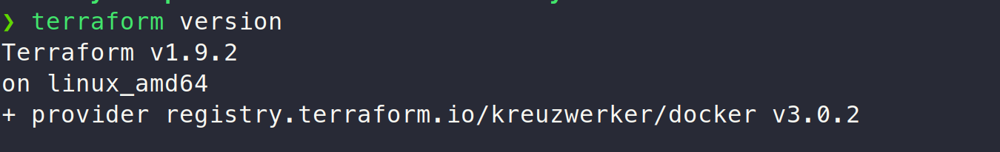
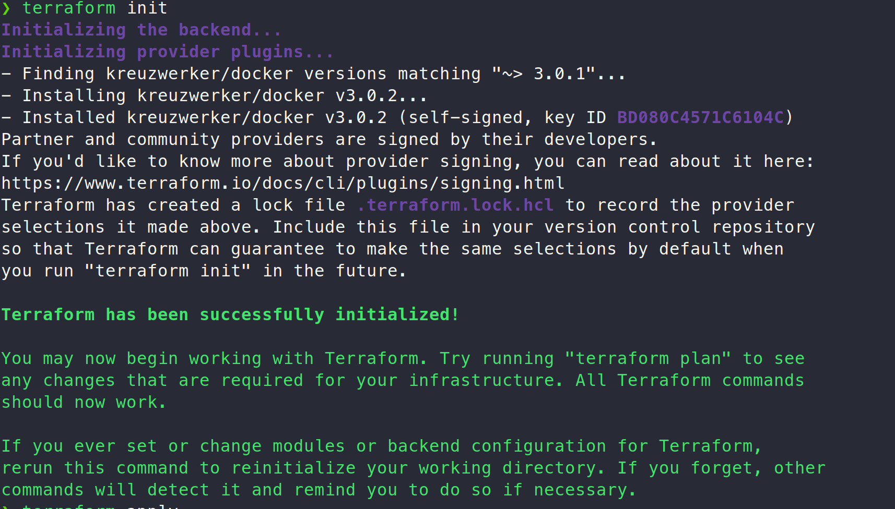
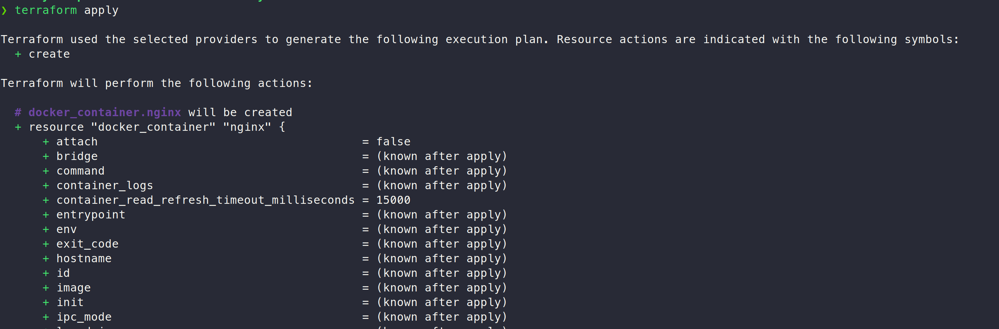
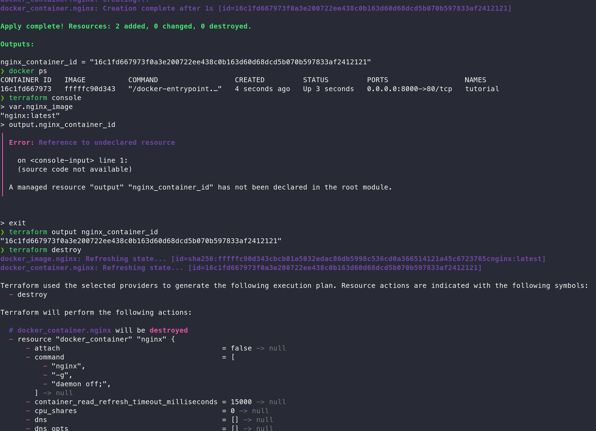

# Terraform and Nginx

## Terraform version



## Terraform installation

I activated a VPN and installed following the official tutorial using apt (https://developer.hashicorp.com/terraform/tutorials/docker-get-started/install-cli)

Using the following commands

```bash
sudo apt-get update && sudo apt-get install -y gnupg software-properties-common
wget -O- https://apt.releases.hashicorp.com/gpg | \
gpg --dearmor | \
sudo tee /usr/share/keyrings/hashicorp-archive-keyring.gpg > /dev/null

echo "deb [signed-by=/usr/share/keyrings/hashicorp-archive-keyring.gpg] \
https://apt.releases.hashicorp.com $(lsb_release -cs) main" | \
sudo tee /etc/apt/sources.list.d/hashicorp.list

sudo apt update

sudo apt-get install terraform

# For autocomplete
terraform -install-autocomplete
```


## Sample Nginx infrastructure

I added the `main.tf`, `variables.tf`, and `outputs.tf` files, then executed the following in the same directory to init, apply the configuration, verify that it is running and check variables and outputs, and finally destroy it.





