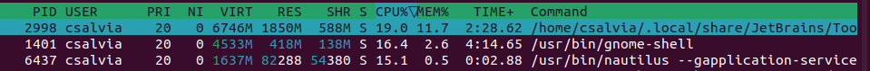
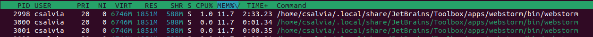
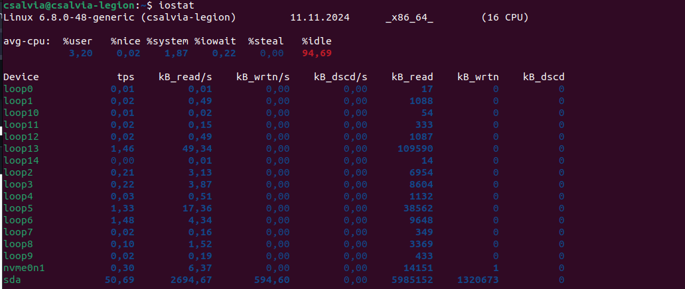
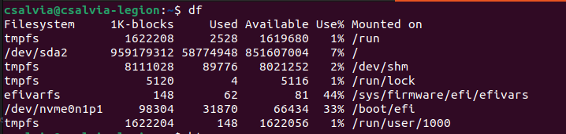

## Task 1

1. install htop and iostat
2. `htop` 
    - top 3 CPU utilisation: webstorm, gnome-shell, nautilus
    - top 3 MEM utilization: webstorm, telegram, chrome
    - top 3 IO utilisation: chrome, vscode (none of other apps used IO at all in a minute)
3. `iostat`
   
4. `df`
   
5. `du`
   