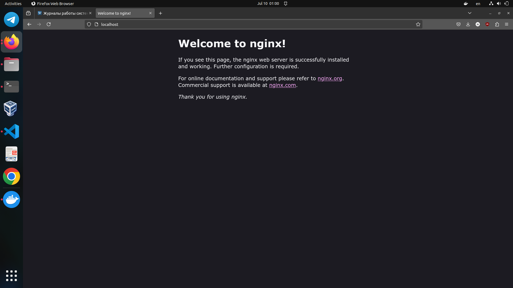

# Task 2

## Create Image Archive:

```shell
aslan@aslan-X756UXM:~$ docker save -o ubuntu_image.tar ubuntu:latest
aslan@aslan-X756UXM:~$ ls
 Android                 go                   PycharmProjects
 AndroidStudioProjects   hs_err_pid8110.log   snap
 coursier                IdeaProjects         target
 custom-repo             Minecraft            Templates
 Desktop                 Music                tmp
 Documents               Packages             ubuntu_image.tar
 Downloads               Pictures             Videos
 eclipse-workspace       Postman             'VirtualBox VMs'
 Games                   project              www.google.com
 gems                    Public
```

**Compare the size of the archive file with the size of the original image.**

```shell
aslan@aslan-X756UXM:~$ docker images ubuntu:latest
REPOSITORY   TAG       IMAGE ID       CREATED       SIZE
ubuntu       latest    35a88802559d   4 weeks ago   78.1MB
aslan@aslan-X756UXM:~$ ls -lh ubuntu_image.tar
-rw------- 1 aslan aslan 77M Jul 10 00:49 ubuntu_image.tar
```
The difference between the sizes of the original image (78.1MB) and the archive file (77MB) is relatively small. But still archived image's size is less.

## Run Nginx Container:

```shell
aslan@aslan-X756UXM:~$ sudo systemctl stop nginx.service 

aslan@aslan-X756UXM:~$ docker run -d -p 80:80 --name nginx_container nginx
docker: Error response from daemon: Conflict. The container name "/nginx_container" is already in use by container "211c4043396262acda6e7f19f6aff53dcfcc738de6bc92eb0024cd379b29e169". You have to remove (or rename) that container to be able to reuse that name.
See 'docker run --help'.
aslan@aslan-X756UXM:~$ docker ps
CONTAINER ID   IMAGE     COMMAND                  CREATED              STATUS         PORTS                NAMES
211c40433962   nginx     "/docker-entrypoint.…"   About a minute ago   Up 2 seconds   0.0.0.0:80->80/tcp   nginx_container
```


## Create HTML File:
```shell
aslan@aslan-X756UXM:/mnt/sdb1/VSProjects/Sum24-intro-labs$ docker cp index.html nginx_container:/usr/share/nginx/html/index.html
Successfully copied 2.05kB to nginx_container:/usr/share/nginx/html/index.html
```

## Create Custom Image:
```shell
aslan@aslan-X756UXM:~$ docker commit nginx_container my_website:latest
sha256:a76d208e49d6a01274436329c481e77dae2d26571d324dd31871d6b448d39363
```
## Remove Original Container:
```shell
aslan@aslan-X756UXM:~$ docker rm -f nginx_container
nginx_container
```
## Create New Container:
```shell
aslan@aslan-X756UXM:~$ docker run -d -p 80:80 --name my_website_container my_website:latest
c7bce1d989ded47cdbca00f178e2ca8c78505f2186a854a41549ed2c27460cde
```
## Test Web Server:
```shell
aslan@aslan-X756UXM:~$ curl http://127.0.0.1:80
<!DOCTYPE html> 
<!-- You can modify it as you wish -->
<html>
<head>
    <title>My Simple Website</title>
</head>
<body>
    <h1>Welcome to My Simple Website</h1>
    <p>This is the content of the folder.</p>
    <ul>
        <li>File 1</li>
        <li>File 2</li>
        <li>File 3</li>
    </ul>
</body>
</html>aslan@aslan-X756UXM:~$ 
```
## Analyze Image Changes
```shell
aslan@aslan-X756UXM:~$ docker diff my_website_container
C /etc
C /etc/nginx
C /etc/nginx/conf.d
C /etc/nginx/conf.d/default.conf
C /run
C /run/nginx.pid
```
Since we added the index.html file as the welcome page, it's expected that changes affected Nginx's configuration file (/etc/nginx/conf.d/default.conf) and its related directories. The /run/nginx.pid file reflects updates to the Nginx process ID, which is normal when the server starts or restarts inside the Docker container.