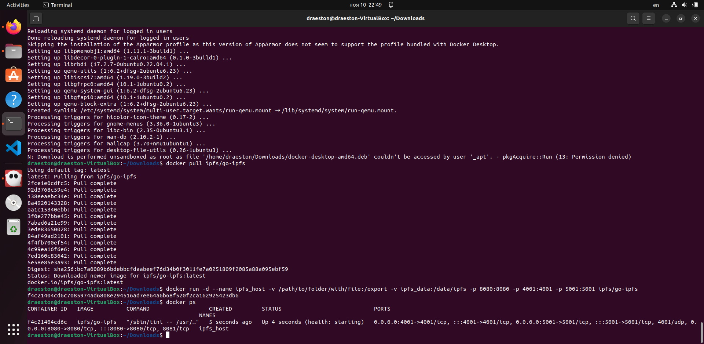
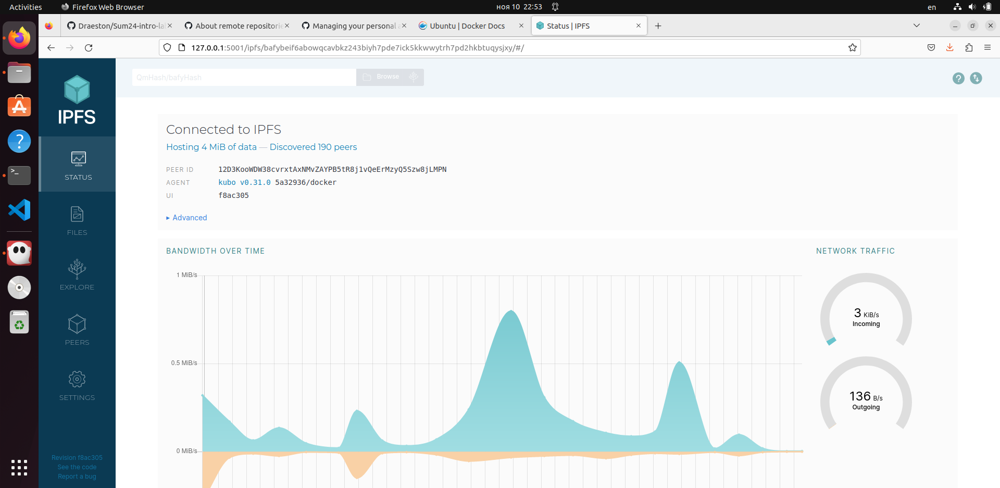
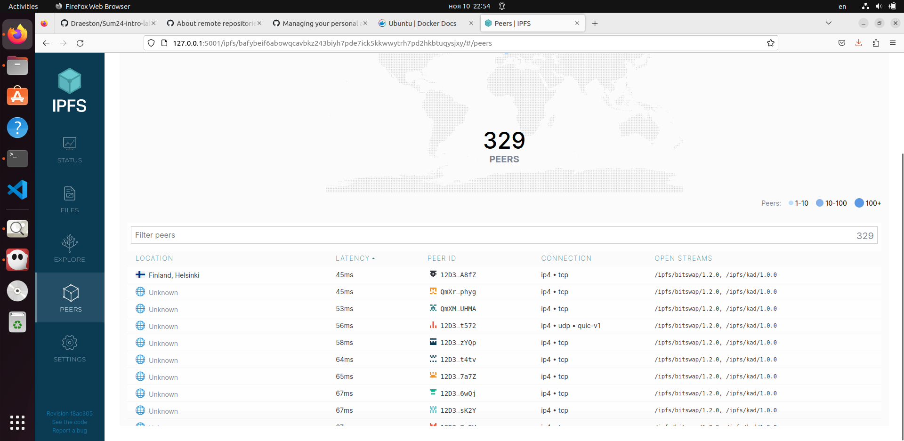
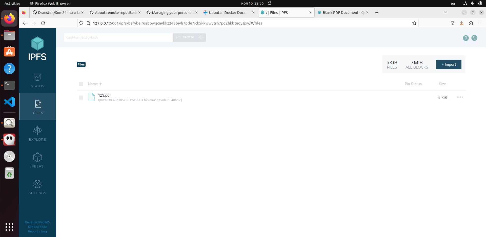

## Task 1

### Docker



### Bandwidth



### Peers



### Hash

I've uploaded blank PDF file with hash of ```QmRM9uHF4EqTB5xFUJYwSKXTEhkwoawigsvnhR5C4Ub5vj```.

Checked on https://ipfs.io/ipfs/QmRM9uHF4EqTB5xFUJYwSKXTEhkwoawigsvnhR5C4Ub5vj



## Task 2

https://incalculable-ice-substantial.on-fleek.app/

Hash: ```bafybeic73agkthlrs2ugaiy7pvxcgybashwu4nm6i4zkysutzzs7nrqv3u```