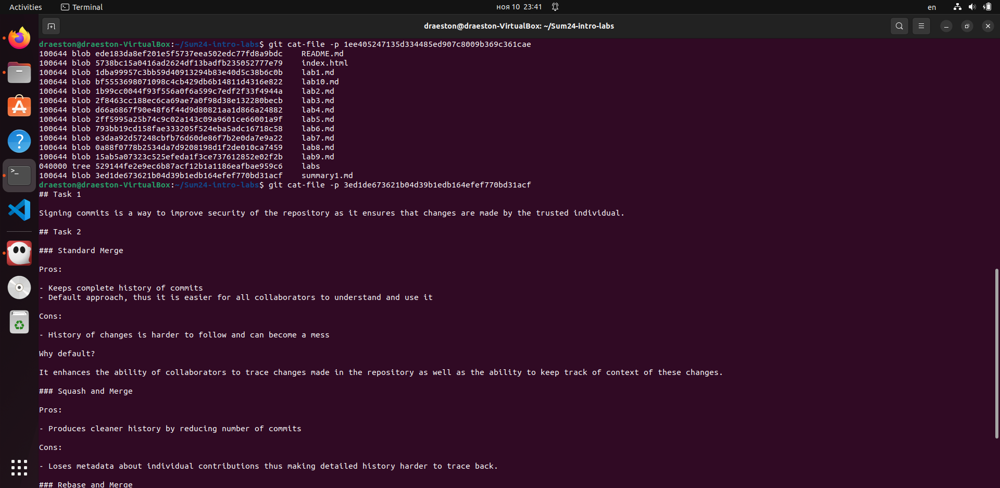
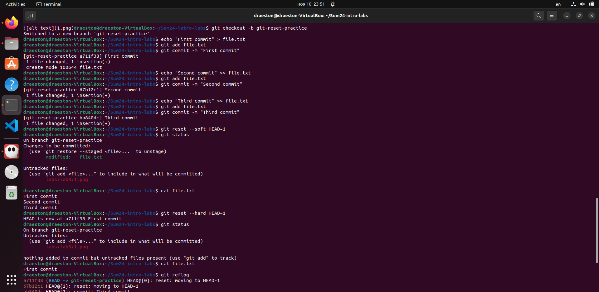
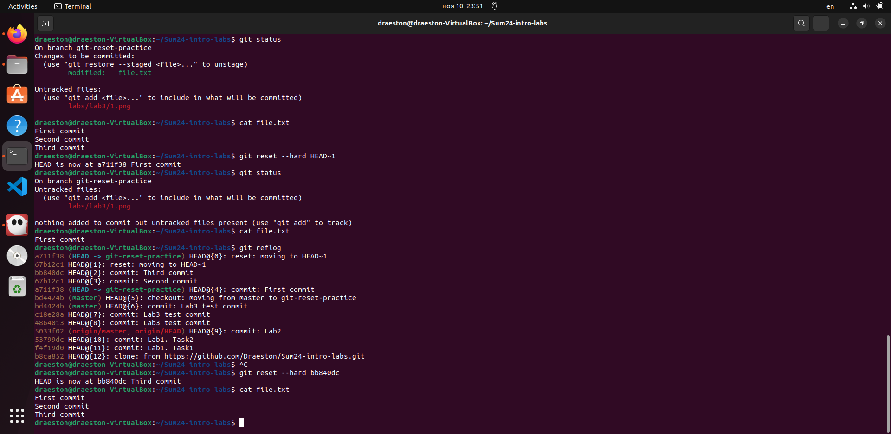

## Task 1



## Task 2




As you can see on screenshot, first of all I made all three test commits, then made soft reset, which has removed the commit but left changes made, then I did hard reset, which also reverted the changes, so we're left only with the changes made in 1st commit. After that, ```reflog``` command has let me to get hash of the 3rd commit and revert to it by 