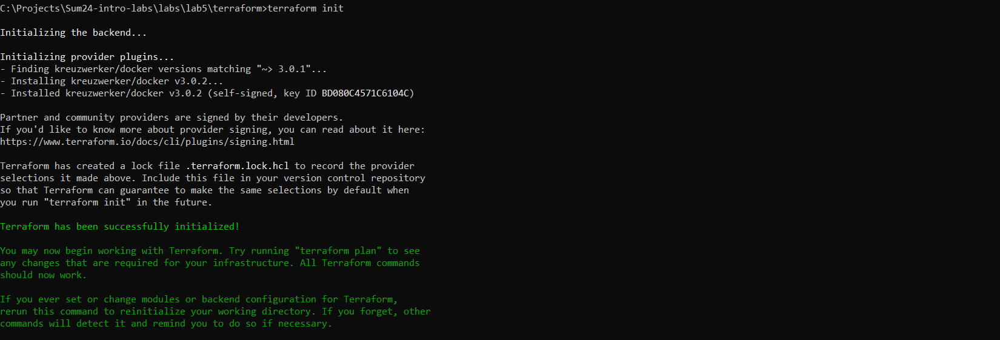
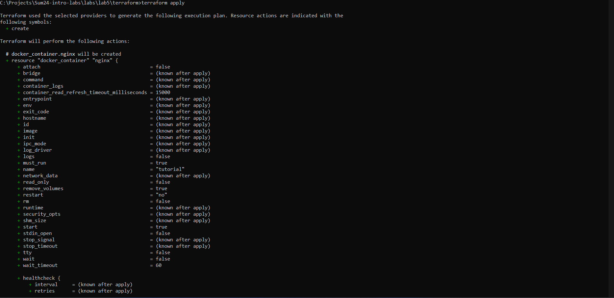
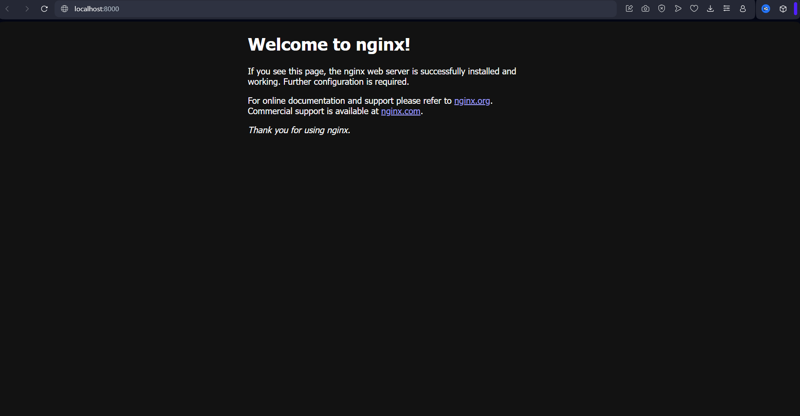

## Task 2

I have installed terraform with Chocolatey that I had pre-installed ```choco terraform```, then I copied ```main.tf``` file from the tutorial.

After that, I executed ```terraform init```



Then, ```terraform apply```



Then, I checked that website was running



And lastly, I destroyed infrastructure with ```terraform destroy```

My main challenge was that it refused to connect with the server at first, until I used VPN, spent considerable amount of time on that issue.