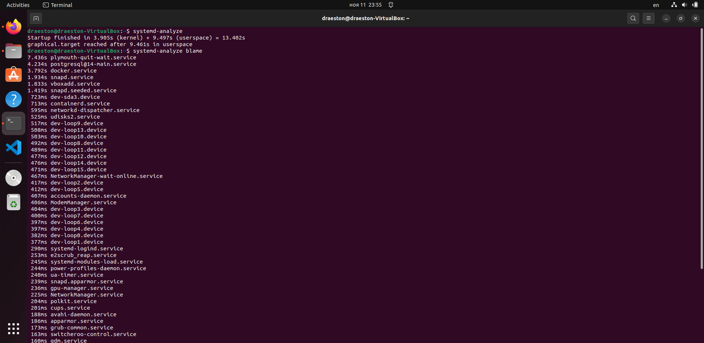
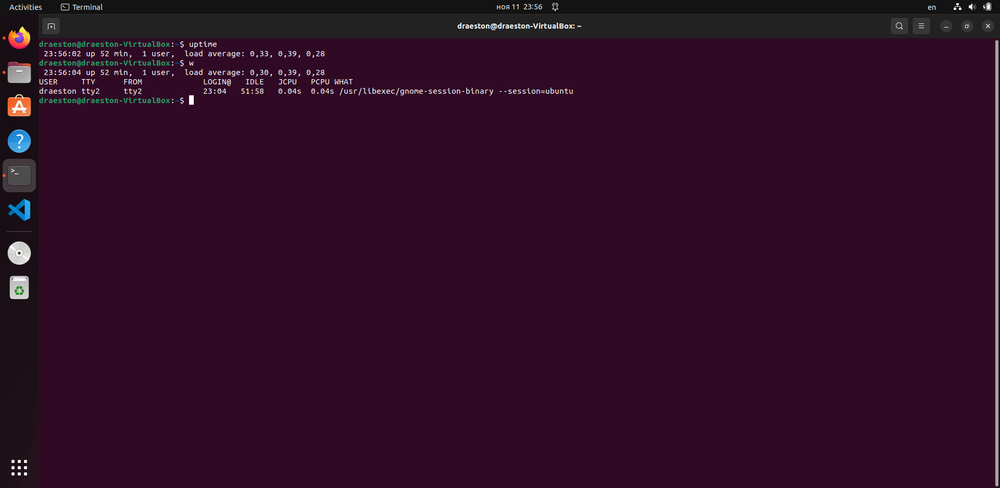
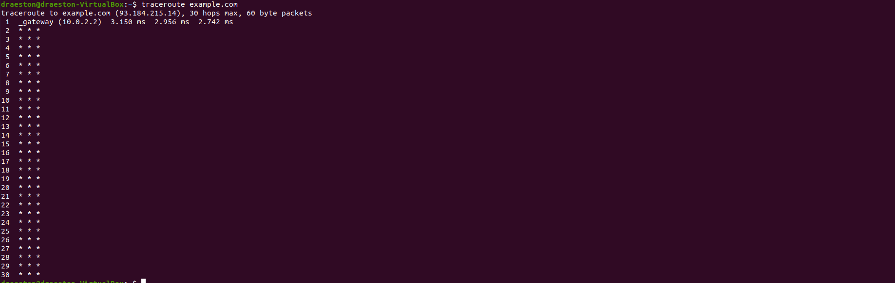
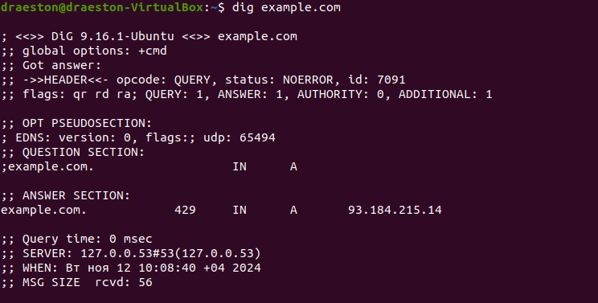

## Task 1

1. Analyze System Boot Time:



Using ```systemd-analyze``` we can see how much time did it take for system to boot, adding ```blame``` allows us to see that ```plymouth-quit-wait``` service takes longest to boot.

2. Check System Load and Uptime:



From next commands we can see that system was up for single main user for ~1 hour.

## Task 2

1. Traceroute:



2. Dig:



With this command we've found out that ip address of example.com is 93.184.215.14