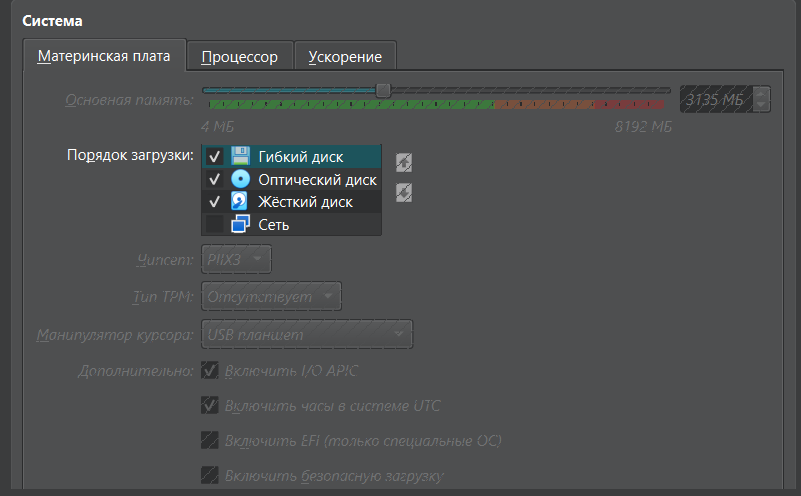

## Task 1
1. Version


2. VM was created with following options


3. Running VM


4. VM parameters



## Task 2

1. CPU info, ```lscpu```


2. Memory info, ```free -h```


3. Network info, ```ip address```


4. OS info, ```lb_release -a```

