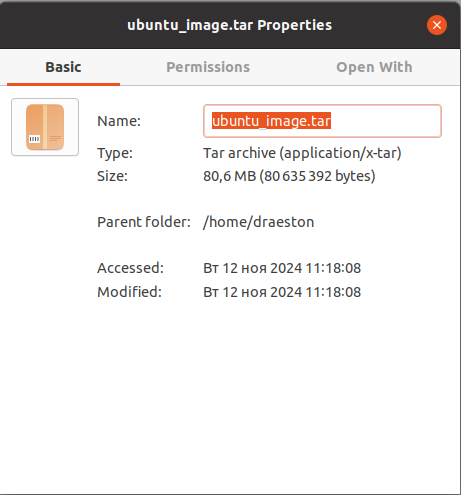
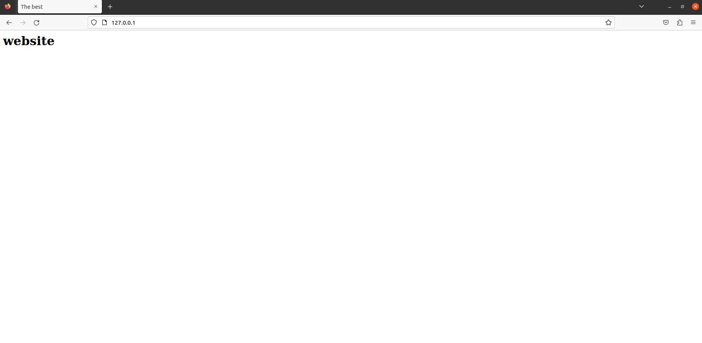

## Task 1

1. List Containers, ```docker ps -a```


2. Pull Latest Ubuntu Image, ```docker pull ubuntu:latest```


3. Run Container, ```docker run -it --name ubuntu_container ubuntu:latest```


4. Remove Image, ```docker rmi ubuntu:latest```


Image is not removed because there is container running based on this image

## Task 2

1. Create Image Archive, ```docker save -o ubuntu_image.tar ubuntu:latest```


Comparing sizes:




Archive is a bit bigger than image, possibly due to additional metadata stored

2. Run Nginx Container, ```docker run -d -p 80:80 --name nginx_container nginx```


3. Create HTML File, ```docker cp index.html nginx_container:/usr/share/nginx/html/index.html```
4. Create Custom Image, ```docker commit nginx_container my_website:latest```
5. Remove Original Container, ```docker rm -f nginx_container```


6. Create New Container, ```docker run -d -p 80:80 --name my_website_container my_website:latest```
7. Test Web Server, ```curl http://127.0.0.1:80```


Also, check that in the browser



8. Analyze Image Changes, ```docker diff my_website_container```


All of these files displayed are changed, they all seem like nginx files that change during the runtime.