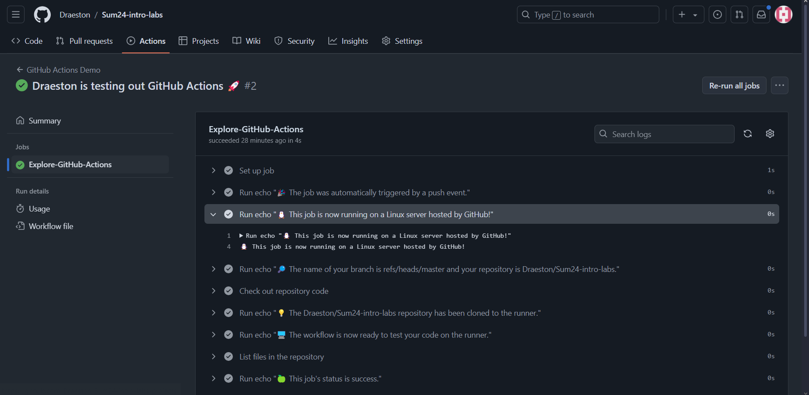

## Task 1

1. Read the Official Guide

Github Actions allows us to manage and automate various steps in software development, such as testing and deployment. It follow workflow files that are description of pipeline of jobs needed to be done in order to correctly perform all necessary actions.

I added standard workflow given in the quickstart guide in GitHub, that was the result of 1 run.


2. Observe the Workflow Execution

Then I added new commit which also worked a expected, without any errors.



## Task 2

1. Configure a Manual Trigger

At this step, I basically added ```on: [push,workflow_dispatch]``` line instead of ```on: [push]``` to my .yml file, thus allowing workflow to be manually triggered.

2. Gather System Information

Here, I added a list of commands that prints different system information into the console.

