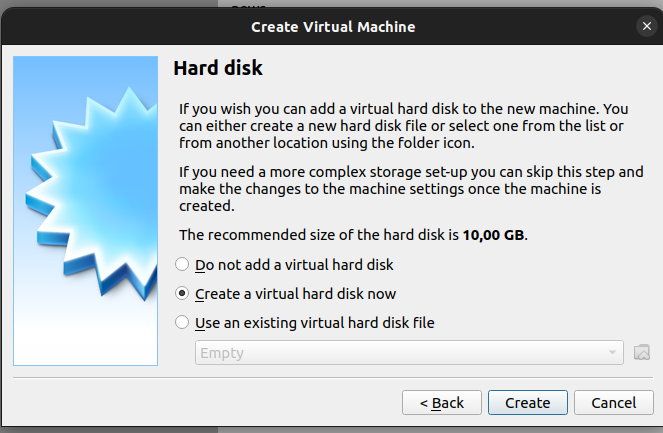
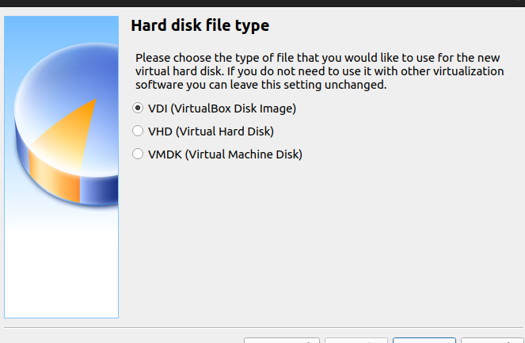
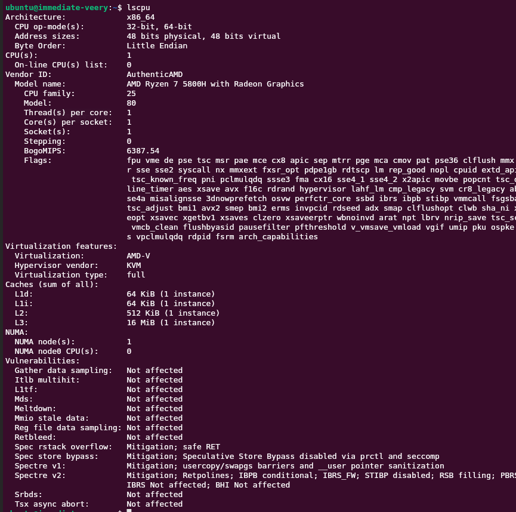
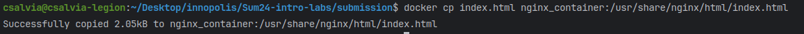

# Lab7

## Task 1
1. install VirtualBox
    - virtualbox version
        ```
        VirtualBox Graphical User Interface Version 6.1.50_Ubuntu r161033
         © 2004-2024 Oracle Corporation (Qt5.15.3)
        ```
2. ubuntu installation
   
   
   
   
   
   

## Task 2
1. cpu
   `lscpu`
   

2. memory
   `free -h`
   

3. network
   `ip a`
   

4. OS
   