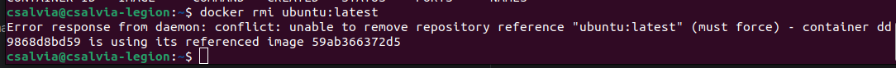
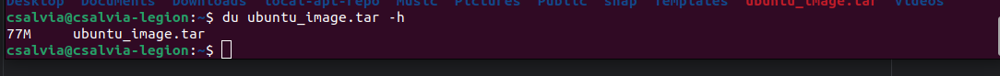
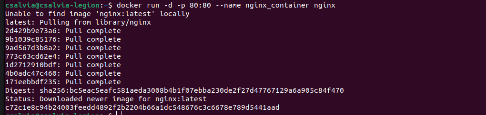
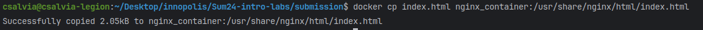

# Lab 8

## Task 1

1. To see all containers, use the command `docker ps -a`.
   

2. Pull an image from Docker Hub.
   

3. Start a new Ubuntu container with `docker run -it --name ubuntu_container ubuntu:latest`.
   

4. Attempt to delete the image.
   

## Task 2

1. Create an archive of the Ubuntu image.
    

2. Launch an Nginx container with a custom index page.
    - `docker run -d -p 80:80 --name nginx_container nginx`
    - 
    - 
    - 
    - 

3. Save the current state of the Nginx container with `docker commit nginx_container my_website:latest`.
    - 

4. Stop and remove the current Nginx container:
    - `docker stop nginx_container && docker rm nginx_container`
    - 

5. Run the saved container image and test it with `curl`.
    - `docker run -d -p 80:80 --name my_website_container my_website:latest`
    - `curl localhost`
    - 
    - 

6. Use `docker diff` to view file changes from the base image in the container.
   
    - `docker diff` displays modifications made to files since the original image build.
