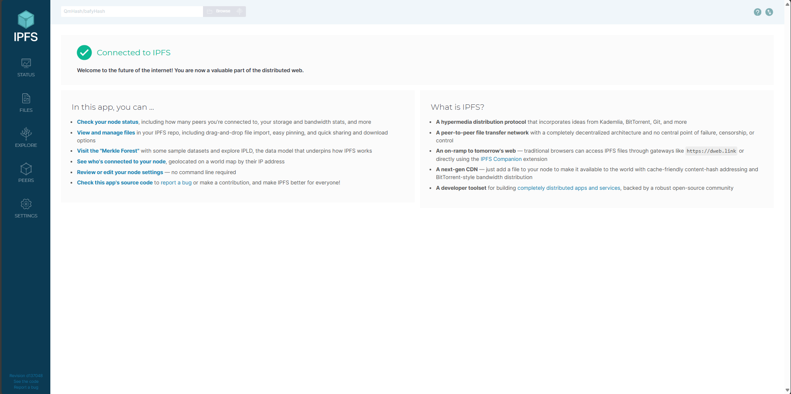
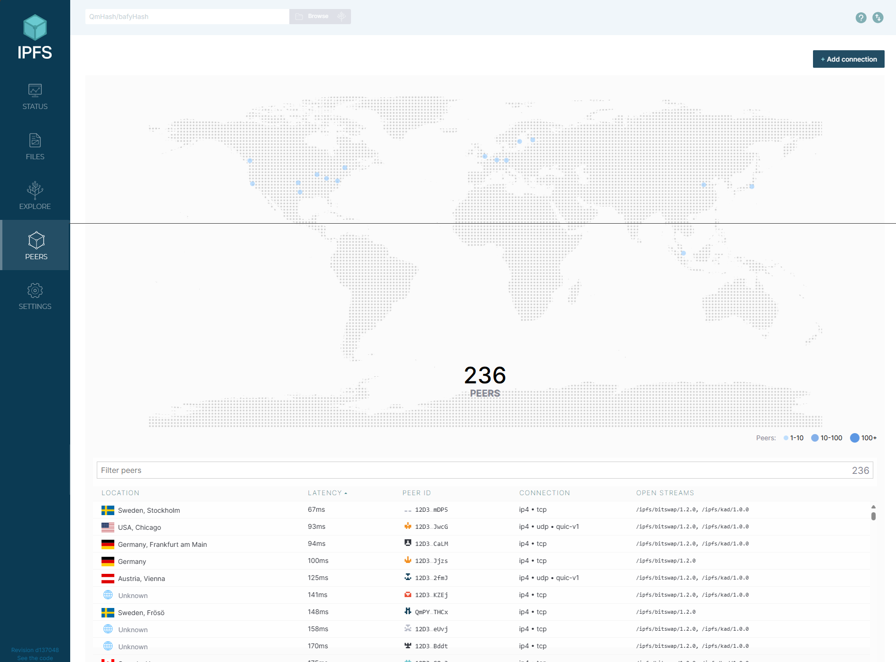
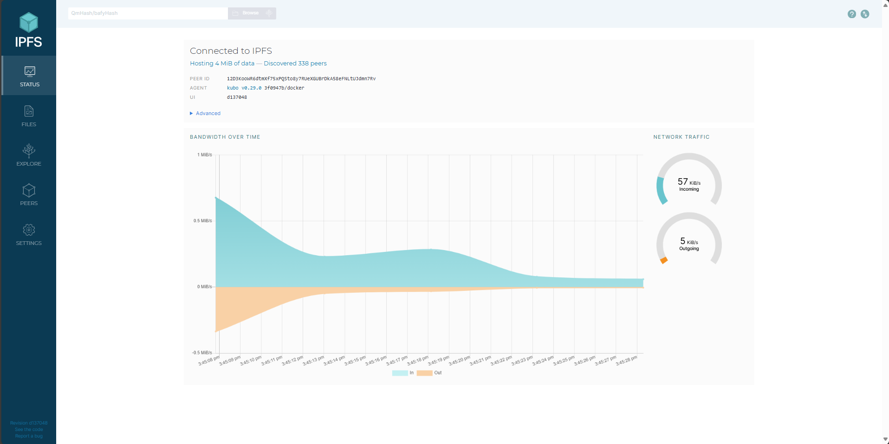
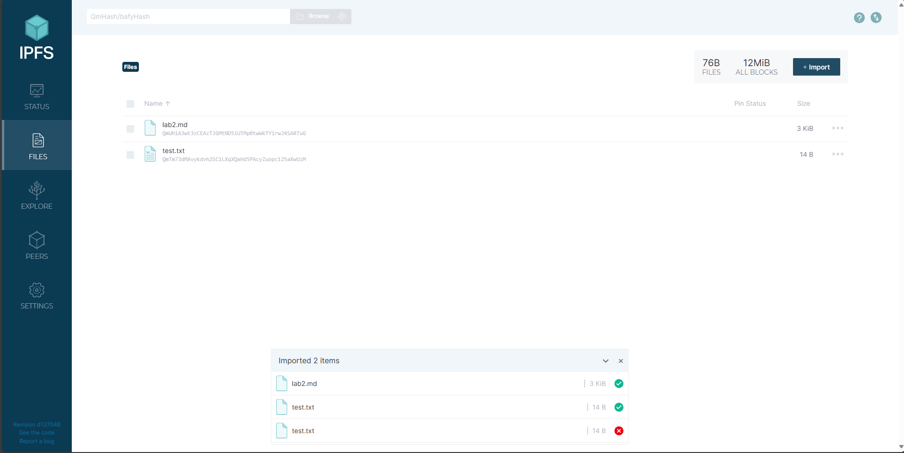
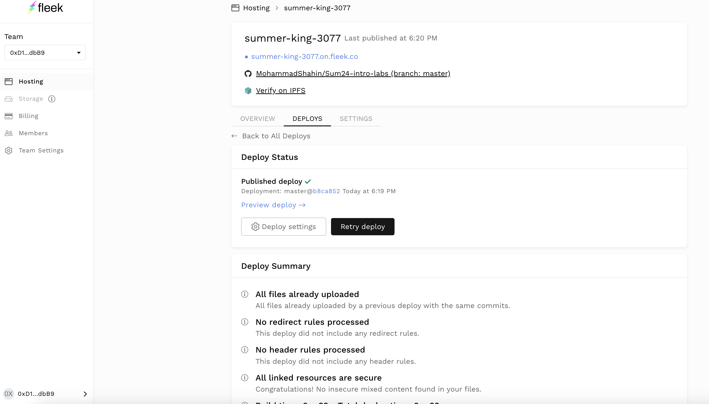
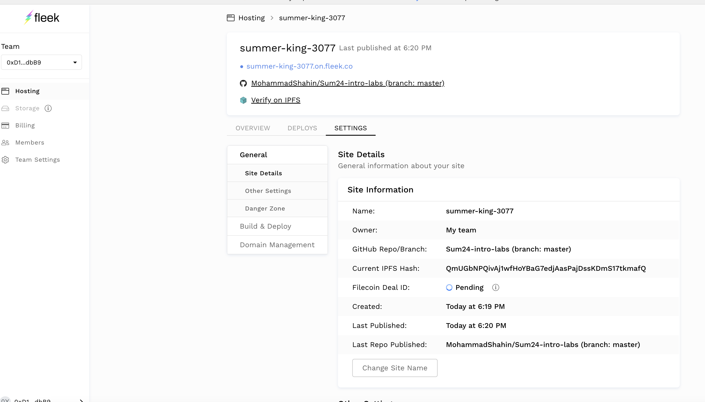

# DevOps Tool Exploration


## Task 1: Set Up an IPFS Gateway Using Docker


1. **Set Up IPFS Gateway**:

   - Pull the IPFS Docker image and run an IPFS container:

     ```sh
     docker pull ipfs/go-ipfs
     docker run -d --name ipfs_host -v /path/to/folder/with/file:/export -v ipfs_data:/data/ipfs -p 8080:8080 -p 4001:4001 -p 5001:5001 ipfs/go-ipfs
     ```
      - Output : 
      ```bash
               PS G:\shahin> docker pull ipfs/go-ipfs
         Using default tag: latest
         latest: Pulling from ipfs/go-ipfs
         ec562eabd705: Pull complete
         bfb7cab26477: Pull complete
         9560bc80d312: Pull complete
         97b7650cf3aa: Pull complete
         5ea8679d1bae: Pull complete
         1227d0550fd7: Pull complete
         20fc5c6870bf: Pull complete
         ec94b9d5cc71: Pull complete
         6479d8d77083: Pull complete
         4f4fb700ef54: Pull complete
         a297c86a9681: Pull complete
         c5285d876603: Pull complete
         916be1b54000: Pull complete
         Digest: sha256:53236eaeb876c6d837ee7b04a9b0e737a22e5f4471d0f99fb499fba28034aa61
         Status: Downloaded newer image for ipfs/go-ipfs:latest
         docker.io/ipfs/go-ipfs:latest

         What's Next?
         View a summary of image vulnerabilities and recommendations → docker scout quickview ipfs/go-ipfs


            docker pull ipfs/go-ipfs
         >> docker run -d --name ipfs_host -v /path/to/folder/with/file:/export -v ipfs_data:/data/ipfs -p 8080:8080 -p 4001:4001 -p 5001:5001 ipfs/go-ipfs
         Using default tag: latest
         latest: Pulling from ipfs/go-ipfs
         Digest: sha256:53236eaeb876c6d837ee7b04a9b0e737a22e5f4471d0f99fb499fba28034aa61
         Status: Image is up to date for ipfs/go-ipfs:latest
         docker.io/ipfs/go-ipfs:latest

         What's Next?
         View a summary of image vulnerabilities and recommendations → docker scout quickview ipfs/go-ipfs
         32236779fee14662f29224b095cfe977474b6d2c3898d414bcc0b25291725e9b
      
      ``` 
   - Verify the IPFS container is running:

     ```sh
     docker ps
     ```
      - Output : 
         ```bash
         
         CONTAINER ID   IMAGE          COMMAND                  CREATED         STATUS                   PORTS                                                                                        NAMES
         32236779fee1   ipfs/go-ipfs   "/sbin/tini -- /usr/…"   2 minutes ago   Up 2 minutes (healthy)   0.0.0.0:4001->4001/tcp, 0.0.0.0:5001->5001/tcp, 4001/udp, 0.0.0.0:8080->8080/tcp, 8081/tcp   ipfs_host    
                        
         
         ```

2. **Upload a File to IPFS**:
   - Open a browser and access the IPFS web UI:

     ```sh
     http://127.0.0.1:5001/webui/
     ```
      
   - Explore the web UI and wait for 5 minutes to sync up with the network.
      the following screenshots shows the peers and bandwidth:

      
      
      

   - Upload any file via the web UI.
      
   - Use the obtained hash to access the file via any public IPFS gateway:
     - [IPFS.io Gateway](https://ipfs.io/ipfs/QmUHiA3wt3zCEAzTJGMtND5iUTMpBtwWkTYirwJ4SARTuG?filename=lab2.md)
     - [Cloudflare IPFS Gateway](https://cloudflare-ipfs.com/ipfs/QmUHiA3wt3zCEAzTJGMtND5iUTMpBtwWkTYirwJ4SARTuG)
     - [Infura IPFS Gateway](https://ipfs.infura.io/ipfs/QmUHiA3wt3zCEAzTJGMtND5iUTMpBtwWkTYirwJ4SARTuG)


## Task 2: Set Up Project on Fleek.co

**Objective**: Set up a project on the Fleek service and share the IPFS link.

1. **Research**:
   - Understand what IPFS is and its purpose.
   - Explore Fleek's features.

2. **Set Up**:
   - Sign up for a Fleek account if you haven't already.
   - Use your fork of the Labs repository as your project source. Optionally, set up your own website (notify us in advance).
   - Configure the project settings on Fleek.
   - Deploy the Labs repository to Fleek, ensuring it is uploaded to IPFS.

3. **Documentation**:
   - Share the IPFS link and domain of the deployed project in the `submission2.md` file.


The link can be found here: https://summer-king-3077.on.fleek.co/
IPFS Hash: QmUGbNPQivAj1wfHoYBaG7edjAasPajDssKDmS17tkmafQ





## Additional Resources

- [IPFS Documentation](https://docs.ipfs.io/)
- [Fleek Documentation](https://docs.fleek.co/)

### Guidelines

- Use proper Markdown formatting for documentation files.
- Organize files with appropriate naming conventions.
- Create a Pull Request to the main branch of the repository with your completed lab assignment.

> Note: Actively explore and document your findings to gain hands-on experience with IPFS and Fleek.
