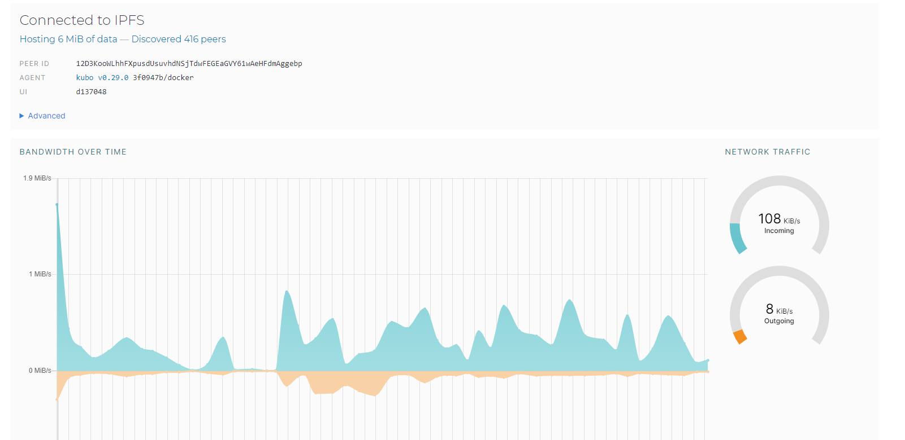
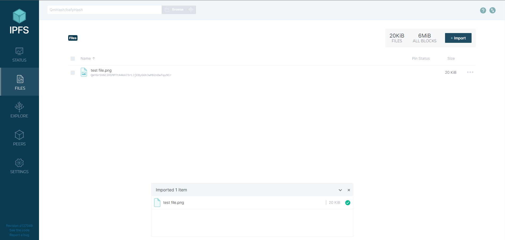
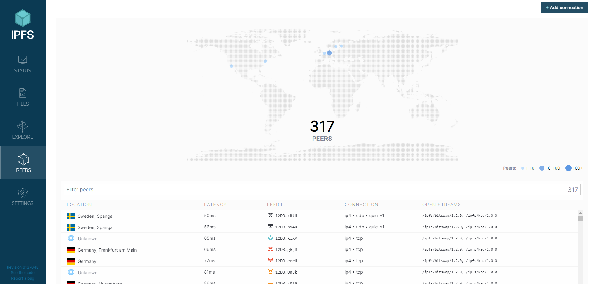
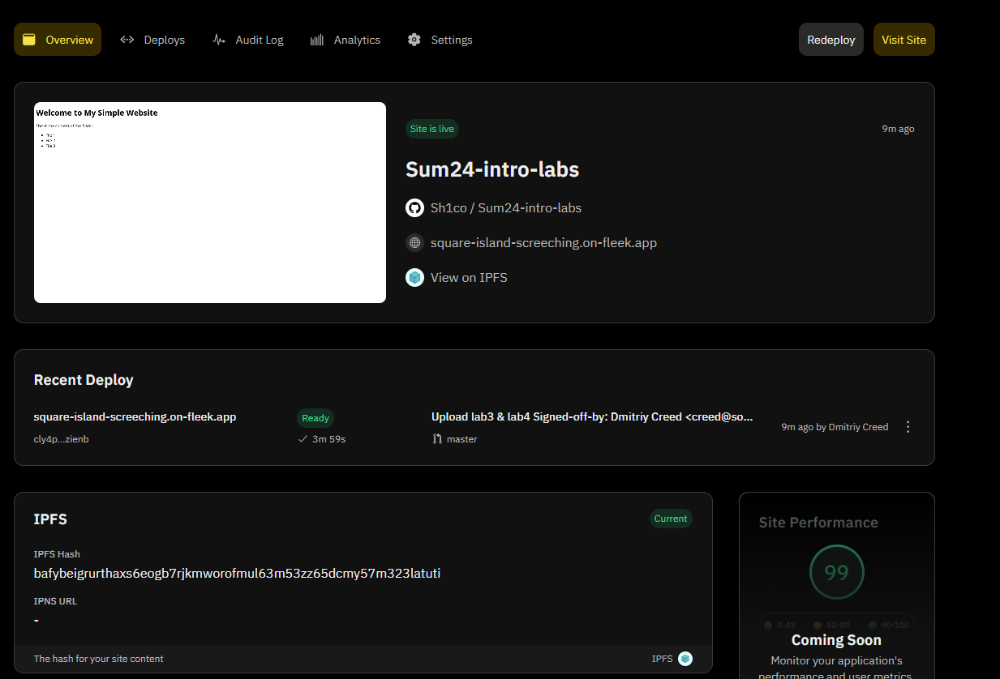

# Lab 2 Submission

## Task 1

### Status page after creating the IPFS container

### Files page after uploading a file

### Peers page

### File hash and link

**Hash:** `QmYGrSV6CiH1MPTt44kA73rLJjEByG6hJwMB2nDwTqu9Cr`

**Link:** <https://ipfs.io/ipfs/QmYGrSV6CiH1MPTt44kA73rLJjEByG6hJwMB2nDwTqu9Cr>

## Task 2

**Website link:** <https://square-island-screeching.on-fleek.app/>

**Website IPFS hash:** `bafybeigrurthaxs6eogb7rjkmworofmul63m53zz65dcmy57m323latuti`
