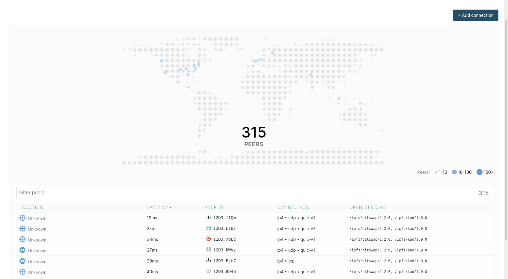
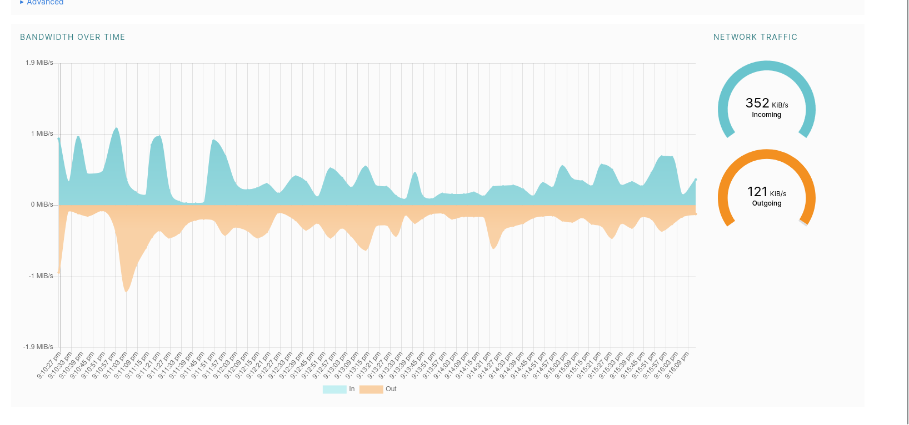

# DevOps Lab 1

## Task 1: Set Up an IPFS Gateway Using Docker

### Connected peers

### Bandwidth

**IPFS Hash**: `QmUGwaqGmcc4hTzyVP4XY5uaYFjCpnjjtVw5Asc3P9xpnD`

**IPFS URL**: [https://ipfs.io/ipfs/QmUGwaqGmcc4hTzyVP4XY5uaYFjCpnjjtVw5Asc3P9xpnD?filename=screenshot.png](https://ipfs.io/ipfs/QmUGwaqGmcc4hTzyVP4XY5uaYFjCpnjjtVw5Asc3P9xpnD?filename=screenshot.png)

## Task 2: Set Up Project on Fleek.co

**IPFS Hash**: `bafybeibkjnutrrrteul3p2uvjnppk53h45v7lfpxbpzvam4vfx5zdic5mq`

**IPFS URL**: [https://ipfs.io/ipfs/bafybeibkjnutrrrteul3p2uvjnppk53h45v7lfpxbpzvam4vfx5zdic5mq](https://ipfs.io/ipfs/bafybeibkjnutrrrteul3p2uvjnppk53h45v7lfpxbpzvam4vfx5zdic5mq)

**Deploy URL** [https://acoustic-zoo-teeny.on-fleek.app](https://acoustic-zoo-teeny.on-fleek.app)
