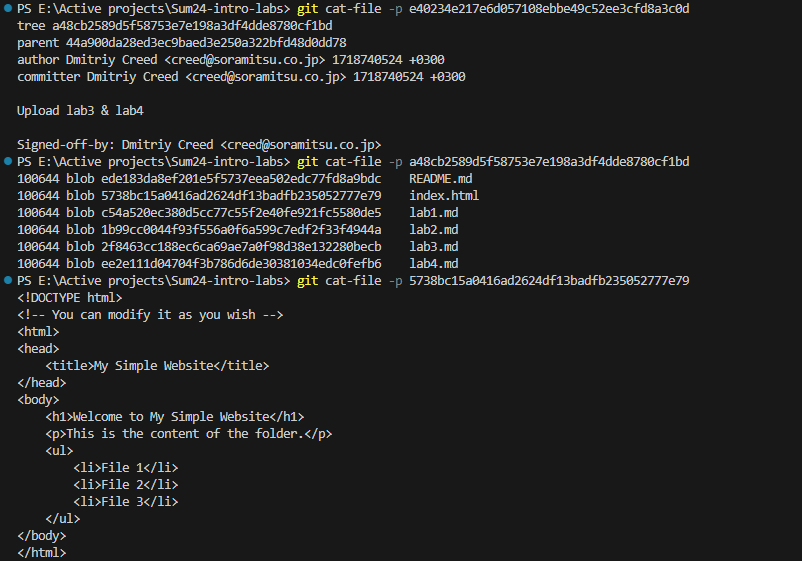
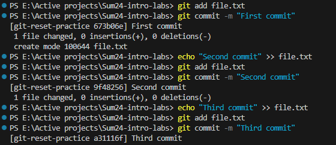

# Submission for Lab 3

## Task 1

## Task 2

### Commits

### Reset and Recover

### Explaination

So basically what I did was create 3 consective commits each adding a file to the file.txt file, then I did a moved one commit back wards but with the `--soft` option which removed the commit but left the third line the file.txt. Then I did another reset to the previous commit but this time with the `--hard` option, which also removed the changes in the staging directory. So now file.txt only has the content from the first commit. Finally, using the reflog commant I got the hash of the head after the third commit, then the reset command was used one last time to go there, and now file.txt has all three lines from all three commits restored!
