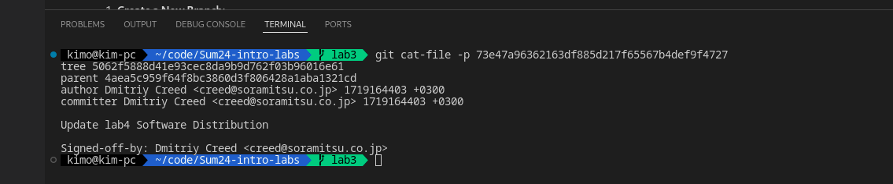
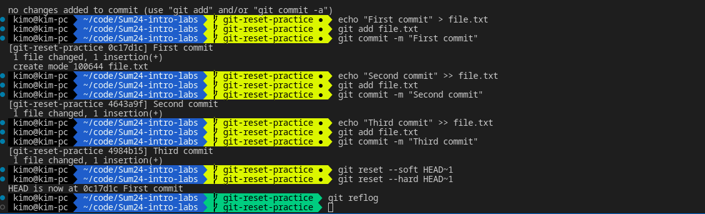
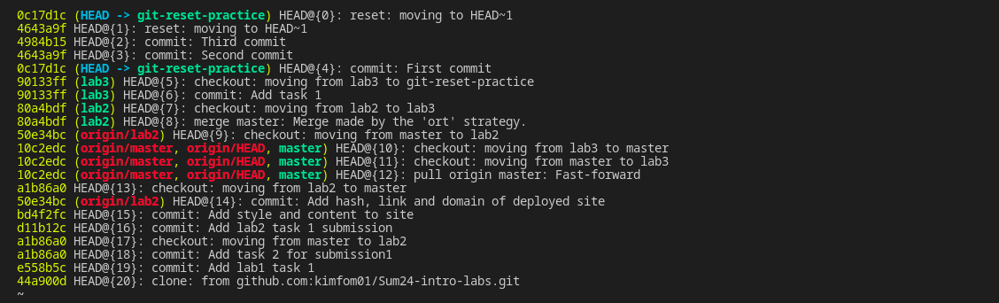

# DevOps Lab 1

## Task 1: Understanding Version Control Systems

## Task 2: Practice with Git Reset Command

### Git reset

- `git reset --soft HEAD~1` will undo the previous commit and restore the changes to the staging area
- `git reset --hard HEAD~1` will undo the previous commit and delete the changes

### Git reflog

