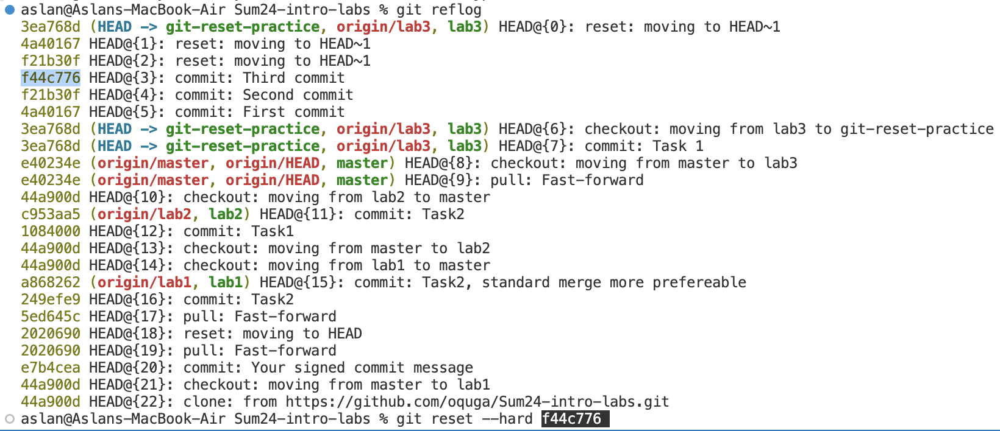

# Lab 3

## Task 1

Command:

```
git cat-file -p  73e47a96362163df885d217f65567b4def9f4727
```

Output:

```
tree 5062f5888d41e93cec8da9b9d762f03b96016e61
parent 4aea5c959f64f8bc3860d3f806428a1aba1321cd
author Dmitriy Creed <creed@soramitsu.co.jp> 1719164403 +0300
committer Dmitriy Creed <creed@soramitsu.co.jp> 1719164403 +0300

Update lab4 Software Distribution

Signed-off-by: Dmitriy Creed <creed@soramitsu.co.jp>
```

Example with a tree hash:


Example with a blob:


## Task 2

### Playing with commits


### Reflog output



### Recovering the reset


