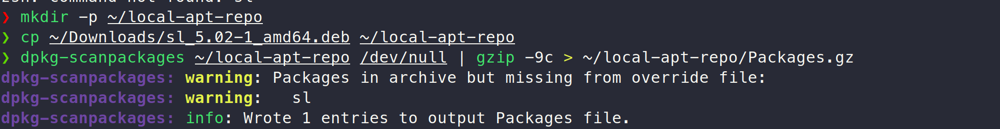
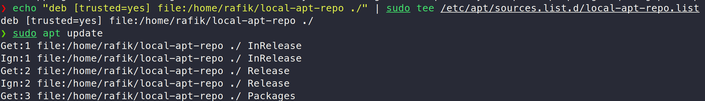
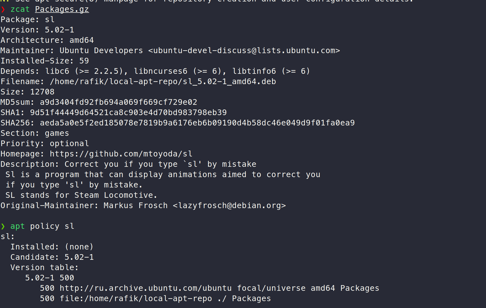
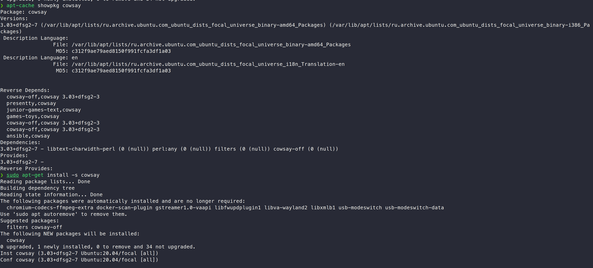
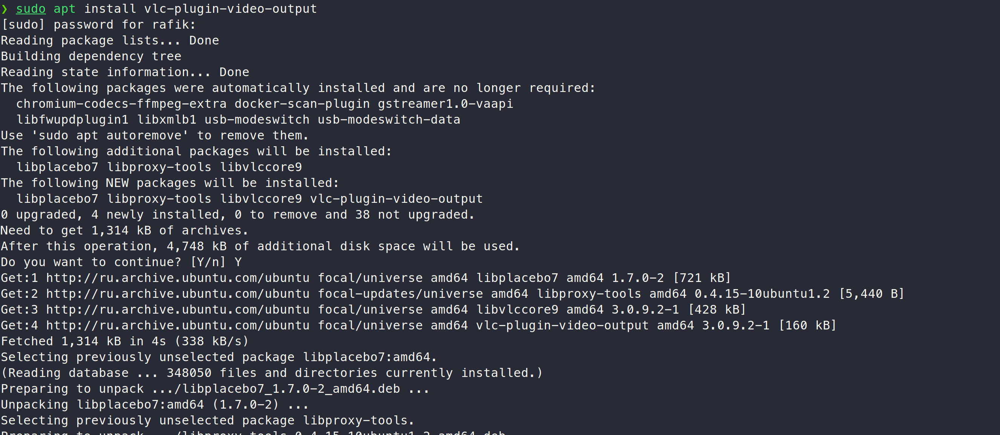
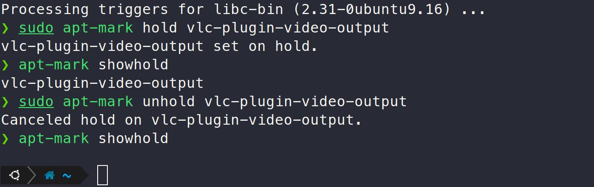

# Lab 4 submission

## Task 1

I downloaded the `.deb` file for the `sl` command (which just displays a steam locomotive in the terminal) to have something in the local repo. (http://archive.ubuntu.com/ubuntu/pool/universe/s/sl/sl_5.02-1_amd64.deb)








## Task 2



We can see that the dependencies are: 

```
3.03+dfsg2-7 - libtext-charwidth-perl (0 (null)) perl:any (0 (null)) filters (0 (null)) cowsay-off (0 (null)) 
```

## Task 3

I chose the `vlc-plugin-video-output` package.




