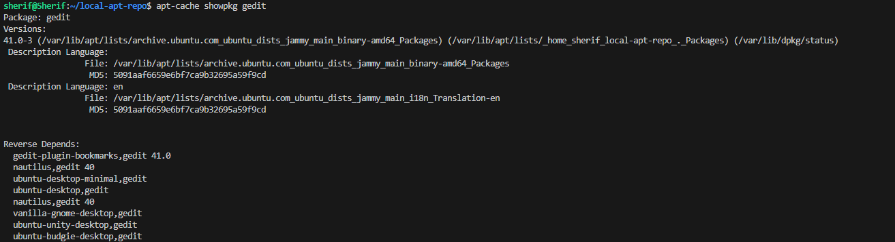
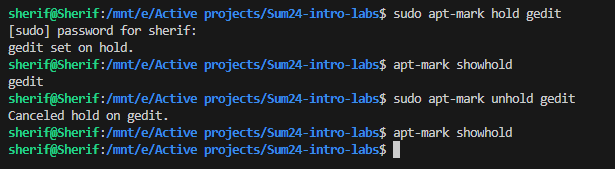

# Submission for lab 4

## Task 1

### Creating local repo

### Adding repo to sources list

### Package install

> Note : Package was already installed because I got the deb files from the local cache 😅

## Task 2

### Using `showpkg`

### Simulating installation

## Task 3

### Holding and Unholding package

