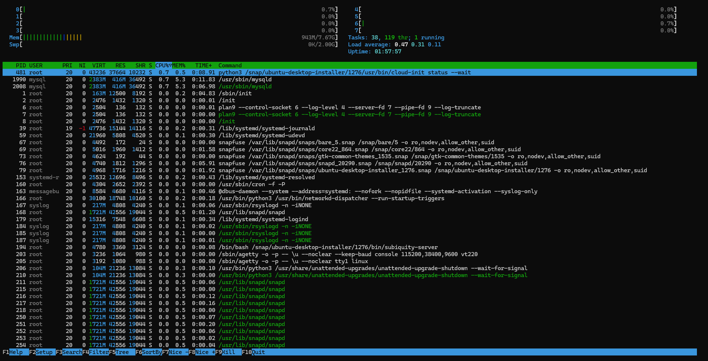
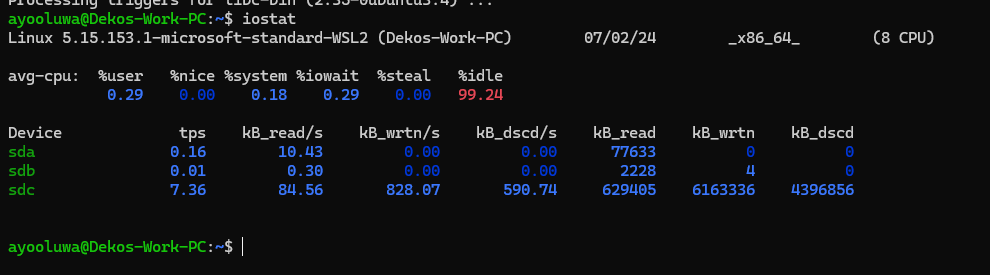
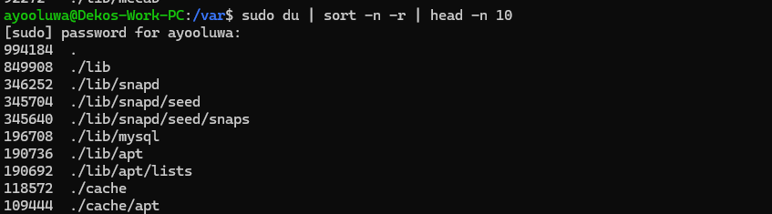

# Task 1: Key Metrics for SRE and SLAs

## Monitor System Resources

### Top 3 Most Consuming Applications

**CPU Usage `htop`**:

| PID  | User  | %CPU | %MEM | Application                                                                           |
|------|-------|------|------|---------------------------------------------------------------------------------------|
| 1980 | mysql | 7.5  | 5.3  | /usr/sbin/mysqld                                                                      |
| 2008 | mysql | 7.5  | 5.3  | /usr/sbin/mysqld                                                                      |
| 481  | root  | 0.7  | 0.5  | /usr/bin/python3 /snap/ubuntu-desktop-installer/1276/usr/bin/cloud-init status --wait |

**Memory Usage `htop`**:

| PID  | User  | %CPU | %MEM | Application                |
|------|-------|------|------|----------------------------|
| 1980 | mysql | 7.5  | 5.3  | /usr/sbin/mysqld           |
| 2008 | mysql | 7.5  | 5.3  | /usr/sbin/mysqld           |
| 153  | root  | 0.0  | 1.0  | /lib/systemd/systemd-udevd |

### Screenshot



### Disk Space Management with `iostat`

**Disk Usage Statistics**:

| Device | tps  | kB_read/s | kB_wrtn/s | kB_dscd/s | kB_read | kB_wrtn | kB_dscd |
|--------|------|-----------|-----------|-----------|---------|---------|---------|
| sda    | 0.16 | 10.43     | 0.00      | 0.00      | 77633   | 0       | 0       |
| sdb    | 0.01 | 0.30      | 0.00      | 0.00      | 2228    | 4       | 0       |
| sdc    | 7.36 | 84.56     | 828.07    | 590.74    | 629405  | 6163336 | 4396856 |

### Screenshot of `iostat`



## Disk Space Management

### Check Disk Usage with `df`

```bash
df -h
```

###
| Memory  | File path        |
|---------|------------------|
| 849908  | ./lib            |
| 346252  | ./lib/snapd      |
| 345704  | ./lib/snapd/seed |



