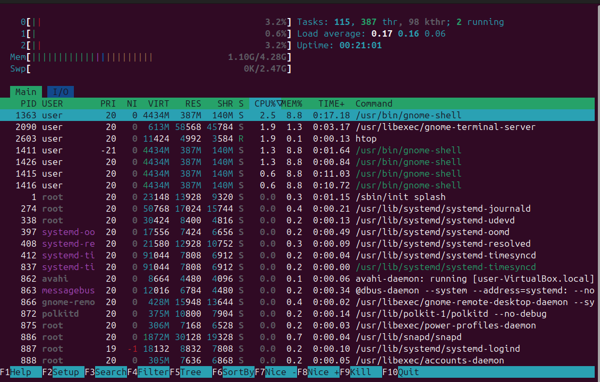
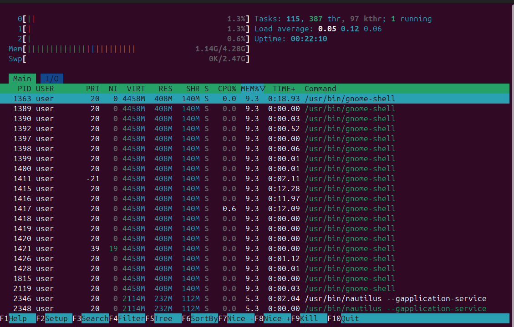
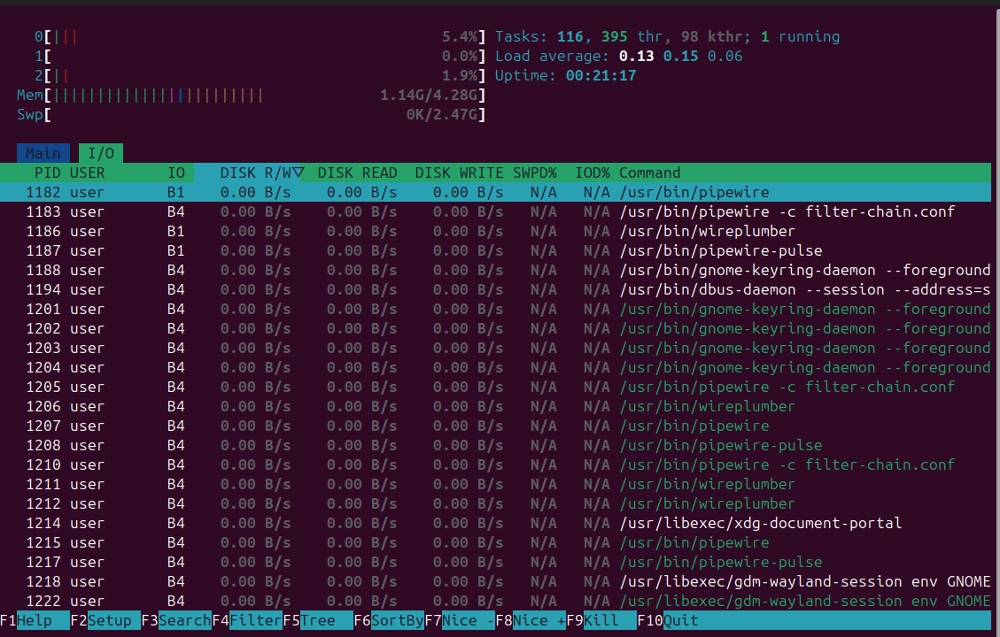

# Task 1
## Monitoring of system resources
The Inspection of 3 most consuming applications using htop command.
For CPU:
/usr/bin/gnome-shell
/usr/libexec/gnome-terminal-server
htop

For MEM:
All three places took /usr/bin/gnome-shell

For I/O:
No applications transfer data between hard disk and RAM.

## Disk Space Management
I identified 3 largest files by using the following command:
user@user-VirtualBox:/var/lib/ubuntu-advantage/apt-esm$ sudo du -ha /var/* | sort -rh | head -n 30
1.8G	/var/lib
1.6G	/var/lib/snapd
1.1G	/var/lib/snapd/snaps
512M	/var/lib/snapd/cache
506M	/var/lib/snapd/snaps/gnome-42-2204_176.snap
446M	/var/lib/snapd/cache/cbec0e9eb7ec36307c18628e8e7d1bf6dc580f7c48af1bb20b47efebe78e67b1a6e2b5d428a7648cbb944339fa3ecf49
270M	/var/lib/snapd/snaps/firefox_4173.snap

There are 3 files:
506M	/var/lib/snapd/snaps/gnome-42-2204_176.snap
446M	/var/lib/snapd/cache/cbec0e9eb7ec36307c18628e8e7d1bf6dc580f7c48af1bb20b47efebe78e67b1a6e2b5d428a7648cbb944339fa3ecf49
270M	/var/lib/snapd/snaps/firefox_4173.snap

