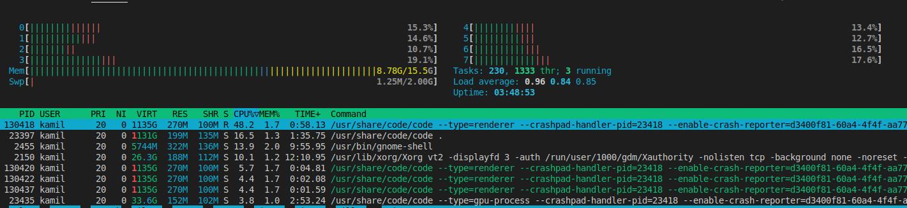
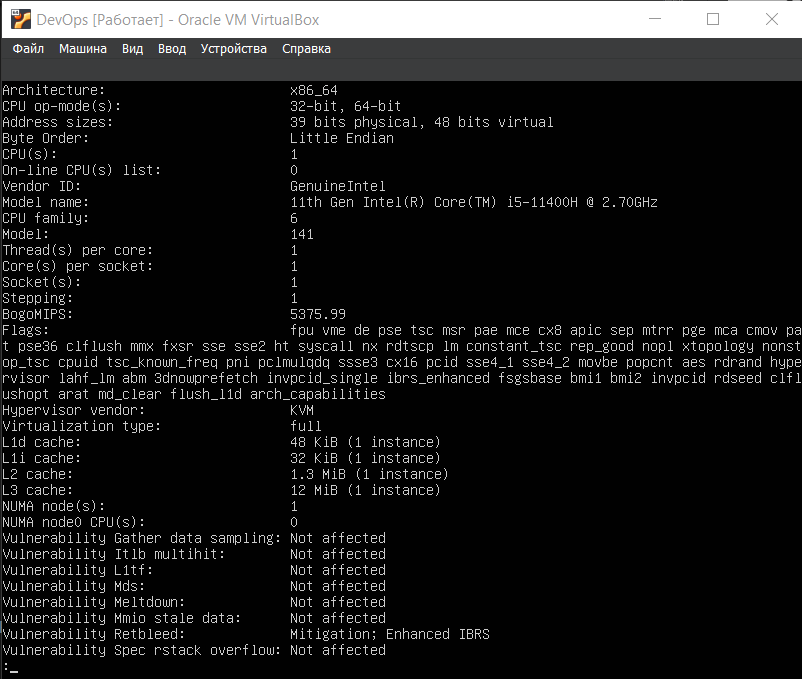
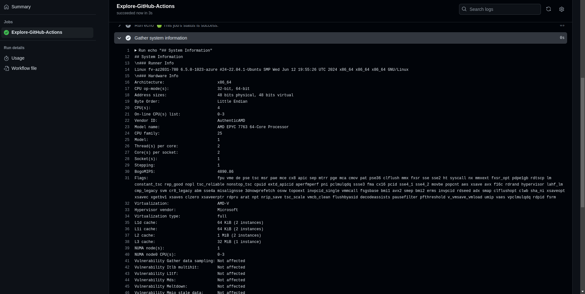
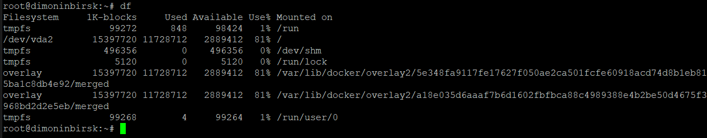
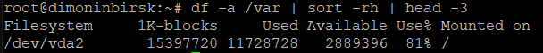
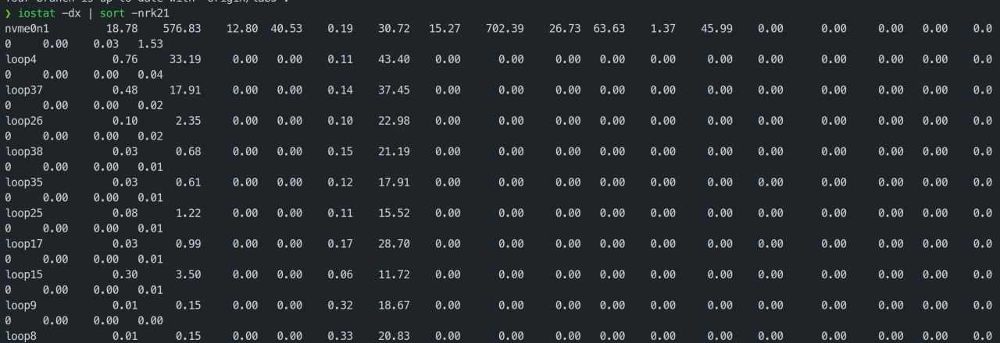

# Lab 5

## Task 1

1. ``htop`` and ``iostat -x 1``

Top 3 CPU consuming applications:

1. dotnet GOResume.API.dll: 31.6%
2. dotnet GOResume.API.dll: 20.4%
3. dotnet GOResume.API.dll: 10.5%

Top 3 Memory consuming applications:

dotnet GOResume.API.dll: 10.0
dotnet GOResume.API.dll: 10.0
dotnet GOResume.API.dll: 10.0

Top 3 I/O consuming applications:

There is very low I/O activity overall.

2. ``df``

``du -a /var | sort -rh | head -3``

