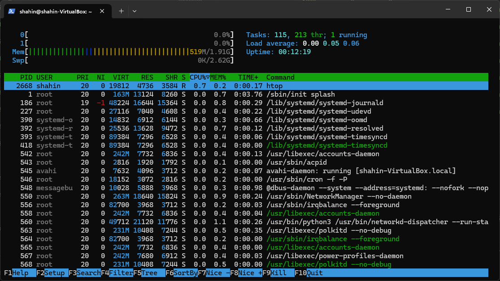
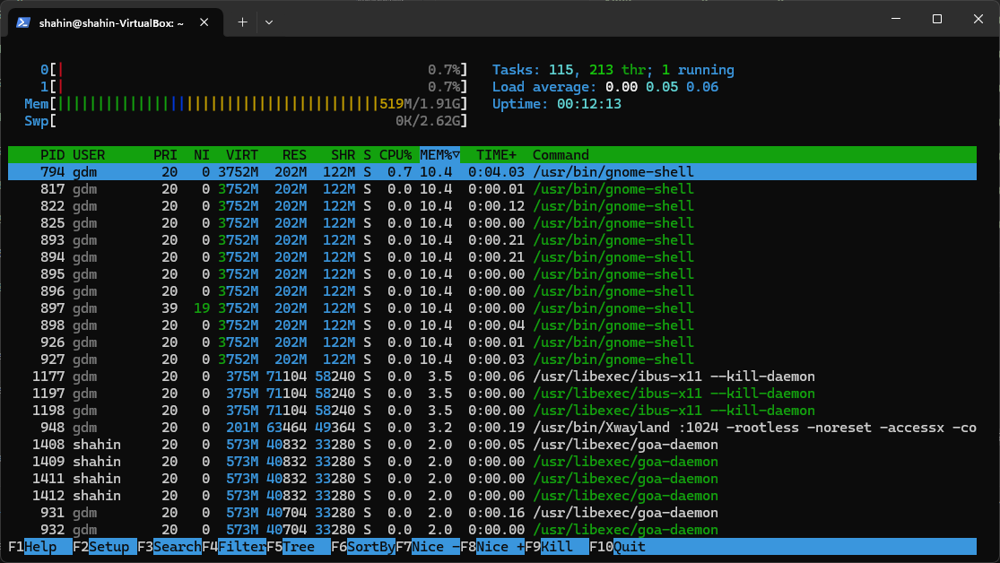

# GitOps & SRE Lab

## Task 1: Key Metrics for SRE and SLAs

**Objective**: Monitor system resources and manage disk space.

1. **Monitor System Resources**:
   - Use commands like `htop` and `iostat` to monitor CPU, memory, and I/O usage.
      - `htop` output:
      .png>)

      - `iostat` output:
         ```ruby
         shahin@shahin-VirtualBox:~$ iostat
         Command 'iostat' not found, but can be installed with:
         sudo apt install sysstat
         shahin@shahin-VirtualBox:~$ sudo apt install sysstat
         ```
         ```ruby
         shahin@shahin-VirtualBox:~$ iostat
         ```
         ```ruby
         Linux 6.5.0-18-generic (shahin-VirtualBox)      18.07.2024      _x86_64_        (2 CPU)

         avg-cpu:  %user   %nice %system %iowait  %steal   %idle
                  3,24    0,82    8,56    1,27    0,00   86,11

         Device             tps    kB_read/s    kB_wrtn/s    kB_dscd/s    kB_read    kB_wrtn    kB_dscd
         loop0             0,11         0,14         0,00         0,00         17          0          0
         loop1             2,58        34,86         0,00         0,00       4372          0          0
         loop2             0,47         8,71         0,00         0,00       1092          0          0
         loop3             8,52       114,47         0,00         0,00      14355          0          0
         loop4             1,46        10,93         0,00         0,00       1370          0          0
         loop5             4,54       163,51         0,00         0,00      20504          0          0
         loop6             0,38         2,88         0,00         0,00        361          0          0
         loop7             0,26         2,50         0,00         0,00        314          0          0
         loop8             0,09         0,11         0,00         0,00         14          0          0
         sda             141,83      5378,73       777,46         0,00     674493      97493          0
         ```

   - Identify and document the top 3 most consuming applications for CPU, memory, and I/O usage
      - Sort by CPU usage: Press Shift + P (uppercase P).
         
      - Sort by memory usage: Press Shift + M (uppercase M).
         

2. **Disk Space Management**:
   - Use `du` and `df` to manage disk space.
      - `du` output: 
         ``` ruby
         shahin@shahin-VirtualBox:~$ du
         4       ./Templates
         4       ./Desktop
         4       ./Music
         4       ./Videos
         4       ./.local/share/icc
         4       ./.local/share/inxi
         4       ./.local/share/sounds
         4       ./.local/share/gnome-settings-daemon
         8       ./.local/share/gnome-shell
         324     ./.local/share/nautilus/tags
         328     ./.local/share/nautilus
         4       ./.local/share/evolution/addressbook/system/photos
         92      ./.local/share/evolution/addressbook/system
         4       ./.local/share/evolution/addressbook/trash
         100     ./.local/share/evolution/addressbook
         4       ./.local/share/evolution/calendar/system
         4       ./.local/share/evolution/calendar/trash
         12      ./.local/share/evolution/calendar
         4       ./.local/share/evolution/mail/trash
         8       ./.local/share/evolution/mail
         8       ./.local/share/evolution/tasks/system
         4       ./.local/share/evolution/tasks/trash
         16      ./.local/share/evolution/tasks
         4       ./.local/share/evolution/memos/trash
         8       ./.local/share/evolution/memos
         148     ./.local/share/evolution
         76      ./.local/share/gvfs-metadata
         4       ./.local/share/flatpak/db
         8       ./.local/share/flatpak
         4       ./.local/share/applications
         4       ./.local/share/ibus-table
         12      ./.local/share/keyrings
         612     ./.local/share
         616     ./.local
         28      ./snap/snapd-desktop-integration/common/.cache/gio-modules
         76      ./snap/snapd-desktop-integration/common/.cache/immodules
         112     ./snap/snapd-desktop-integration/common/.cache
         116     ./snap/snapd-desktop-integration/common
         4       ./snap/snapd-desktop-integration/83/.local/share/glib-2.0/schemas
         8       ./snap/snapd-desktop-integration/83/.local/share/glib-2.0
         4       ./snap/snapd-desktop-integration/83/.local/share/icons
         16      ./snap/snapd-desktop-integration/83/.local/share
         20      ./snap/snapd-desktop-integration/83/.local
         4       ./snap/snapd-desktop-integration/83/.config/gtk-2.0
         4       ./snap/snapd-desktop-integration/83/.config/ibus
         4       ./snap/snapd-desktop-integration/83/.config/dconf
         8       ./snap/snapd-desktop-integration/83/.config/fontconfig
         4       ./snap/snapd-desktop-integration/83/.config/gtk-3.0
         44      ./snap/snapd-desktop-integration/83/.config
         72      ./snap/snapd-desktop-integration/83
         192     ./snap/snapd-desktop-integration
         196     ./snap
         4       ./Documents
         4       ./Downloads
         4       ./Public
         192     ./.cache/ibus/bus
         196     ./.cache/ibus
         12      ./.cache/update-manager-core
         8       ./.cache/mesa_shader_cache/02
         8       ./.cache/mesa_shader_cache/ed
         8       ./.cache/mesa_shader_cache/b3
         8       ./.cache/mesa_shader_cache/ec
         8       ./.cache/mesa_shader_cache/a3
         8       ./.cache/mesa_shader_cache/cd
         12      ./.cache/mesa_shader_cache/e2
         8       ./.cache/mesa_shader_cache/18
         8       ./.cache/mesa_shader_cache/f0
         8       ./.cache/mesa_shader_cache/28
         8       ./.cache/mesa_shader_cache/d3
         8       ./.cache/mesa_shader_cache/c1
         8       ./.cache/mesa_shader_cache/f4
         8       ./.cache/mesa_shader_cache/d4
         8       ./.cache/mesa_shader_cache/e3
         8       ./.cache/mesa_shader_cache/60
         8       ./.cache/mesa_shader_cache/04
         8       ./.cache/mesa_shader_cache/b9
         12      ./.cache/mesa_shader_cache/ea
         8       ./.cache/mesa_shader_cache/a5
         8       ./.cache/mesa_shader_cache/da
         8       ./.cache/mesa_shader_cache/bc
         8       ./.cache/mesa_shader_cache/dc
         8       ./.cache/mesa_shader_cache/f2
         8       ./.cache/mesa_shader_cache/a4
         8       ./.cache/mesa_shader_cache/a8
         8       ./.cache/mesa_shader_cache/d5
         12      ./.cache/mesa_shader_cache/8c
         8       ./.cache/mesa_shader_cache/3f
         8       ./.cache/mesa_shader_cache/e8
         16      ./.cache/mesa_shader_cache/03
         8       ./.cache/mesa_shader_cache/48
         12      ./.cache/mesa_shader_cache/14
         8       ./.cache/mesa_shader_cache/36
         8       ./.cache/mesa_shader_cache/22
         8       ./.cache/mesa_shader_cache/05
         8       ./.cache/mesa_shader_cache/fe
         8       ./.cache/mesa_shader_cache/41
         8       ./.cache/mesa_shader_cache/4f
         8       ./.cache/mesa_shader_cache/3c
         8       ./.cache/mesa_shader_cache/06
         8       ./.cache/mesa_shader_cache/f6
         8       ./.cache/mesa_shader_cache/3a
         8       ./.cache/mesa_shader_cache/c6
         8       ./.cache/mesa_shader_cache/73
         8       ./.cache/mesa_shader_cache/19
         8       ./.cache/mesa_shader_cache/4b
         8       ./.cache/mesa_shader_cache/54
         8       ./.cache/mesa_shader_cache/93
         8       ./.cache/mesa_shader_cache/7e
         8       ./.cache/mesa_shader_cache/94
         8       ./.cache/mesa_shader_cache/d8
         8       ./.cache/mesa_shader_cache/11
         8       ./.cache/mesa_shader_cache/f7
         8       ./.cache/mesa_shader_cache/4e
         8       ./.cache/mesa_shader_cache/0c
         8       ./.cache/mesa_shader_cache/84
         8       ./.cache/mesa_shader_cache/59
         8       ./.cache/mesa_shader_cache/10
         8       ./.cache/mesa_shader_cache/24
         12      ./.cache/mesa_shader_cache/53
         8       ./.cache/mesa_shader_cache/83
         8       ./.cache/mesa_shader_cache/5d
         8       ./.cache/mesa_shader_cache/5a
         8       ./.cache/mesa_shader_cache/21
         8       ./.cache/mesa_shader_cache/52
         8       ./.cache/mesa_shader_cache/35
         8       ./.cache/mesa_shader_cache/92
         8       ./.cache/mesa_shader_cache/79
         1872    ./.cache/mesa_shader_cache
         392     ./.cache/gstreamer-1.0
         8       ./.cache/ubuntu-pro
         4       ./.cache/evolution/sources/trash
         8       ./.cache/evolution/sources
         4       ./.cache/evolution/addressbook/trash
         8       ./.cache/evolution/addressbook
         4       ./.cache/evolution/calendar/trash
         8       ./.cache/evolution/calendar
         4       ./.cache/evolution/mail/trash
         8       ./.cache/evolution/mail
         4       ./.cache/evolution/tasks/trash
         8       ./.cache/evolution/tasks
         4       ./.cache/evolution/memos/trash
         8       ./.cache/evolution/memos
         52      ./.cache/evolution
         4       ./.cache/tracker3/files/errors
         14012   ./.cache/tracker3/files
         14016   ./.cache/tracker3
         4       ./.cache/ibus-table
         8       ./.cache/ubuntu-report
         16576   ./.cache
         12      ./.config/ibus/bus
         16      ./.config/ibus
         4       ./.config/htop
         8       ./.config/dconf
         4       ./.config/goa-1.0
         4       ./.config/nautilus
         84      ./.config/pulse
         8       ./.config/evolution/sources
         12      ./.config/evolution
         8       ./.config/gtk-3.0
         4       ./.config/update-notifier
         168     ./.config
         4       ./Pictures
         17608   .
         ```
      - `df` output :
         ``` ruby 
         shahin@shahin-VirtualBox:~$ df
         Filesystem     1K-blocks     Used Available Use% Mounted on
         tmpfs             200604     1476    199128   1% /run
         /dev/sda3       25106692 11615940  12190068  49% /
         tmpfs            1003004        0   1003004   0% /dev/shm
         tmpfs               5120        4      5116   1% /run/lock
         /dev/sda2         524252     6220    518032   2% /boot/efi
         tmpfs             200600       76    200524   1% /run/user/128
         tmpfs             200600       68    200532   1% /run/user/1000
         ```

   - Identify and log the top 3 largest files in the `/var` directory 

      - ` sudo find /var -type f -exec du -h {} + | sort -rh | head -n 3`
      - output:
         ```ruby
         497M    /var/lib/snapd/snaps/gnome-42-2204_141.snap
         497M    /var/lib/snapd/seed/snaps/gnome-42-2204_141.snap
         267M    /var/lib/snapd/snaps/firefox_3836.snap
         ```


## Task 2: Terraform Installation and Nginx Deployment

**Objective**: Install Terraform and deploy an Nginx container.

1. **Research and Installation**:
   - ```ruby
      PS C:\Windows\system32> choco install terraform
      PS C:\Windows\system32> terraform -version                                                                 Terraform v1.9.2
      on windows_amd64                         
      ```
   - Install docker desktop.
   - Create a file called `main.tf` and paste the following Terraform configuration into it.
      ```bash
      terraform {
      required_providers {
         docker = {
         source  = "kreuzwerker/docker"
         version = "~> 3.0.1"
         }
      }
      }

      provider "docker" {
      host    = "npipe:////.//pipe//docker_engine"
      }

      resource "docker_image" "nginx" {
      name         = "nginx"
      keep_locally = false
      }

      resource "docker_container" "nginx" {
      image = docker_image.nginx.image_id
      name  = "tutorial"

      ports {
         internal = 80
         external = 8000
      }
      }
      ```
   - `terraform init`

      ```ruby
      PS G:\shahin\lab5> terraform init
      Initializing the backend...
      Initializing provider plugins...
      - Finding kreuzwerker/docker versions matching "~> 3.0.1"...
      - Installing kreuzwerker/docker v3.0.2...
      - Installed kreuzwerker/docker v3.0.2 (self-signed, key ID BD080C4571C6104C)
      Partner and community providers are signed by their developers.
      If you'd like to know more about provider signing, you can read about it here:
      https://www.terraform.io/docs/cli/plugins/signing.html
      Terraform has created a lock file .terraform.lock.hcl to record the provider
      selections it made above. Include this file in your version control repository
      so that Terraform can guarantee to make the same selections by default when
      you run "terraform init" in the future.

      Terraform has been successfully initialized!
      ```
   - `terraform apply`


   - Go to [localhost:8000](localhost:8000) to verify the existence of the NGINX container.

      


2. **Nginx Deployment**:
   - `docker ps` 
   
      ```bash
      PS G:\shahin\lab5> docker ps
      CONTAINER ID   IMAGE               COMMAND                  CREATED         STATUS         PORTS                  NAMES
      5bc5e68ab5c0   fffffc90d343        "/docker-entrypoint.…"   2 minutes ago   Up 2 minutes   0.0.0.0:8000->80/tcp   ExampleNginxContainer
      afb46509197f   my_website:latest   "/docker-entrypoint.…"   2 hours ago     Up 2 hours     0.0.0.0:8080->80/tcp   my_website_container
      ```


- Add `output.tf` an `variables.tf` to the woking directory with the following contents: 
    ```bash
    variable "container_name" {
      description = "Value of the name for the Docker container"
      type        = string
      default     = "ExampleNginxContainer"
    }
    ```
    ```bash
    output "container_id" {
      description = "ID of the Docker container"
      value       = docker_container.nginx.id
    }

    output "image_id" {
      description = "ID of the Docker image"
      value       = docker_image.nginx.id
    }
    ```
- `terraform apply`
    ```bash
      Terraform used the selected providers to generate the following execution plan. Resource actions are indicated with the following symbols:
      + create

      Terraform will perform the following actions:

      # docker_container.nginx will be created
      + resource "docker_container" "nginx" {
            + attach                                      = false
            + bridge                                      = (known after apply)
            + command                                     = (known after apply)
            + container_logs                              = (known after apply)
            + container_read_refresh_timeout_milliseconds = 15000
            + entrypoint                                  = (known after apply)
            + env                                         = (known after apply)
            + exit_code                                   = (known after apply)
            + hostname                                    = (known after apply)
            + id                                          = (known after apply)
            + image                                       = (known after apply)
            + init                                        = (known after apply)
            + ipc_mode                                    = (known after apply)
            + log_driver                                  = (known after apply)
            + logs                                        = false
            + must_run                                    = true
            + name                                        = "ExampleNginxContainer"
            + network_data                                = (known after apply)
            + read_only                                   = false
            + remove_volumes                              = true
            + restart                                     = "no"
            + rm                                          = false
            + runtime                                     = (known after apply)
            + security_opts                               = (known after apply)
            + shm_size                                    = (known after apply)
            + start                                       = true
            + stdin_open                                  = false
            + stop_signal                                 = (known after apply)
            + stop_timeout                                = (known after apply)
            + tty                                         = false
            + wait                                        = false
            + wait_timeout                                = 60

            + healthcheck (known after apply)

            + labels (known after apply)

            + ports {
               + external = 8000
               + internal = 80
               + ip       = "0.0.0.0"
               + protocol = "tcp"
            }
         }

      # docker_image.nginx will be created
      + resource "docker_image" "nginx" {
            + id           = (known after apply)
            + image_id     = (known after apply)
            + keep_locally = false
            + name         = "nginx:latest"
            + repo_digest  = (known after apply)
         }

      Plan: 2 to add, 0 to change, 0 to destroy.

      Changes to Outputs:
      + container_id = (known after apply)
      + image_id     = (known after apply)

      Do you want to perform these actions?
      Terraform will perform the actions described above.
      Only 'yes' will be accepted to approve.

      Enter a value: yes

      docker_image.nginx: Creating...
      docker_image.nginx: Creation complete after 0s [id=sha256:fffffc90d343cbcb01a5032edac86db5998c536cd0a366514121a45c6723765cnginx:latest]
      docker_container.nginx: Creating...
      docker_container.nginx: Creation complete after 1s [id=5bc5e68ab5c0f79f38b44457a8ab2c6c97299a2dbe49f39b23b69a66b55eace3]

      Apply complete! Resources: 2 added, 0 changed, 0 destroyed.

      Outputs:

      container_id = "5bc5e68ab5c0f79f38b44457a8ab2c6c97299a2dbe49f39b23b69a66b55eace3"
      image_id = "sha256:fffffc90d343cbcb01a5032edac86db5998c536cd0a366514121a45c6723765cnginx:latest"
    ```

-  `terraform output`

      ```bash
      PS G:\shahin\lab5> terraform output
      container_id = "5bc5e68ab5c0f79f38b44457a8ab2c6c97299a2dbe49f39b23b69a66b55eace3"
      image_id = "sha256:fffffc90d343cbcb01a5032edac86db5998c536cd0a366514121a45c6723765cnginx:latest"
      ```
-  `terraform destroy`

      ``` ruby
      PS G:\shahin\lab5> terraform destroy
      docker_image.nginx: Refreshing state... [id=sha256:fffffc90d343cbcb01a5032edac86db5998c536cd0a366514121a45c6723765cnginx:latest]
      docker_container.nginx: Refreshing state... [id=5bc5e68ab5c0f79f38b44457a8ab2c6c97299a2dbe49f39b23b69a66b55eace3]

      Terraform used the selected providers to generate the following execution plan. Resource actions are indicated with the following symbols:
      - destroy

      Terraform will perform the following actions:

      # docker_container.nginx will be destroyed
      - resource "docker_container" "nginx" {
            - attach                                      = false -> null
            - command                                     = [
               - "nginx",
               - "-g",
               - "daemon off;",
            ] -> null
            - container_read_refresh_timeout_milliseconds = 15000 -> null
            - cpu_shares                                  = 0 -> null
            - dns                                         = [] -> null
            - dns_opts                                    = [] -> null
            - dns_search                                  = [] -> null
            - entrypoint                                  = [
               - "/docker-entrypoint.sh",
            ] -> null
            - env                                         = [] -> null
            - group_add                                   = [] -> null
            - hostname                                    = "5bc5e68ab5c0" -> null
            - id                                          = "5bc5e68ab5c0f79f38b44457a8ab2c6c97299a2dbe49f39b23b69a66b55eace3" -> null
            - image                                       = "sha256:fffffc90d343cbcb01a5032edac86db5998c536cd0a366514121a45c6723765c" -> null
            - init                                        = false -> null
            - ipc_mode                                    = "private" -> null
            - log_driver                                  = "json-file" -> null
            - log_opts                                    = {} -> null
            - logs                                        = false -> null
            - max_retry_count                             = 0 -> null
            - memory                                      = 0 -> null
            - memory_swap                                 = 0 -> null
            - must_run                                    = true -> null
            - name                                        = "ExampleNginxContainer" -> null
            - network_data                                = [
               - {
                  - gateway                   = "172.17.0.1"
                  - global_ipv6_prefix_length = 0
                  - ip_address                = "172.17.0.3"
                  - ip_prefix_length          = 16
                  - mac_address               = "02:42:ac:11:00:03"
                  - network_name              = "bridge"
                     # (2 unchanged attributes hidden)
                  },
            ] -> null
            - network_mode                                = "default" -> null
            - privileged                                  = false -> null
            - publish_all_ports                           = false -> null
            - read_only                                   = false -> null
            - remove_volumes                              = true -> null
            - restart                                     = "no" -> null
            - rm                                          = false -> null
            - runtime                                     = "runc" -> null
            - security_opts                               = [] -> null
            - shm_size                                    = 64 -> null
            - start                                       = true -> null
            - stdin_open                                  = false -> null
            - stop_signal                                 = "SIGQUIT" -> null
            - stop_timeout                                = 0 -> null
            - storage_opts                                = {} -> null
            - sysctls                                     = {} -> null
            - tmpfs                                       = {} -> null
            - tty                                         = false -> null
            - wait                                        = false -> null
            - wait_timeout                                = 60 -> null
            # (7 unchanged attributes hidden)

            - ports {
               - external = 8000 -> null
               - internal = 80 -> null
               - ip       = "0.0.0.0" -> null
               - protocol = "tcp" -> null
            }
         }

      # docker_image.nginx will be destroyed
      - resource "docker_image" "nginx" {
            - id           = "sha256:fffffc90d343cbcb01a5032edac86db5998c536cd0a366514121a45c6723765cnginx:latest" -> null
            - image_id     = "sha256:fffffc90d343cbcb01a5032edac86db5998c536cd0a366514121a45c6723765c" -> null
            - keep_locally = false -> null
            - name         = "nginx:latest" -> null
            - repo_digest  = "nginx@sha256:67682bda769fae1ccf5183192b8daf37b64cae99c6c3302650f6f8bf5f0f95df" -> null
         }

      Plan: 0 to add, 0 to change, 2 to destroy.

      Changes to Outputs:
      - container_id = "5bc5e68ab5c0f79f38b44457a8ab2c6c97299a2dbe49f39b23b69a66b55eace3" -> null
      - image_id     = "sha256:fffffc90d343cbcb01a5032edac86db5998c536cd0a366514121a45c6723765cnginx:latest" -> null

      Do you really want to destroy all resources?
      Terraform will destroy all your managed infrastructure, as shown above.
      There is no undo. Only 'yes' will be accepted to confirm.

      Enter a value: YES

      Destroy cancelled.
      PS G:\shahin\lab5> terraform destroy
      docker_image.nginx: Refreshing state... [id=sha256:fffffc90d343cbcb01a5032edac86db5998c536cd0a366514121a45c6723765cnginx:latest]
      docker_container.nginx: Refreshing state... [id=5bc5e68ab5c0f79f38b44457a8ab2c6c97299a2dbe49f39b23b69a66b55eace3]

      Terraform used the selected providers to generate the following execution plan. Resource actions are indicated with the following symbols:
      - destroy

      Terraform will perform the following actions:

      # docker_container.nginx will be destroyed
      - resource "docker_container" "nginx" {
            - attach                                      = false -> null
            - command                                     = [
               - "nginx",
               - "-g",
               - "daemon off;",
            ] -> null
            - container_read_refresh_timeout_milliseconds = 15000 -> null
            - cpu_shares                                  = 0 -> null
            - dns                                         = [] -> null
            - dns_opts                                    = [] -> null
            - dns_search                                  = [] -> null
            - entrypoint                                  = [
               - "/docker-entrypoint.sh",
            ] -> null
            - env                                         = [] -> null
            - group_add                                   = [] -> null
            - hostname                                    = "5bc5e68ab5c0" -> null
            - id                                          = "5bc5e68ab5c0f79f38b44457a8ab2c6c97299a2dbe49f39b23b69a66b55eace3" -> null
            - image                                       = "sha256:fffffc90d343cbcb01a5032edac86db5998c536cd0a366514121a45c6723765c" -> null
            - init                                        = false -> null
            - ipc_mode                                    = "private" -> null
            - log_driver                                  = "json-file" -> null
            - log_opts                                    = {} -> null
            - logs                                        = false -> null
            - max_retry_count                             = 0 -> null
            - memory                                      = 0 -> null
            - memory_swap                                 = 0 -> null
            - must_run                                    = true -> null
            - name                                        = "ExampleNginxContainer" -> null
            - network_data                                = [
               - {
                  - gateway                   = "172.17.0.1"
                  - global_ipv6_prefix_length = 0
                  - ip_address                = "172.17.0.3"
                  - ip_prefix_length          = 16
                  - mac_address               = "02:42:ac:11:00:03"
                  - network_name              = "bridge"
                     # (2 unchanged attributes hidden)
                  },
            ] -> null
            - network_mode                                = "default" -> null
            - privileged                                  = false -> null
            - publish_all_ports                           = false -> null
            - read_only                                   = false -> null
            - remove_volumes                              = true -> null
            - restart                                     = "no" -> null
            - rm                                          = false -> null
            - runtime                                     = "runc" -> null
            - security_opts                               = [] -> null
            - shm_size                                    = 64 -> null
            - start                                       = true -> null
            - stdin_open                                  = false -> null
            - stop_signal                                 = "SIGQUIT" -> null
            - stop_timeout                                = 0 -> null
            - storage_opts                                = {} -> null
            - sysctls                                     = {} -> null
            - tmpfs                                       = {} -> null
            - tty                                         = false -> null
            - wait                                        = false -> null
            - wait_timeout                                = 60 -> null
            # (7 unchanged attributes hidden)

            - ports {
               - external = 8000 -> null
               - internal = 80 -> null
               - ip       = "0.0.0.0" -> null
               - protocol = "tcp" -> null
            }
         }

      # docker_image.nginx will be destroyed
      - resource "docker_image" "nginx" {
            - id           = "sha256:fffffc90d343cbcb01a5032edac86db5998c536cd0a366514121a45c6723765cnginx:latest" -> null
            - image_id     = "sha256:fffffc90d343cbcb01a5032edac86db5998c536cd0a366514121a45c6723765c" -> null
            - keep_locally = false -> null
            - name         = "nginx:latest" -> null
            - repo_digest  = "nginx@sha256:67682bda769fae1ccf5183192b8daf37b64cae99c6c3302650f6f8bf5f0f95df" -> null
         }

      Plan: 0 to add, 0 to change, 2 to destroy.

      Changes to Outputs:
      - container_id = "5bc5e68ab5c0f79f38b44457a8ab2c6c97299a2dbe49f39b23b69a66b55eace3" -> null
      - image_id     = "sha256:fffffc90d343cbcb01a5032edac86db5998c536cd0a366514121a45c6723765cnginx:latest" -> null

      Do you really want to destroy all resources?
      Terraform will destroy all your managed infrastructure, as shown above.
      There is no undo. Only 'yes' will be accepted to confirm.

      Enter a value: yes

      docker_container.nginx: Destroying... [id=5bc5e68ab5c0f79f38b44457a8ab2c6c97299a2dbe49f39b23b69a66b55eace3]
      docker_container.nginx: Destruction complete after 0s
      docker_image.nginx: Destroying... [id=sha256:fffffc90d343cbcb01a5032edac86db5998c536cd0a366514121a45c6723765cnginx:latest]
      docker_image.nginx: Destruction complete after 0s

      Destroy complete! Resources: 2 destroyed.
      PS G:\shahin\lab5> 
      ```
