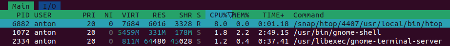
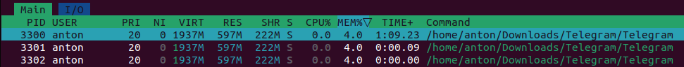
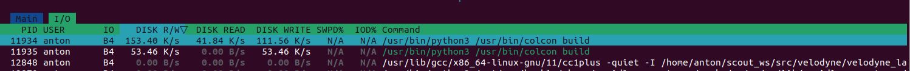

# Lab 5: GitOps & SRE Lab
## Anton Buguev, a.buguev@innopolis.university, M23-RO-01

### Task 1. Key Metrics for SRE and SLAs.

1. System resources:
- Top-3 applications by CPU usage


- Top-3 applications by Memory usage


- Top-3 applications by I/O usage:


2. Disk space:
```sh
$ sudo du -a /var/ | sort -n -r | head -n 20

4089092	/var/
3035316	/var/lib
2622832	/var/lib/snapd
1122092	/var/lib/snapd/snaps
1006396	/var/lib/snapd/seed
1006308	/var/lib/snapd/seed/snaps
986896	/var/cache
935084	/var/cache/apt
935080	/var/cache/apt/archives
508912	/var/lib/snapd/snaps/gnome-42-2204_141.snap # Number 1
508912	/var/lib/snapd/seed/snaps/gnome-42-2204_141.snap  # Number 2
491664	/var/lib/snapd/cache
319804	/var/lib/snapd/cache/c49b45a3d7cb75596f15705c9007b1e4192432bda8fdfed4b72536421fee4d519155a96a45b7fab5c668f959eaa68f46
273032	/var/lib/snapd/snaps/firefox_3836.snap # Number 3
273032	/var/lib/snapd/seed/snaps/firefox_3836.snap
269180	/var/lib/apt
268980	/var/lib/apt/lists
260492	/var/cache/apt/archives/linux-firmware_20220329.git681281e4-0ubuntu3.31_all.deb
102056	/var/lib/dpkg
95724	/var/lib/dpkg/info
```
The largest files are marked with comments.