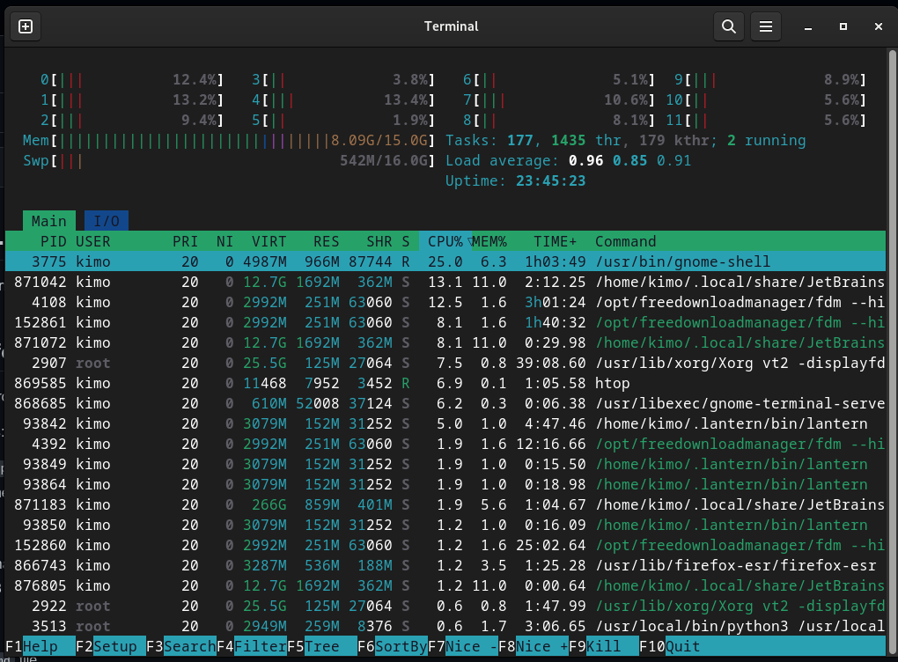
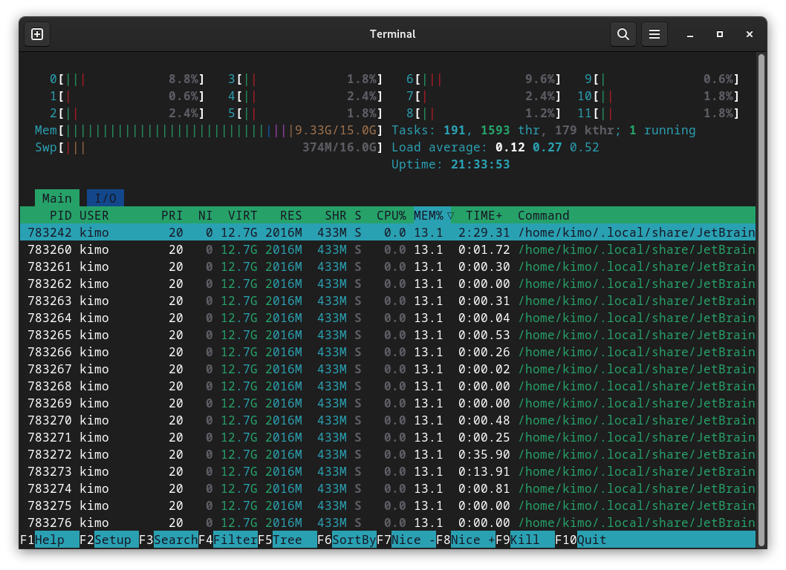
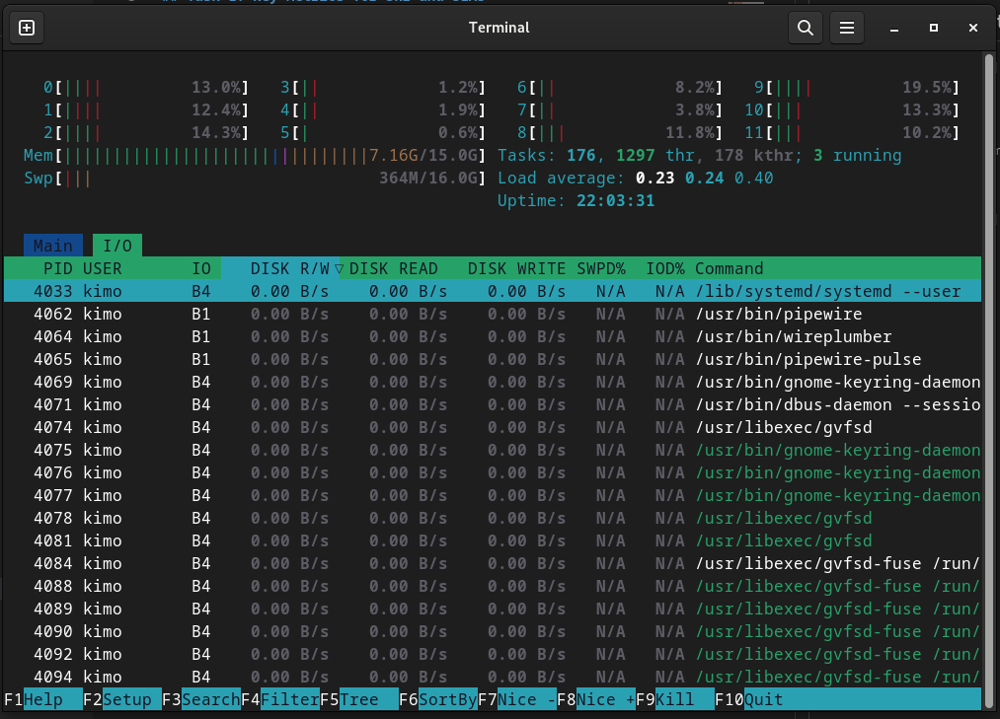
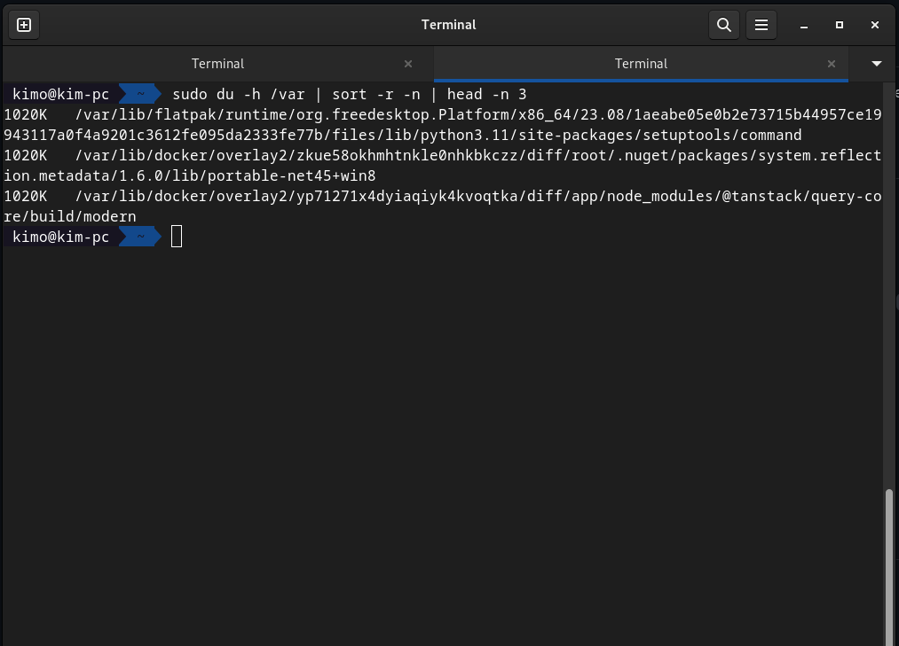

# GitOps & SRE Lab

## Task 1: Key Metrics for SRE and SLAs

Top 3 processes based on cpu usage

- gnome-shell
- jetbrains rider
- free download manager

Top 3 processes based on RAM usage

- jetbrains rider
- jetbrains rider
- jetbrains rider

Top 3 processes based on IO usage

- systemd
- pipewire
- wireplumber

Top 3 largest files in /var directory

## Task 2: Terraform Installation and Nginx Deployment

Faced lots of issues with terraform setup both from hashicorp and yandex cloud so I gave up 🥲
