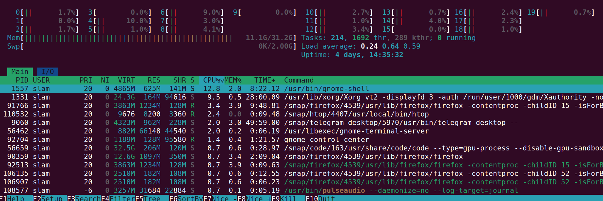
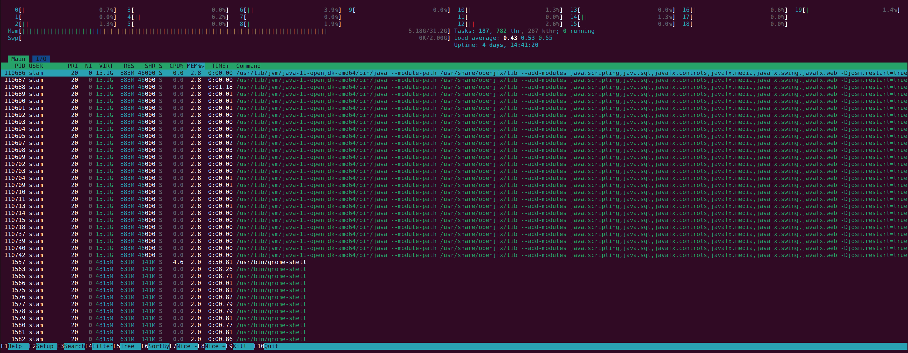
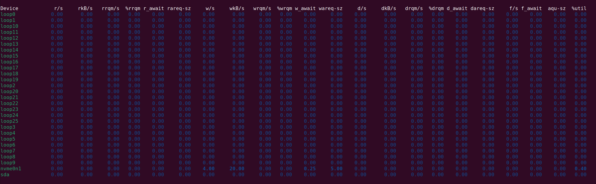

#### Task 1.1

In order to find most consuming aps for CPU usage and Memory usage we will use htop and it's internal filtering system.

We will first open htop:
```
htop
```
Then we will press F6 ans sort by CPU% usage.



### Most CPU-Usage intensive applications:
1. /usr/bin/gnome-shell - 12.8% (PID: 1557)
   - The main user interface process for the GNOME desktop environment, handling display and window management.
2. /usr/lib/xorg/Xorg vt2 -displayfd 3 -auth /run/user/1000/gdm/Xauthority -noreset -keeptty -verbose 3 - 9.5% (PID: 1331)
   - The Xorg server, which manages the display, keyboard, and mouse for the graphical user interface.
3. /snap/firefox/4539/usr/lib/firefox/firefox -contentproc -childID 15 -isForBrowser -prefsLen 1 -prefMapSize 225063 -jsInit 306290 -parentBuildID 20230707235334 -appdir /snap/firefox/4539/usr/lib/firefox/browser 91766 true tab - 3.4% (PID: 91766)
    - Firefox browser for surfing the internet. 



### Most Memory-Usage intensive applications:
1. /usr/lib/jvm/java-11-openjdk-amd64/bin/java --module-path /usr/share/openjfx/lib --add-modules java.scripting,java.sql,javafx.controls,javafx.media,javafx.swing,javafx.web -Djosm.restart=true - 2.8% Memory usage (PID: 110686)
   - A Java application using OpenJDK 11, running a JavaFX-based graphical application .

2. /usr/bin/gnome-shell - 2.0% Memory usage (PID: 1557)
   - The main user interface process for the GNOME desktop environment, handling display and window management.

3. /usr/lib/xorg/Xorg vt2 -displayfd 3 -auth /run/user/1000/gdm/Xauthority -noreset -keeptty -verbose 3 - 0.5% Memory usage (PID: 1331)
   - The Xorg server, which manages the display, keyboard, and mouse for the graphical user interface.


We can also sort by Virtual memory taken, time alive, etc.

In order to sort applications by I/O and find the most I/O active one i used 

```
iostat -dx 1 10
```
That showed me this:


Here we can see that Loopback devices (which are usually used for temp. tasks) are not performing any reads or writes at the moment. However, nvme0n1 has some write activity - (4 write requests per second, as well as 20 kB written per seconds).

But this is not realy our interest. We are interested in applications. That's why I used:

```
pidstat -d 1 5
```
```
slam@slam:~/colcon_ws$ pidstat -d 1 5
Linux 6.5.0-41-generic (slam) 	07/10/2024 	_x86_64_	(20 CPU)

12:26:18 PM   UID       PID   kB_rd/s   kB_wr/s kB_ccwr/s iodelay  Command
12:26:19 PM  1000    110637      0.00      4.00      0.00       0  java

12:26:19 PM   UID       PID   kB_rd/s   kB_wr/s kB_ccwr/s iodelay  Command
12:26:20 PM  1000    113909      0.00    100.00      0.00       0  firefox

12:26:20 PM   UID       PID   kB_rd/s   kB_wr/s kB_ccwr/s iodelay  Command

12:26:21 PM   UID       PID   kB_rd/s   kB_wr/s kB_ccwr/s iodelay  Command

12:26:22 PM   UID       PID   kB_rd/s   kB_wr/s kB_ccwr/s iodelay  Command

Average:      UID       PID   kB_rd/s   kB_wr/s kB_ccwr/s iodelay  Command
Average:     1000    110637      0.00      0.80      0.00       0  java
Average:     1000    113909      0.00     20.00      0.00       0  firefox
```

We can find 2 applications which are preforming writes at the moment.

They are - 

1. Java - 0.80 kB/s write (PID: 110637)
2. Firefox - 20.00 kB/s write (PID: 113909)

There is no third app performing relatively big I/O in order for pidstat to catch it with pidstat with these flags. 

#### Task 1.2

In order to do that i entered this command:

```
sudo find /var -type f -exec du -h {} + | sort -rh | head -n 3
```

- find /var with type -f locates all files in /var folder

 - du -h displays the size of the each file in human-readable format

- sort -rh sorts files by size from biggest to lowest

- and head just leaves 3 first ones

And we do get:

Top 3 Largest Files in /var Directory:
```
506M	/var/lib/snapd/snaps/gnome-42-2204_176.snap
497M	/var/lib/snapd/snaps/gnome-42-2204_141.snap
497M	/var/lib/snapd/seed/snaps/gnome-42-2204_141.snap
```

#### Task 2.1

First, I installed the 