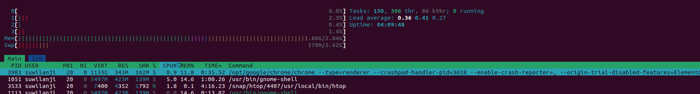
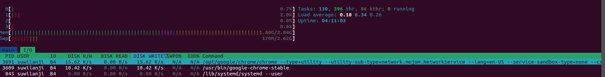
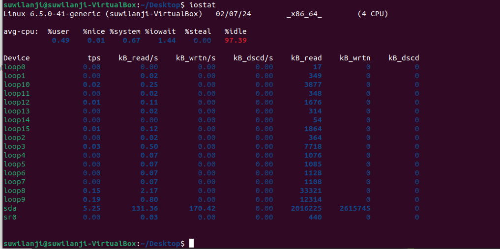
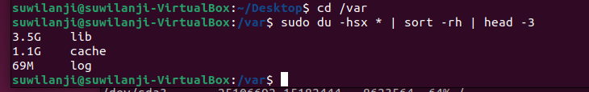
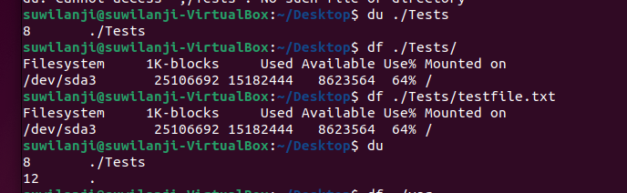

# Lab 5 : GitOps & SRE Lab

## Task 1: Key Metrics for SRE and SLAs

1. **Monitor System Resources**:
   - Using `htop` and `isostat` we can see here the three applicaitions/processes that are taking up the most CPU and memory.
    

   - Here we can see that `google chrome` has the most I/O usage.
    

   - `iostat` shows my system's storage I/O statistics.
    
 
2. **Disk Space Management**:
   - The 3 largest /directories in the `/var` directory.

      
    
      
    
## Task 2: Terraform Installation and Nginx Deployment
- Solution in `TerraformAndNginx.md`.