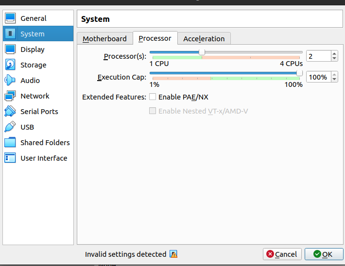
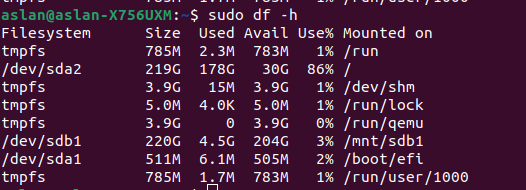
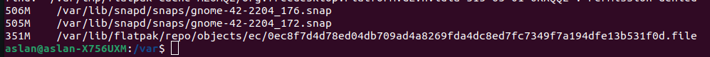

# Lab 5 submission

## Task 1

#### System resource monitoring

Most CPU-consuming processes:

Most Memory-consuming processes:

Most IO consuming processes (I had to pipe the output to the `sort` command and sort by the 21st column, which corresponds to the utilization percentage in this case).

#### Disk space

Checking free space:

Checking the largest files in /var

