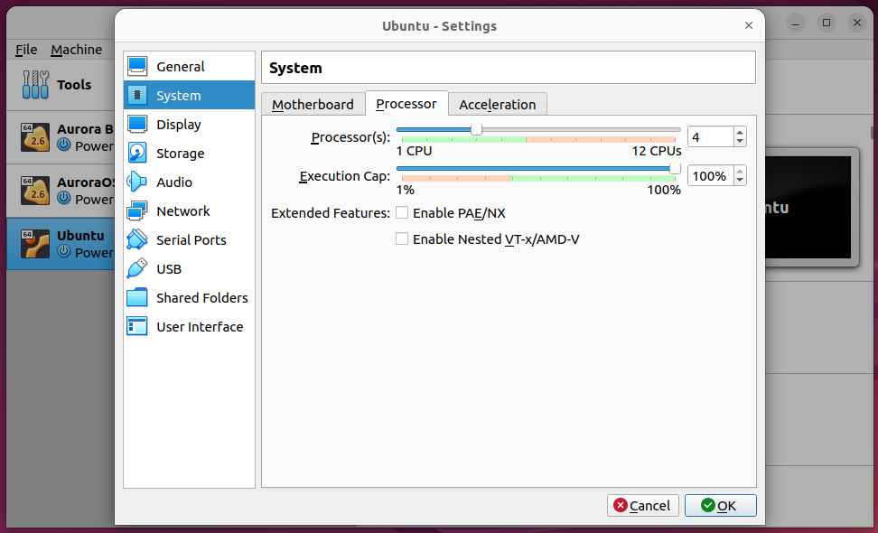

### Task 1: Key Metrics for SRE and SLAs

#### 1. Monitor System Resources:
```cpu```

```memory```


```iostat```


#### 2. Disk Space Management:

```sh
applewolf@DESKTOP-AK2I7AA:~$ du
896K    /var/lib/apt/lists/archive.ubuntu.com_ubuntu_dists_jammy_restricted_binary-amd64_Packages
700K    /var/lib/usbutils/usb.ids
600K    /var/lib/dpkg/info/keyboard-configuration.templates
```

```sh
applewolf@DESKTOP-AK2I7AA:~$ df
Filesystem      1K-blocks      Used  Available Use% Mounted on
none              3908168         4    3908164   1% /mnt/wsl
none            125726716 120438020    5288696  96% /usr/lib/wsl/drivers
/dev/sdc       1055762868   1107752 1000951644   1% /
none              3908168        84    3908084   1% /mnt/wslg
none              3908168         0    3908168   0% /usr/lib/wsl/lib
rootfs            3904872      2060    3902812   1% /init
none              3908168       792    3907376   1% /run
none              3908168         0    3908168   0% /run/lock
none              3908168         0    3908168   0% /run/shm
tmpfs                4096         0       4096   0% /sys/fs/cgroup
none              3908168       100    3908068   1% /mnt/wslg/versions.txt
none              3908168       100    3908068   1% /mnt/wslg/doc
C:\             125726716 120438020    5288696  96% /mnt/c
D:\                354304       948     353356   1% /mnt/d
E:\             363314172 299580104   63734068  83% /mnt/e
F:\              10485756   2895676    7590080  28% /mnt/f
snapfuse              128       128          0 100% /snap/bare/5
snapfuse            75776     75776          0 100% /snap/core22/864
snapfuse            93952     93952          0 100% /snap/gtk-common-themes/1535
snapfuse            41856     41856          0 100% /snap/snapd/20290
snapfuse           134272    134272          0 100% /snap/ubuntu-desktop-installer/1276
```