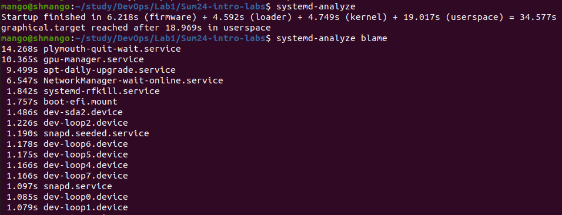
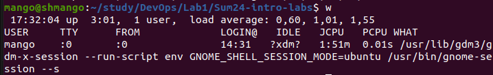
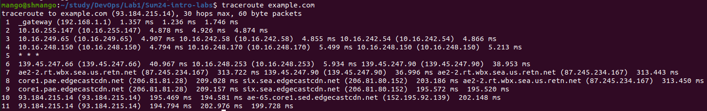
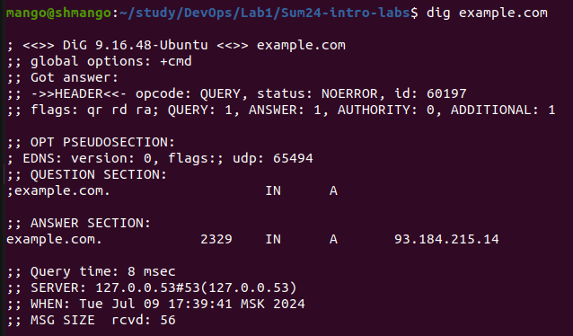

# Lab 6

## Task 1
Output of the provided commands:

|```systemd-analyze```|``` uptime ```|```w ```|
|--|--|--|
||``` 17:32:02 up  3:01,  1 user,  load average: 0,65, 1,03, 1,56```||

### Observations
The majority of boot time is due to UI loading, including GPU service. Kernel by itself takes the least ammount of time to boot.

## Task 2
Output of the provided commands:

|```traceroute```|``` dig ```|
|--|--|
| | 

### Observations

Traceroute reported hopping between multiple IPs without domains, before getting to DNS. Once it got to the DNS the latency increased tenfold.