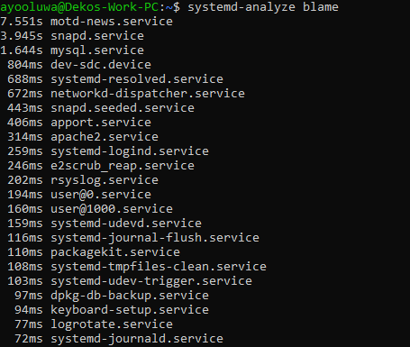
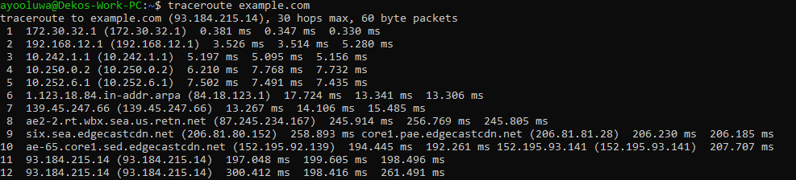
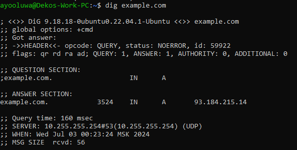

# Task 1: Operating System Analysis

## Analyze System Boot Time

### systemd-analyze


```plaintext
Startup finished in 5.380s (userspace)
graphical.target reached after 5.277s in userspace
```

### systemd-analyze blame


```plaintext
7.551s motd-news.service
3.945s snapd.service
1.644s mysql.service
848ms dev-sdc.device
688ms systemd-resolved.service
443ms networkd-dispatcher.service
404ms snapd.seeded.service
395ms apport.service
314ms apache2.service
295ms systemd-logind.service
246ms e2scrub_reap.service
225ms rsyslog.service
195ms user@0.service
169ms systemd-udevd.service
159ms systemd-journal-flush.service
144ms systemd-tmpfiles-clean.service
103ms systemd-udev-trigger.service
97ms dkpg-db-backup.service
94ms keyboard-setup.service
75ms logrotate.service
72ms systemd-journald.service
55ms snap-bare-5.mount
```

## Check System Load and Uptime

### uptime


```plaintext
00:19:03 up 1:06, 2 users, load average: 0.06, 0.11, 0.09
```

### w


```plaintext
00:19:03 up 1:06, 2 users, load average: 0.06, 0.11, 0.09
USER     TTY      FROM             LOGIN@   IDLE   JCPU   PCPU WHAT
ayooluwa pts/1    -                23:17    1:01m  0.03s  0.02s -bash
root     pts/3    -                23:31    47:20  0.04s  0.03s -bash
```

### Observations and Insights
- **Boot Time Analysis**: The overall boot time is relatively fast, with the majority of the time spent in userspace. The `motd-news.service` and `snapd.service` are the top services contributing to the boot time.
- **System Load and Uptime**: The system has been up for 1 hour and 6 minutes, with a low load average indicating the system is not under heavy load. Two users are currently logged in.

# Task 2: Networking Analysis

## Traceroute

### Command Executed
```bash
traceroute example.com
```

### Output


```plaintext
traceroute to example.com (93.184.215.14), 30 hops max, 60 byte packets
 1  172.30.32.1 (172.30.32.1)  0.381 ms  0.347 ms  0.330 ms
 2  192.168.12.1 (192.168.12.1)  3.526 ms  3.514 ms  5.280 ms
 3  10.242.1.1 (10.242.1.1)  5.197 ms  5.095 ms  5.156 ms
 4  10.252.6.1 (10.252.6.1)  6.210 ms  7.768 ms  7.732 ms
 5  * * *
 6  * * *
 7  139.45.247.66 (139.45.247.66)  13.267 ms  14.106 ms  15.485 ms
 8  * * *
 9  * * *
10  * * *
11  93.184.215.14 (93.184.215.14)  197.048 ms  199.605 ms  198.496 ms
12  93.184.215.14 (93.184.215.14)  300.412 ms  198.416 ms  261.491 ms
```

## Dig

### Command Executed
```bash
dig example.com
```

### Output


```plaintext
; <<>> DiG 9.18.18-ubuntu0.22.04.1-Ubuntu <<>> example.com
;; global options: +cmd
;; Got answer:
;; ->>HEADER<<- opcode: QUERY, status: NOERROR, id: 59922
;; flags: qr rd ra ad; QUERY: 1, ANSWER: 1, AUTHORITY: 0, ADDITIONAL: 0

;; QUESTION SECTION:
;example.com.                   IN      A

;; ANSWER SECTION:
example.com.            3524    IN      A       93.184.215.14

;; Query time: 160 msec
;; SERVER: 10.255.255.254#53(10.255.255.254) (UDP)
;; WHEN: Wed Jul 03 00:23:24 MSK 2024
;; MSG SIZE  rcvd: 56
```

### Observations and Insights
- **Traceroute Analysis**: The traceroute to `example.com` shows the path taken to reach the destination IP address. The traceroute completes in a few hops, indicating a relatively direct path with low latency.
- **DNS Resolution**: The `dig` command shows the DNS resolution for `example.com`, including the IP address, authoritative name servers, and additional information. The query time is low, indicating efficient DNS resolution.
