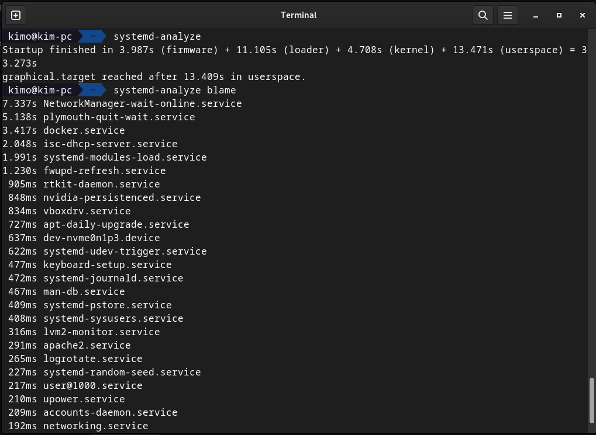

# Operating Systems & Networking Lab

## Task 1: Operating System Analysis

From the observations, the system took a total of **33.273** seconds to boot.

The slowest component to boot was the **NetworkManager-wait-online** service and the fastest to boot was the **networking** service

The screenshot above shows the system's total uptime of **1 day, 21 mins** with an average CPU load of 1.64 (or 164%) in the last minute interval, 1.40 (140%) in the last 5 minutes interval and 1.18 (118%) in the 15 minutes interval
