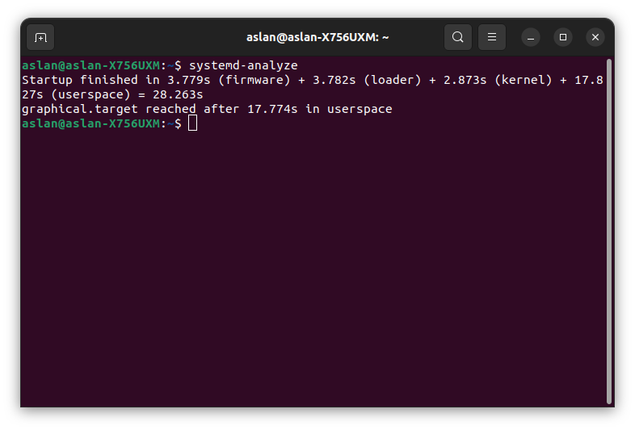

# Lab 6 submission

## Task 1

*Observation*: Most of the bootup time is spent loading the user space and getting to the grahical target (loading the UI).

## Task 2

*Observation*: The latency in traceroute increases for further hops in the route, which seems to be logical.

