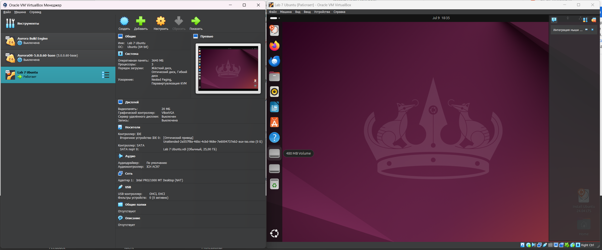

# Task 1: VM Deployment
To install Ubuntu on Oracle VirtualBox, the following steps are required:

1. Download Ubuntu ISO:
    - Go to the official Ubuntu website (https://ubuntu.com/download) and download the Ubuntu ISO file for the version you want to install.

2. Download and Install Oracle VirtualBox:
    - Go to the Oracle VirtualBox website (https://www.virtualbox.org/) and download the VirtualBox software for your operating system.
    - Install VirtualBox by following the installation instructions provided on the website.
    - My version is: 7.0.18
   
3. Create a New Virtual Machine:
    - Open Oracle VirtualBox and click on the "New" button to create a new virtual machine.
    - Enter a name for your virtual machine, select "Linux" as the type, and choose the version that matches your Ubuntu ISO (e.g., Ubuntu 64-bit).
    - Allocate memory (RAM) to your virtual machine. It's recommended to allocate at least 2 GB of RAM for a smooth experience.

4. Create a Virtual Hard Disk:
    - Create a virtual hard disk when prompted. You can choose the default options unless you have specific requirements.

5. Configure Virtual Machine Settings:
    - Select your newly created virtual machine from the list and click on "Settings".
    - Under "Storage", add the Ubuntu ISO file you downloaded earlier to the virtual optical drive.

6. Install Ubuntu:
    - Start the virtual machine by clicking on the "Start" button.
    - The Ubuntu installer should boot up. Follow the on-screen instructions to install Ubuntu on your virtual machine.
    - When prompted, choose the option to install Ubuntu alongside VirtualBox's default settings.

7. Complete Installation:
    - Once the installation is complete, restart your virtual machine.

My ubuntu and settings:


# Task 2: System Information Tools

 - CPU: lscpu

```bash
ubuntu@ubuntu:~$ lscpu
Architecture:             x86_64
  CPU op-mode(s):         32-bit, 64-bit
  Address sizes:          48 bits physical, 48 bits virtual
  Byte Order:             Little Endian
CPU(s):                   3
  On-line CPU(s) list:    0-2
Vendor ID:                AuthenticAMD
  Model name:             AMD Ryzen 5 3600 6-Core Processor
    CPU family:           23
    Model:                113
    Thread(s) per core:   1
    Core(s) per socket:   3
    Socket(s):            1
    Stepping:             0
    BogoMIPS:             7200.01
    Flags:                fpu vme de pse tsc msr pae mce cx8 apic sep mtrr pge m
                          ca cmov pat pse36 clflush mmx fxsr sse sse2 ht syscall
                           nx mmxext fxsr_opt rdtscp lm constant_tsc rep_good no
                          pl nonstop_tsc cpuid extd_apicid tsc_known_freq pni pc
                          lmulqdq ssse3 cx16 sse4_1 sse4_2 movbe popcnt aes rdra
                          nd hypervisor lahf_lm cmp_legacy cr8_legacy abm sse4a 
                          misalignsse 3dnowprefetch ssbd vmmcall fsgsbase bmi1 b
                          mi2 rdseed clflushopt arat
Virtualization features:  
  Hypervisor vendor:      KVM
  Virtualization type:    full
Caches (sum of all):      
  L1d:                    96 KiB (3 instances)
  L1i:                    96 KiB (3 instances)
  L2:                     1.5 MiB (3 instances)
  L3:                     96 MiB (3 instances)
NUMA:                     
  NUMA node(s):           1
  NUMA node0 CPU(s):      0-2
Vulnerabilities:          
  Gather data sampling:   Not affected
  Itlb multihit:          Not affected
  L1tf:                   Not affected
  Mds:                    Not affected
  Meltdown:               Not affected
  Mmio stale data:        Not affected
  Reg file data sampling: Not affected
  Retbleed:               Mitigation; untrained return thunk; SMT disabled
  Spec rstack overflow:   Vulnerable: Safe RET, no microcode
  Spec store bypass:      Not affected
  Spectre v1:             Mitigation; usercopy/swapgs barriers and __user pointe
                          r sanitization
  Spectre v2:             Mitigation; Retpolines; STIBP disabled; RSB filling; P
                          BRSB-eIBRS Not affected; BHI Not affected
  Srbds:                  Not affected
  Tsx async abort:        Not affected
```

 - RAM: free
```bash
ubuntu@ubuntu:~$ free -h
               total        used        free      shared  buff/cache   available
Mem:           3.4Gi       2.0Gi       158Mi       177Mi       1.7Gi       1.4Gi
Swap:             0B          0B          0B
```

- Network Information: ifconfig
```bash
ubuntu@ubuntu:~$ ifconfig
Command 'ifconfig' not found, but can be installed with:
sudo apt install net-tools
ubuntu@ubuntu:~$ sudo apt install net-tools
Reading package lists... Done
Building dependency tree... Done
Reading state information... Done
The following NEW packages will be installed:
  net-tools
0 upgraded, 1 newly installed, 0 to remove and 0 not upgraded.
Need to get 204 kB of archives.
After this operation, 811 kB of additional disk space will be used.
Get:1 http://archive.ubuntu.com/ubuntu noble/main amd64 net-tools amd64 2.10-0.1ubuntu4 [204 kB]
Fetched 204 kB in 1s (310 kB/s)
Selecting previously unselected package net-tools.
(Reading database ... 210655 files and directories currently installed.)
Preparing to unpack .../net-tools_2.10-0.1ubuntu4_amd64.deb ...
Unpacking net-tools (2.10-0.1ubuntu4) ...
Setting up net-tools (2.10-0.1ubuntu4) ...
Processing triggers for man-db (2.12.0-4build2) ...
ubuntu@ubuntu:~$ ifconfig
enp0s3: flags=4163<UP,BROADCAST,RUNNING,MULTICAST>  mtu 1500
        inet 10.0.2.15  netmask 255.255.255.0  broadcast 10.0.2.255
        inet6 fe80::a00:27ff:fedf:cbcc  prefixlen 64  scopeid 0x20<link>
        ether 08:00:27:df:cb:cc  txqueuelen 1000  (Ethernet)
        RX packets 24605  bytes 30675834 (30.6 MB)
        RX errors 0  dropped 0  overruns 0  frame 0
        TX packets 8427  bytes 884065 (884.0 KB)
        TX errors 0  dropped 0 overruns 0  carrier 0  collisions 0

lo: flags=73<UP,LOOPBACK,RUNNING>  mtu 65536
        inet 127.0.0.1  netmask 255.0.0.0
        inet6 ::1  prefixlen 128  scopeid 0x10<host>
        loop  txqueuelen 1000  (Local Loopback)
        RX packets 673  bytes 79811 (79.8 KB)
        RX errors 0  dropped 0  overruns 0  frame 0
        TX packets 673  bytes 79811 (79.8 KB)
        TX errors 0  dropped 0 overruns 0  carrier 0  collisions 0
```

- Operating System Information: lsb_release

```bash
ubuntu@ubuntu:~$ lsb_release -a
No LSB modules are available.
Distributor ID: Ubuntu
Description: Ubuntu 24.04 LTS
Release: 24.04
Codename: noble
```